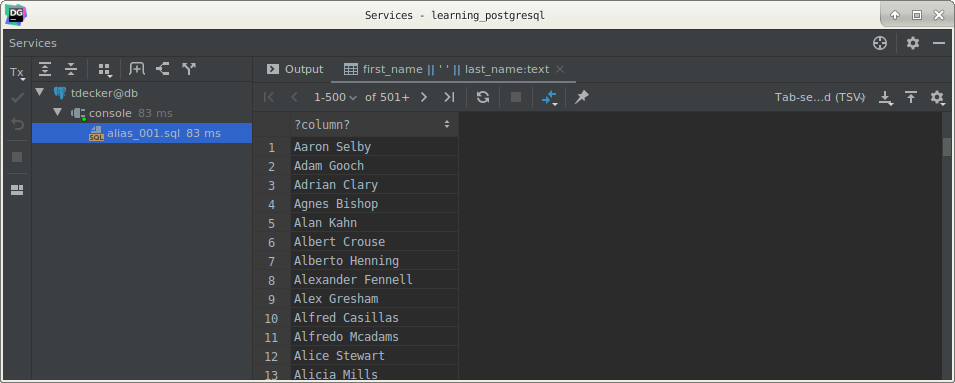
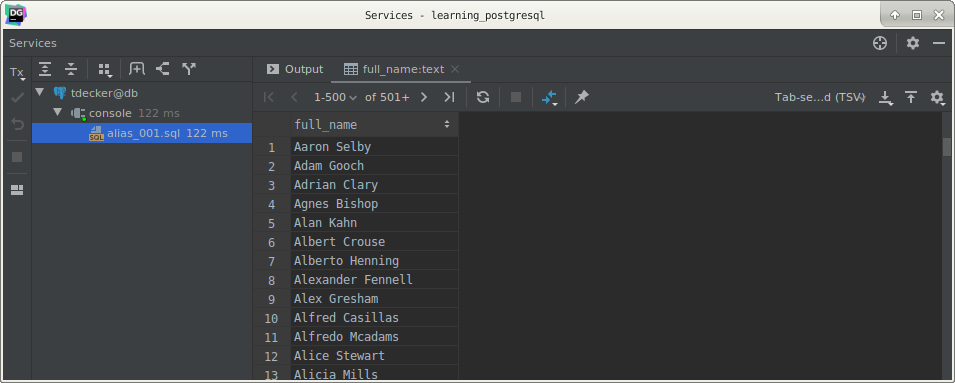

# PostgreSQL aliases

## What you will learn

in this tutorial, you will learn about the PostgreSQL alias including column and table aliases.

A PostgreSQL alias assigns a table or a column a temporary name in a query. 

The aliases only exist during the execution of the query.

## Column alias

The following shows the syntax of column alias:

    SELECT column_name AS alias_name
    FROM table;
    
In this syntax, the `column_name` is assigned an alias as alias_name. 

The `AS` keyword is optional so you can skip it as shown below:

    SELECT column_name alias_name
    FROM table;
    
Besides the column name, you can assign an alias to an expression in the `SELECT` clause as follows:

    SELECT expression alias_name
    FROM table;
    
The main purpose of the column alias is to make the output of a query more meaningful.

## Column alias examples

The following query finds the full names of all customers:

    SELECT
        first_name || ' ' || last_name
        FROM
            customer
        ORDER BY
            first_name || ' ' || last_name;
            

To make the query short and its output more meaningful, you can use the column aliases as follows:

    SELECT
        first_name || ' ' || last_name AS full_name
        FROM
            customer
        ORDER BY
            full_name;
            

Because PostgreSQL evaluates the `ORDER BY` clause after the `SELECT` clause, you can use the column alias in the 
`ORDER BY` clause.

For the other clauses evaluated before the `SELECT` clause such as `WHERE`, `GROUP BY`, and `HAVING`, you cannot 
reference the column alias in these clauses.

Table alias

The following illustrates the syntax of the table alias:

    SELECT
        column_list
        FROM
            table_name AS alias_name;
            
Similar to the column alias, the `AS` keyword in the table alias syntax is also optional.

>Note that you can also use the table alias for views.

The table alias has several uses.

First, if you must qualify a column name with a long table name, you can use the table alias to save some keystrokes 
and make your query more readable.

For example, instead of using the following query:

    SELECT a_very_long_table_name.column_name
    FROM a_very_long_table_name;
    
You use the table alias as shown below:

    SELECT t.column_name
    FROM a_very_long_table_name t;
    
In this example, t is the table alias of the a_very_long_table_name.

The practical uses of the table alias are when you query data from multiple tables that have the same column names. 

In this case, you must qualify the columns using the table names as follows:

    SELECT table_name1.column_name, 
         table_name2.column_name
    FROM table_name1
    INNER JOIN table_name2 ON join_predicate;
    
To make the query shorter, you can use the table aliases for the table names listed on `FROM` and `INNER JOIN` clauses:

    SELECT t1.column_name, 
         t2.column_name
    FROM table_name1 t1
    INNER JOIN table_name2 t2 ON join_predicate;
    
Note that you will learn about the INNER JOIN clause in the next tutorial.

Second, when you join a table to itself a.k.a self-join, you must use table aliases because PostgreSQL does not allow 
you to reference the same table multiple times within a query.

    SELECT
        colum_list
    FROM
        table_name table_alias
    INNER JOIN table_name ON join_predicate;
    
## What you have learned

In this tutorial, you have learned how to use the PostgreSQL alias to assign a new name to a column and a table 
temporarily during the execution of a query.