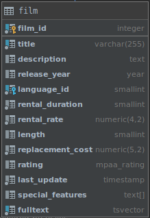

# PostgreSQL `ALL` operator

## What you will learn

in this tutorial, you will learn how to use the PostgreSQL `ALL` operator to compare a value with a list of values 
returned by a sub-query.

## Overview of the PostgreSQL `ALL` operator

The PostgreSQL `ALL` operator allows you to query data by comparing a value with a list of values returned by a 
sub-query.

The following illustrates the syntax of the `ALL` operator:

    comparison_operator ALL (subquery)
    
In this syntax:

- The `ALL` operator must be preceded by a comparison operator such as equal (`=`), not equal (`!=`), greater than 
(`>`), greater than or equal to (`>=`), less than (`<`), and less than or equal to (`<=`).
- The `ALL` operator must be followed by a sub-query which also must be surrounded by the parentheses.

With the assumption that the sub-query returns some rows, the `ALL` operator works as follows:

- column_name `> ALL` (sub-query) the expression evaluates to true if a value is greater than the biggest value 
returned by the sub-query.

- column_name `>= ALL` (sub-query) the expression evaluates to true if a value is greater than or equal to the biggest 
value returned by the sub-query.

- column_name `< ALL` (sub-query) the expression evaluates to true if a value is less than the smallest value returned 
by the sub-query.

- column_name `<= ALL` (sub-query) the expression evaluates to true if a value is less than or equal to the smallest 
value returned by the sub-query.

- column_name `= ALL` (sub-query) the expression evaluates to true if a value is equal to any value returned by the 
sub-query.

- column_name `!= ALL` (sub-query) the expression evaluates to true if a value is not equal to any value returned by 
the sub-query.

In case the sub-query returns no row, then the ALL operator always evaluates to true.

## PostgreSQL `ALL` operator examples

Let’s use the `film` table from the sample database for the demonstration.

The following query returns the average lengths of all films grouped by film rating:

    SELECT
        ROUND(AVG(length), 2) avg_length
        FROM
            film
        GROUP BY
            rating
        ORDER BY
            avg_length DESC;
            

To find all films whose lengths are greater than the list of the average lengths above, you use the `ALL` and greater 
than operator (>) as follows:

    SELECT
        film_id,
        title,
        length
        FROM
            film
        WHERE
                length > ALL (
                SELECT
                    ROUND(AVG(length), 2)
                    FROM
                        film
                    GROUP BY
                        rating
            )
        ORDER BY
            length;
            

As you can see clearly from the output, the query return all films whose lengths are greater than the biggest value in 
the average length list returned by the sub-query.

## What you have learned

In this tutorial, you have learned how to used the PostgreSQL `ALL` operator to compare a value with a list of values 
returned by a sub-query.