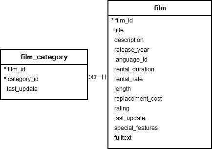
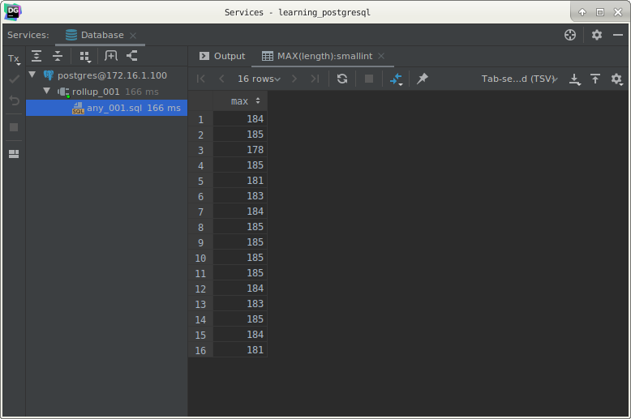
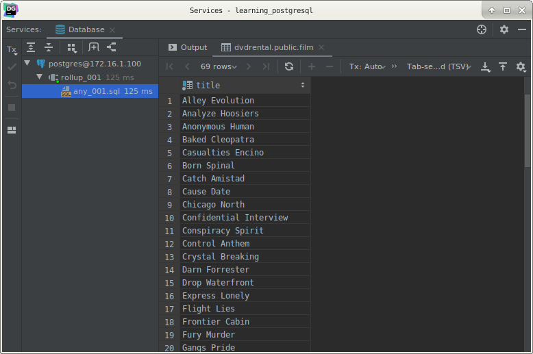
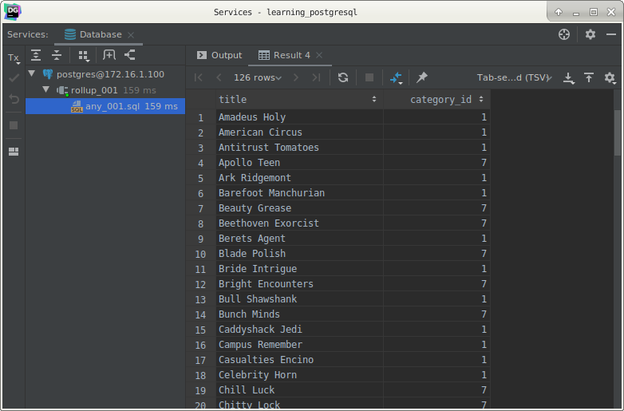

# PostgreSQL `ANY` operator

## What you will learn

In this tutorial, you will learn how to use the PostgreSQL `ANY` operator to compare a scalar value with a set of 
values returned by a sub-query.

## Introduction to PostgreSQL `ANY` operator

The PostgreSQL `ANY` operator compares a value to a set of values returned by a sub-query. 

The following illustrates the syntax of  the `ANY` operator:

    expresion operator ANY(subquery)
    
In this syntax:

- The sub-query must return exactly one column.
- The `ANY` operator must be preceded by one of the following comparison operator =, <=, >, <, > and <>
- The `ANY` operator returns true if any value of the sub-query meets the condition, otherwise, it returns false.

Note that `SOME` is a synonym for ANY, meaning that you can substitute `SOME` for `ANY` in any SQL statement.

## PostgreSQL `ANY` examples

We will use the following `film` and `film_category` tables in the sample database for the demonstration.

The following example returns the maximum length of film grouped by film category:

    SELECT
        MAX(length)
        FROM
            film
                INNER JOIN film_category
                           USING (film_id)
        GROUP BY
            category_id;

            
You can use this query as a sub-query in the following statement that finds the films whose lengths are greater than or 
equal to the maximum length of any film category :

    SELECT
        title
        FROM
            film
        WHERE
                length >= ANY (
                SELECT
                    MAX(length)
                    FROM
                        film
                            INNER JOIN film_category USING (film_id)
                    GROUP BY category_id);
                    
Here is the result:

For each film category, the sub-query finds the maximum length. 

The outer query looks at all these values and determines which film’s lengths are greater than or equal to any film 
category’s maximum length.

>Note that if the sub-query does not return any rows, the entire query returns an empty result set.

## `ANY` vs. `IN`

The `= ANY` is equivalent to `IN` operator.

The following example gets the film whose category is either Action or Drama.

    SELECT
        title,
        category_id
        FROM
            film
                INNER JOIN film_category
                           USING (film_id)
        WHERE
                category_id = ANY (
                SELECT
                    category_id
                    FROM
                        category
                    WHERE
                         NAME = 'Action'
                      OR NAME = 'Drama'
            );
            
The result is:

The following statement uses the `IN` operator which produces the same result:

    SELECT
        title,
        category_id
        FROM
            film
                INNER JOIN film_category
                           USING (film_id)
        WHERE
                category_id IN (
                SELECT
                    category_id
                    FROM
                        category
                    WHERE
                         NAME = 'Action'
                      OR NAME = 'Drama'
            );
            

Note that the `<> ANY` operator is different from `NOT IN`. 

The following expression:

    x <> ANY (a,b,c)
    
is equivalent to:

    x <> a OR <> b OR x <> c
    
## What you have learned

In this tutorial, you have learned how to use the PostgreSQL `ANY` operator to compare a value to a set of values 
returned by a sub-query.