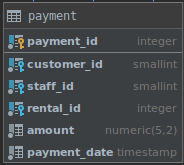

# PostgreSQL `BETWEEN` clause

## What you will learn

in this tutorial, you will learn how to use the PostgreSQL `BETWEEN` operator to match a value against a range of 
values.

## Introduction to the PostgreSQL `BETWEEN` operator

You use the `BETWEEN` operator to match a value against a range of values. 

The following illustrates the syntax of the `BETWEEN` operator:

    value BETWEEN low AND high;
    
If the value is greater than or equal to the low value and less than or equal to the high value, the expression returns 
true, otherwise, it returns false.

You can rewrite the `BETWEEN` operator by using the greater than or equal (`>=`) or less than or equal (`<=`) operators 
as the following statement:

    value >= low and value <= high
    
If you want to check if a value is out of a range, you combine the `NOT` operator with the `BETWEEN` operator as 
follows:

    value NOT BETWEEN low AND high;
    
The following expression is equivalent to the expression that uses the `NOT` and `BETWEEN` operators:

    value < low OR value > high
    
You often use the `BETWEEN` operator in the `WHERE` clause of a `SELECT`, `INSERT`, `UPDATE` or `DELETE` statement.

## PostgreSQL `BETWEEN` operator examples

Let’s take a look at the payment table in the sample database.

The following query selects the payment whose amount is between 8 and 9 (€):

    SELECT
        customer_id,
        payment_id,
        amount
        FROM
            payment
        WHERE
            amount BETWEEN 8
                AND 9;
                

To get payments whose amount is not in the range of 8 and 9, you use the following query:

    SELECT
        customer_id,
        payment_id,
        amount
        FROM
            payment
        WHERE
            amount NOT BETWEEN 8
                AND 9;
                

If you want to check a value against of date ranges, you should use the literal date in ISO 8601 format i.e., 
YYYY-MM-DD. 

For example, to get the payment whose payment date is between 2007-02-07 and 2007-02-15, you use the following query:

    SELECT
        customer_id,
        payment_id,
        amount,
        payment_date
        FROM
            payment
        WHERE
            payment_date BETWEEN '2007-02-07'
                AND '2007-02-15';
                

## What you have learned

In this tutorial, you have learned how to use PostgreSQL `BETWEEN` operator to select a value that is in a range of 
values.