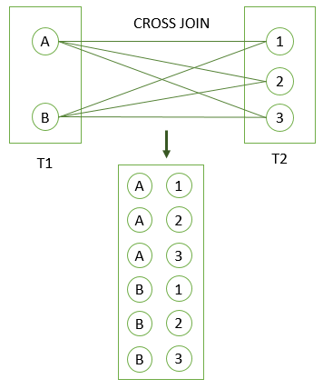

# PostgreSQL `CROSS JOIN`

## What you will learn

in this tutorial, you will learn how to use the PostgresQL `CROSS JOIN` to produce the cartesian product of rows in the 
joined tables.

## Introduction to the PostgreSQL `CROSS JOIN` clause

A `CROSS JOIN` clause allows you to produce the Cartesian Product of rows in two or more tables. 

Different from the other `JOIN` operators such as `LEFT JOIN` or `INNER JOIN`, the `CROSS JOIN` does not have any 
matching condition in the join clause.

Suppose we have to perform the `CROSS JOIN` of two tables T1 and T2. 

For every row from T1 and T2 i.e., a cartesian product, the result set will contain a row that consists of all columns 
in the T1 table followed by all columns in the T2 table. 

If T1 has N rows, T2 has M rows, the result set will have N x M rows.

The following illustrates the syntax of the PostgreSQL `CROSS JOIN` clause:

    SELECT *
        FROM
            T1
                CROSS JOIN T2;
                
You can use the `INNER JOIN` clause with the condition evaluates to true to perform the cross join as follows:

    SELECT *
        FROM
            T1
                INNER JOIN T2 ON TRUE;
                
## PostgreSQL `CROSS JOIN` example

The following `CREATE TABLE` statements create T1 and T2 tables and insert some sample data for the cross demonstration.

    CREATE TABLE T1
    (
        label CHAR(1) PRIMARY KEY
    );
    
    CREATE TABLE T2
    (
        score INT PRIMARY KEY
    );
    
    INSERT
        INTO
            T1 (label)
        VALUES
            ('A'),
            ('B');
    
    INSERT
        INTO
            T2 (score)
        VALUES
            (1),
            (2),
            (3);
            

The following statement uses the `CROSS JOIN` operator to join the T1 table with the T2 table.

    SELECT *
        FROM
            T1
                CROSS JOIN T2;
                
Which produces:

The following picture illustrates the result of the `CROSS JOIN` operator when we join the T1 table with the T2 table:

## What you have learned

In this tutorial, you have learned how to use the PostgreSQL `CROSS JOIN` clause to make a Cartesian Product of rows in 
two or more tables.