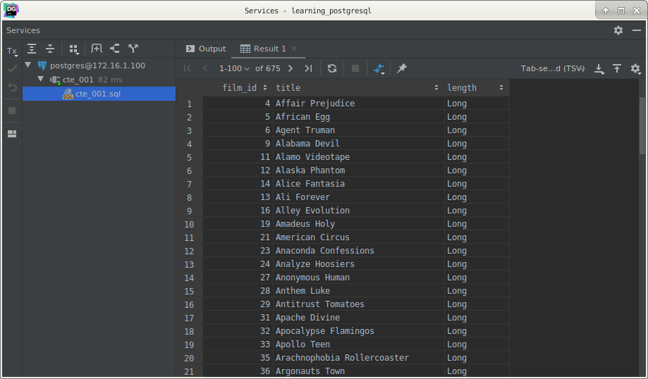
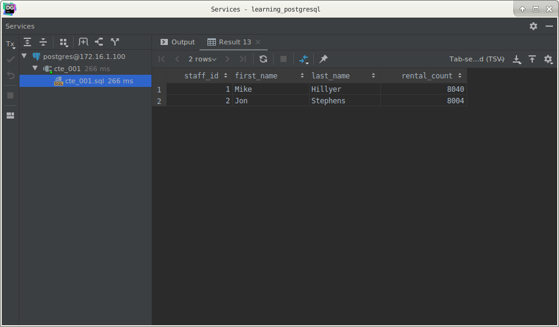
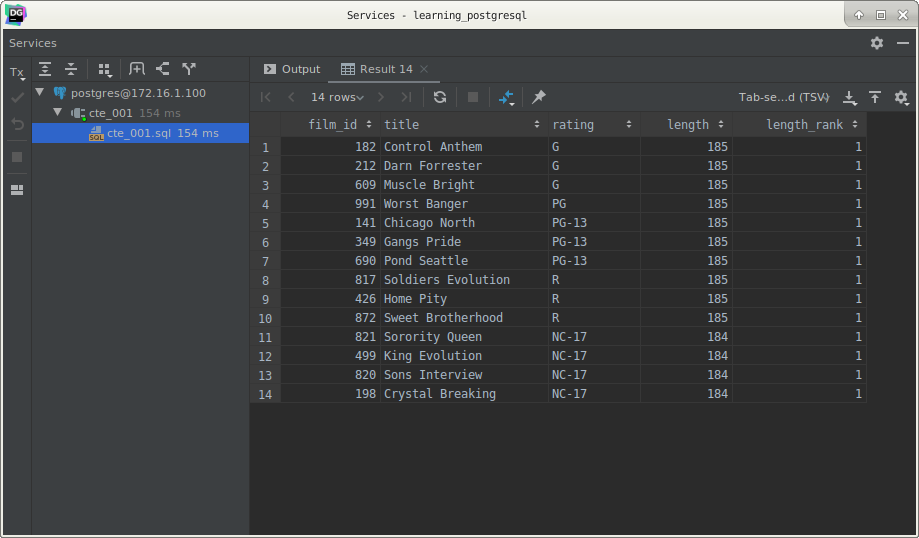

# PostgreSQL CTE

## What you will learn

in this tutorial, you will learn how to use the PostgreSQL CTE (common table expressions) to simplify complex queries.

## Introduction to PostgreSQL common table expressions or CTEs

A common table expression is a temporary result set which you can reference within another SQL statement including 
`SELECT`, `INSERT`, `UPDATE` or `DELETE`.

Common Table Expressions are temporary in the sense that they only exist during the execution of the query.

The following shows the syntax of creating a CTE:

    WITH cte_name (column_list) AS (
        CTE_query_definition 
    )
    statement;
    
In this syntax:

- First, specify the name of the CTE following by an optional column list.
- Second, inside the body of the `WITH` clause, specify a query that returns a result set. If you do not explicitly 
specify the column list after the CTE name, the select list of the CTE_query_definition will become the column list of 
the CTE.
- Third, use the CTE like a table or view in the statement which can be a `SELECT`, `INSERT`, `UPDATE`, or `DELETE`.

Common Table Expressions or CTEs are typically used to simplify complex joins and sub-queries in PostgreSQL.

## PostgreSQL CTE examples

Let’s take some examples of using CTEs to get a better understanding.

## A simple PostgreSQL CTE example

We will use the `film` and `rental` tables from the sample database for the demonstration.

See the following example:

    WITH
        cte_film AS (
            SELECT
                film_id,
                title,
                (CASE
                     WHEN length < 30 THEN 'Short'
                     WHEN length >= 30 AND length < 90 THEN 'Medium'
                     WHEN length > 90 THEN 'Long'
                    END) length
                FROM
                    film
        )
    SELECT
        film_id,
        title,
        length
        FROM
            cte_film
        WHERE
            length = 'Long'
        ORDER BY
            title;
            
Here is the partial output:

Note that this example is for the demonstration purpose.

In this example, we first defined a common table expression named `cte_film` using the `WITH` clause as follows:

    WITH cte_film AS (
        SELECT 
            film_id, 
            title,
            (CASE 
                WHEN length < 30 
                    THEN 'Short'
                WHEN length >= 30 AND length < 90 
                    THEN 'Medium'
                WHEN length > 90 
                    THEN 'Long'
            END) length    
        FROM
            film
    )

The common table expression has two parts:

- The first part defines the name of the CTE which is `cte_film`.
- The second part defines a `SELECT` statement that populates the expression with rows.

We then used the `cte_film` CTE in the `SELECT` statement to return only films whose lengths are ‘Long’.

## Joining a CTE with a table example

In the following example, we will use the `rental` and `staff` tables.

The following statement illustrates how to join a CTE with a table:

    WITH
        cte_rental AS (
            SELECT
                staff_id,
                COUNT(rental_id) rental_count
                FROM
                    rental
                GROUP BY staff_id
        )
    SELECT
        s.staff_id,
        first_name,
        last_name,
        rental_count
        FROM
            staff s
                INNER JOIN cte_rental USING (staff_id);
                
In this example:

- First, the CTE returns a result set that includes staff id and the number of rentals.
- Then, join the staff table with the CTE using the `staff_id` column.

Here is the output:

## Using CTE with a window function example

The following statement illustrates how to use the CTE with the `RANK()` window function:

    WITH
        cte_film AS (
            SELECT
                film_id,
                title,
                rating,
                length,
                RANK() OVER (
                    PARTITION BY rating
                    ORDER BY length DESC)
                    length_rank
                FROM
                    film
        )
    SELECT *
        FROM
            cte_film
        WHERE
            length_rank = 1;
            
In this example:

- First, we defined a CTE that returns the film ranking by length for each film rating.
- Second, we selected only films whose length rankings are one.

The following picture shows the output:

### PostgreSQL CTE advantages

The following are some advantages of using common table expressions or CTEs:

- Improve readability of the complex queries. You use CTEs to organize complex queries in a more organized and readable 
manner.
- Ability to create recursive queries. Recursive queries are queries that reference themselves. The recursive queries 
come in handy when you want to query hierarchical data such as organization chart or bill of materials.
- Use in conjunction with window functions. You can use CTEs in conjunction with window functions to create an initial 
result set and use another select statement to further process this result set.

## What you have learned

In this tutorial, you have learned about the PostgreSQL CTE or common table expression to simplify complex queries.