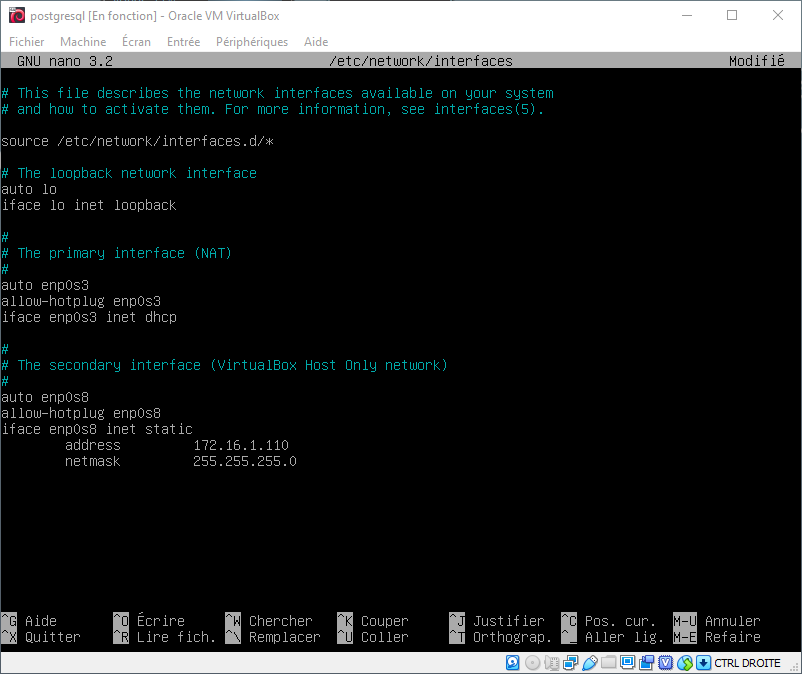
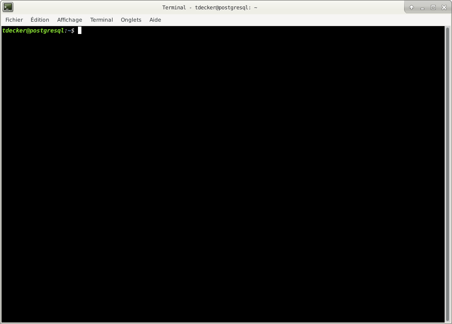
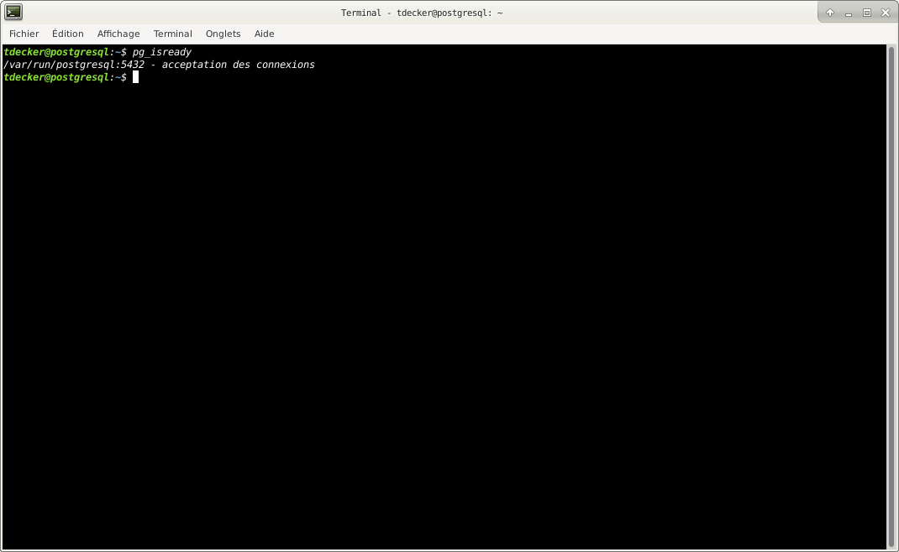
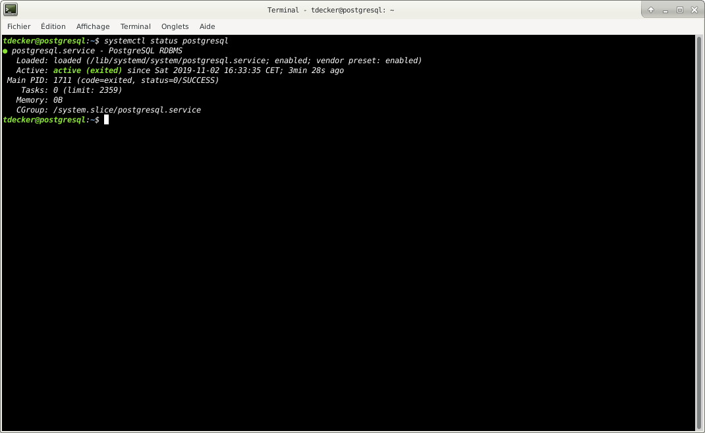
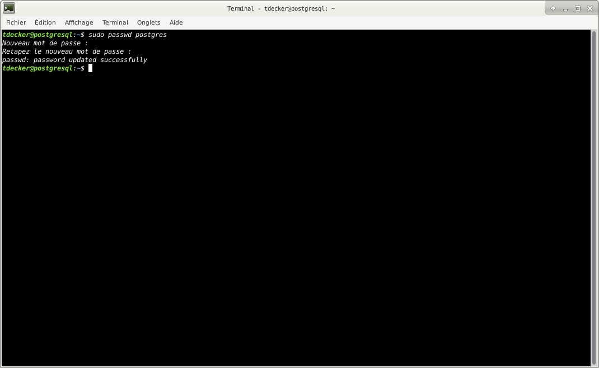
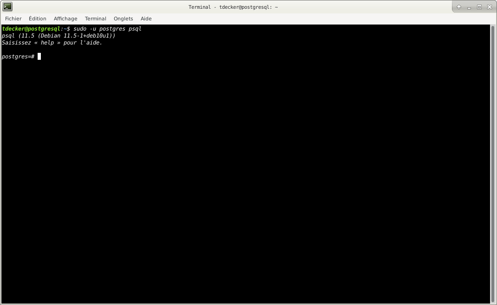
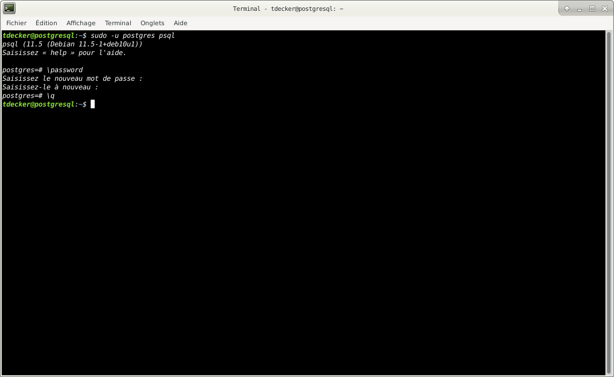

# PostgreSQL Debian installation

## Architecture

## 1) Set up `postgresql` virtual machine

The current tutorial is based on a Debian 10 (Buster) virtual machine.

The postgresql virtual machine, is running two NICs.

- The first one (`enp0s3`) is the primary interface and is set up as NAT interface in VirtualBox. This interface will 
give access to the Internet. Address will probably be `10.0.2.15`.

- The second one (`enp0s8`) is the secondary interface and is set up on a VirtualBox Host only network. This interface
will give the internal connectivity in the lab between the different virtual machines.

Carefully follow these steps to install the first virtual machine that will run the PostgreSQL database server.

### 1a) Initial configuration

>At the next step, configure your own user account: `tdecker` for me in this tutorial.
>
>This user account will be used for the rest of this tutorial.

### 1b) Setup network configuration

From the virtual machine console:

Connect as `root` user.

Install `sudo` application:

    apt update
    apt install sudo
    
Add your own ser account to sudo group:

    sudo adduser <user_account> sudo
    
Set up the secondary interface to assign it it's IP address:

Edit the `interface` file.

    nano /etc/network/interface

and make it like this:

Restart networking service:

    systemctl restart networking

From now on, we will only use an `ssh` connection (with our own user account) from our host machine.

    root@postgresql:~# logout

### 1c) PostgreSQL installation

From your host machine, connect to your `postgresql` virtual machine via ssh, using your own user account.

    sudo apt update
    sudo apt install postgresql-11

Verify your installation:

    pg_isready

You should see:

    systemctl status progresql
    

### 1c) Securing and configuring PostgreSQL database engine

By default, PostgreSQL uses the concept of roles to manage database access permissions and database roles are 
conceptually completely separate from operating system users. 

A role can be a user or a group, and a role that has login right is called user.

A freshly initialized system always contains one predefined role called `postgres`, it has the same name as the 
operating system user account called postgres, which is used to access the `psql` (PostgreSQL shell) and other database 
programs.

The PostgreSQL system user account is not protected using a password, to secure it, you can create a password using the 
`passwd` utility.

    sudo passwd postgres
    

Also, the `postgres` role (or administrative database user if you like) is not secured by default. 

You also need to secure it with a password. 

Now switch to the postgres system user account and postgres role (remember to set a strong and secure password) as 
shown.

    sudo -u postgres psql
    

You are now connected to the PostgreSQL shell.

Issue the following commands to assign a password to `postgres` role:

