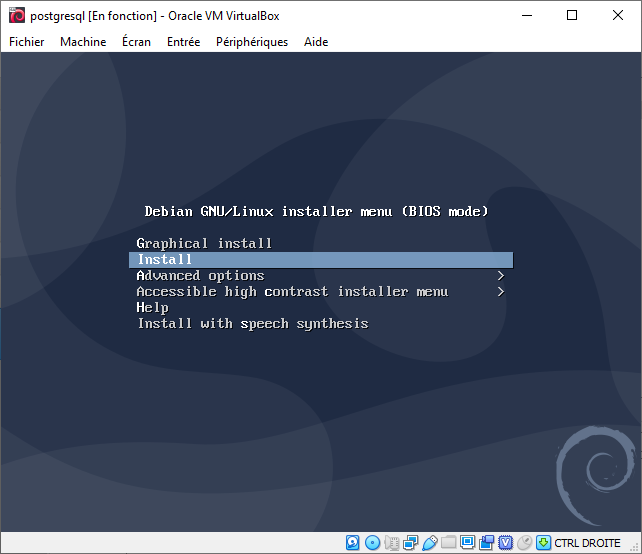

# PostgreSQL Debian installation

## Architecture

## postgresql virtual machine

### Connect to the postgresql virtual machine using ssh.

### 1) Setup PostgreSQL PPA

    sudo install gnupg
    sudo wget -q https://www.postgresql.org/media/keys/ACCC4CF8.asc -O - | sudo apt-key add -
    sudo sh -c 'echo "deb http://apt.postgresql.org/pub/repos/apt/ buster-pgdg main" >> /etc/apt/sources.list.d/pgdg.list'

### 2) Install PostgreSQL

    sudo apt update
    sudo apt-get install postgresql postgresql-contrib

### 3) Connect to PostgreSQL

After installing the PostgreSQL database server by default, it creates a user `postgres` with role `postgres`. 

It also creates a system account with the same name `postgres`. 

So to connect to PostgreSQL server, login to your system as user postgres and connect the database.

    sudo -u postgres psql

Now you are logged in to PostgreSQL database server. 

To check login info use following command from the database command prompt.

    psql (12.0 (Debian 12.0-2.pgdg100+1))
    Saisissez « help » pour l'aide.
    
    postgres=#

    postgres=# \conninfo
    Vous êtes connecté à la base de données « postgres » en tant qu'utilisateur « postgres » via le socket dans « /var/run/postgresql » via le port « 5432 ».
    postgres=# 

To disconnect from PostgreSQL database command prompt just type below command and press enter. 

It will return you back to Debian command prompt.

    postgres-# \q
    
> Currently, only `postgres` user exist on your system for connecting to PostgreSQL engine.
> This account does not have any password and can only connect using unix socket from the local system.
> As it is, you will not be able to connect to your PostgreSQL database server using any network connection.

## Set up PostgreSQL to accept network connections

    sudo nano /etc/postgresql/12/main/postgresql.conf

- Find the line containing `listen_address` and replace `localhost` by `ip_address_of_the_postgresql_machine`.

- Find the line containing `password_encryption` and replace the `md5` default value with `scram-sha-256`.

    sudo nano /etc/postgresql/12/main/pg_hba.conf

    
### Set up a password for `postgres` user 

    psql (12.0 (Debian 12.0-2.pgdg100+1))
    Saisissez « help » pour l'aide.
    
    postgres=# \password 
    Saisissez le nouveau mot de passe : 
    Saisissez-le à nouveau : 
    postgres=# \q

## pgadmin virtual machine