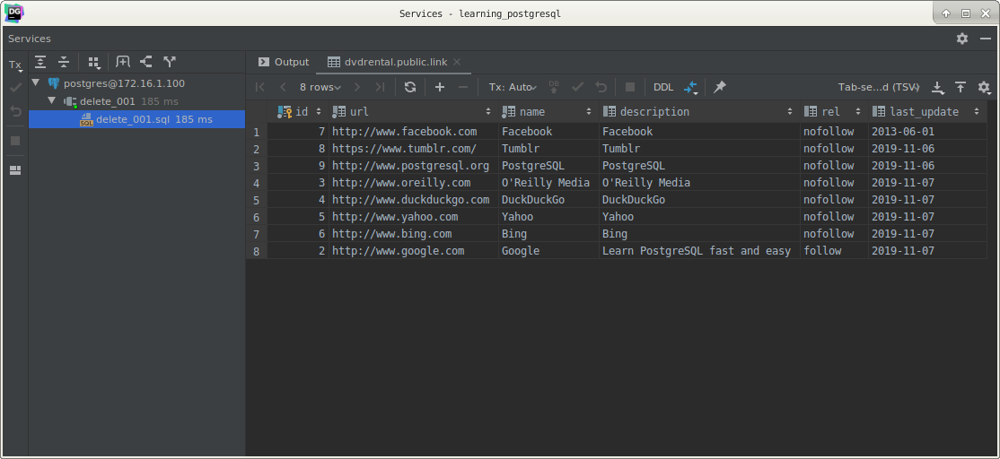
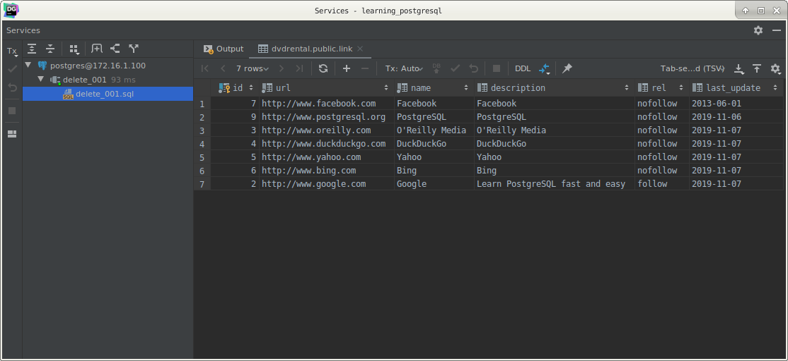
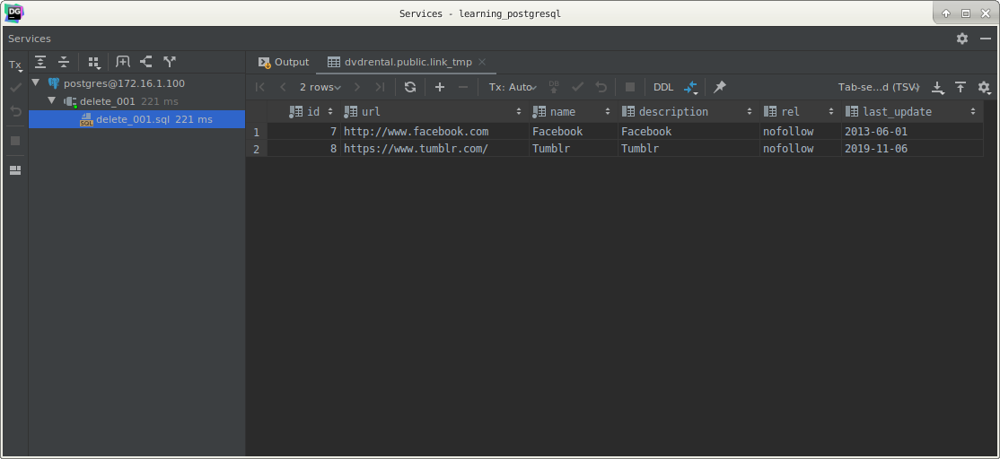
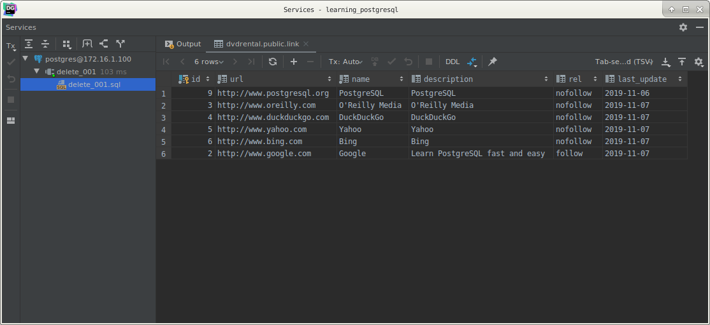
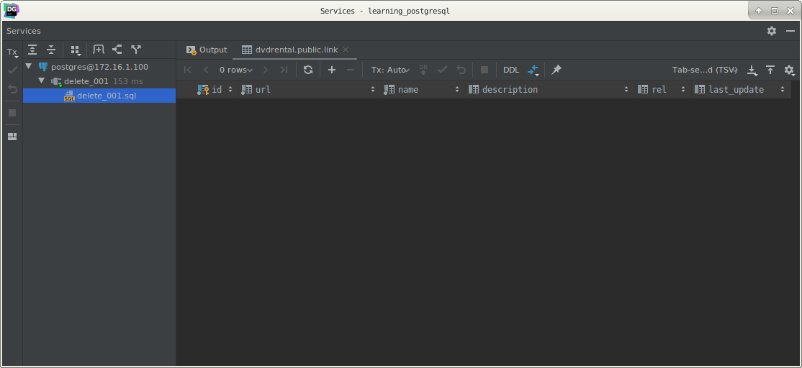
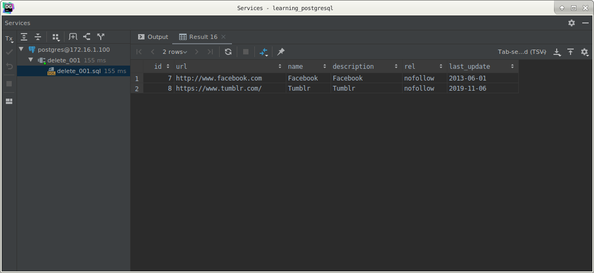

# PostgreSQL `DELETE`

## What you will learn

in this tutorial, you will learn how to use the PostgreSQL `DELETE` statement to delete data from a table.

## Introduction to PostgreSQL `DELETE` statement

To delete data from a table, you use PostgreSQL `DELETE` statement as shown below:

    DELETE
      FROM table
     WHERE condition;
     
In this syntax:

- First, specify the table from which you want to delete data in the `DELETE FROM` clause.
- Second, specify which rows to delete by using the condition in the `WHERE` clause. The `WHERE` clause is optional. 
However, if you omit it, the `DELETE` statement will delete all rows in the table.

The `DELETE` statement returns the number of deleted rows. 

It may not the same as the number of rows specified by the condition in the `WHERE` clause because the table may contain 
a `BEFORE DELETE` trigger that does something else before deletion. 

If no row is deleted, the `DELETE` statement returns zero.

In case you want to check the condition that references to one or more columns in another table, you use the `USING` 
clause as follows:

    DELETE
      FROM table
          USING another_table
     WHERE table.id = another_table.id
       AND …

If you do not want to use the `USING` clause, you can use the sub-query as shown in the following statement:

    DELETE
      FROM table
     WHERE table.id = (SELECT id FROM another_table);

## PostgreSQL `DELETE` examples

We will use the `link` and `link_tmp` tables that we created in the inserting data tutorial. 

The following illustrates the content of the `link` table:

    SELECT *
      FROM link;

## PostgreSQL `DELETE` with `WHERE` clause example

The following statement deletes the rows whose value in the id column is 8:

    DELETE
      FROM link
     WHERE id = 8;
     

# PostgreSQL `DELETE USING` statement example

Suppose you want to remove all rows from the `link` table that have values of the id columns are in the link_tmp table.

First, check the `link_tmp` table data:

    SELECT *
      FROM link_tmp;
      

We expect that the rows with id 7 and 8 will be removed from the `link` table:

Second, use the following `DELETE` statement with the `USING` clause to delete the rows in the link table:

    DELETE
      FROM link
          USING link_tmp
     WHERE link.id = link_tmp.id;
     

As you can see clearly from the output, the statement worked as expected.

## PostgreSQL deletes all rows from a table

To delete all rows from the link table, you omit the `WHERE` clause in the `DELETE` statement as follows:

    DELETE
      FROM link;

The `link` table is now empty.
      

To delete all rows in the `link_tmp` table and return the deleted rows, you use the `RETURNING` clause in the `DELETE` 
statement as follows:

    DELETE
      FROM link_tmp
    RETURNING *;
    

## What you have learned

In this tutorial, we have shown you how to use the PostgreSQL `DELETE` statement to delete data in a table.