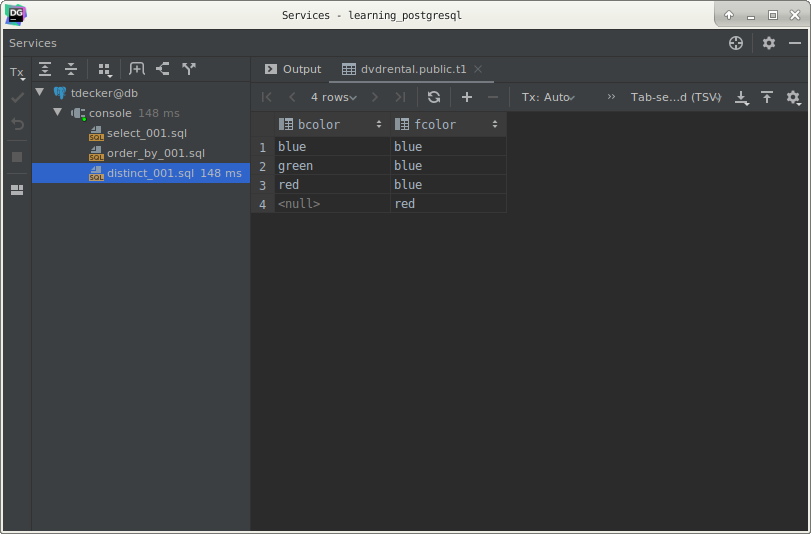

# PostgreSQL `DISTINCT` clause

## What you will learn

in this tutorial, you will learn how to use the PostgreSQL `SELECT DISTINCT` clause to remove duplicate rows from a 
result set returned by a query.

## Introduction to PostgreSQL `SELECT DISTINCT` clause

The `DISTINCT` clause is used in the `SELECT` statement to remove duplicate rows from a result set. 

The `DISTINCT` clause keeps one row for each group of duplicates. 

The `DISTINCT` clause can be used on one or more columns of a table.

The following illustrates the syntax of the `DISTINCT` clause:

    SELECT DISTINCT
        column_1
        FROM
            table_name;
            
In this statement, the values in the column_1 column are used to evaluate the duplicate.

If you specify multiple columns, the `DISTINCT` clause will evaluate the duplicate based on the combination of values of 
these columns.

    SELECT DISTINCT
        column_1,
        column_2
        FROM
            table_name;
            
In this case, the combination of values in both column_1 and column_2 columns will be used for evaluating the duplicate.

>PostgreSQL also provides the `DISTINCT ON (expression)` to keep the “first” row of each group of duplicates using the 
>following syntax:

    SELECT DISTINCT ON (column_1)
        column_alias,
        column_2
        FROM
            table_name
        ORDER BY
            column_1,
            column_2;
            
>The order of rows returned from the `SELECT` statement is unpredictable therefore the “first” row of each group of the 
>duplicate is also unpredictable. 
>
>It is good practice to always use the `ORDER BY` clause with the `DISTINCT ON(expression)` to make the result set 
>obvious.
>
>Notice that the DISTINCT ON expression must match the leftmost expression in the ORDER BY clause.

## PostgreSQL `SELECT DISTINCT` examples

Let’s create a new table named `t1` and insert data into the table for practicing the `DISTINCT` clause.

First, use the following statement to create the `t1` table that consists of three columns: id, bcolor and fcolor.

    CREATE TABLE t1
    (
        id     serial NOT NULL PRIMARY KEY,
        bcolor VARCHAR,
        fcolor VARCHAR
    );
    
Second, insert some rows into the `t1` table using the following `INSERT` statement:

    INSERT
        INTO
            t1 (bcolor, fcolor)
        VALUES
            ('red', 'red'),
            ('red', 'red'),
            ('red', NULL),
            (NULL, 'red'),
            ('red', 'green'),
            ('red', 'blue'),
            ('green', 'red'),
            ('green', 'blue'),
            ('green', 'green'),
            ('blue', 'red'),
            ('blue', 'green'),
            ('blue', 'blue');

> Take these SQL statements as they are.
>
>You have not seen them as far but you will soon.
           
Third, query the data from the `t1` table using the `SELECT` statement:

    SELECT
        id,
        bcolor,
        fcolor
        FROM
            t1;
            

As you can see, 'red' and 'green' (as an example) colors appear several time in both 'bcolor' and 'fcolor' columns.

## PostgreSQL `DISTINCT` on one column example

The following statement selects unique values in the bcolor column from the `t1` table and sorts the result set in 
alphabetical order by using the `ORDER BY` clause.

    SELECT DISTINCT
        bcolor
        FROM
            t1
        ORDER BY
            bcolor;
            

## PostgreSQL `DISTINCT` on multiple columns

The following statement demonstrates how to use the `DISTINCT` clause on multiple columns:

    SELECT DISTINCT
        bcolor,
        fcolor
        FROM
            t1
        ORDER BY
            bcolor,
            fcolor;
            

Because we specified both `bcolor` and `fcolor` columns in the `SELECT DISTINCT` clause, PostgreSQL combined the values 
in both bcolor and fcolor columns to evaluate the uniqueness of the rows.

The query returns the unique combination of bcolor and fcolor from the t1 table. 

>Notice that the `t1` table has two rows with red value in both bcolor and fcolor columns. 
>
>When we applied the `DISTINCT` to both columns, one row was removed from the result set because it is the duplicate.

## PostgreSQL `DISTINCT ON` example

The following statement sorts the result set by the  `bcolor` and  `fcolor`, and then for each group of duplicates, it 
keeps the first row in the returned result set.

    SELECT DISTINCT ON
        (bcolor)
        bcolor,
        fcolor
        FROM
            t1
        ORDER BY
            bcolor,
            fcolor;
            

The following picture illustrates the process:

## What you have learned

In this tutorial, you have learned how to use PostgreSQL `SELECT DISTINCT` statement to remove duplicate rows from the 
result set returned by a query.