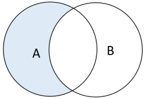
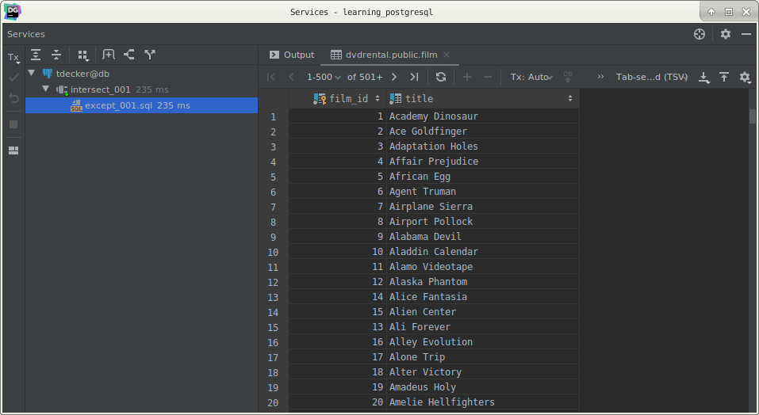
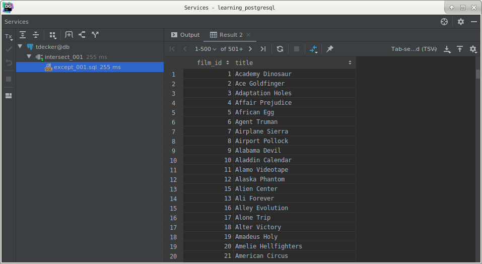
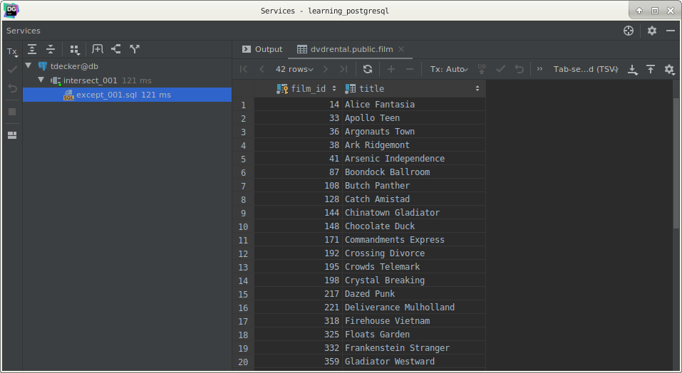

# PostgreSQL `EXCEPT` operator

## What you will learn

in this tutorial, you will learn how to use the PostgresQL `EXCEPT` operator to return the rows in the first query that 
do not appear in the output of the second query.

## Introduction to the PostgreSQL `EXCEPT` operator

Like the `UNION` and `INTERSECT` operators, the `EXCEPT` operator returns rows by comparing the result sets of two or 
more queries.

The `EXCEPT` operator returns distinct rows from the first (left) query that are not in the output of the second (right) 
query. 

The following illustrates the syntax of the `EXCEPT` operator.

    SELECT
        column_list
        FROM
            A
        WHERE
            condition_a
    EXCEPT
    SELECT
        column_list
        FROM
            B
        WHERE
            condition_b;
            
To combine the queries using the `EXCEPT` operator, you must obey the following rules:

- The number of columns and their orders must be the same in the two queries.
- The data types of the respective columns must be compatible.

The following Venn diagram illustrates the result of the of `EXCEPT` operator that apply to the A and B tables.

## PostgreSQL `EXCEPT` example

Let’s take a look at the film and inventory tables of the sample database.

The following query returns the films in the film table.

    SELECT
        film_id,
        title
        FROM
            film
        ORDER BY
            title;
            

The following query returns the films that are in the inventory:

    SELECT DISTINCT
        inventory.film_id,
        title
        FROM
            inventory
                INNER JOIN film ON film.film_id = inventory.film_id
        ORDER BY
            title;
            

Both queries return a result set that consists of two columns: `film_id` and `title`.

To get the films that are not in the inventory, you use the `EXCEPT` operator as follows:

    SELECT
        film_id,
        title
        FROM
            film
    EXCEPT
    SELECT DISTINCT
        inventory.film_id,
        title
        FROM
            inventory
                INNER JOIN film ON film.film_id = inventory.film_id
    ORDER BY
        title;
            

Notice that we placed the `ORDER BY` clause at the end of the statement to sort the films by their titles. 

If you place the `ORDER BY` clause in each query, the final result may not be sorted because each query will sort the 
result set by the title column and after that the `EXCEPT` operator is applied to the both queries.

## What you have learned

In this tutorial, we have shown you how to use the PostgreSQL `EXCEPT` operator to combine two queries to get the rows 
in the first query that do not appear in the output of the second query.