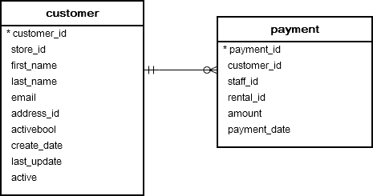
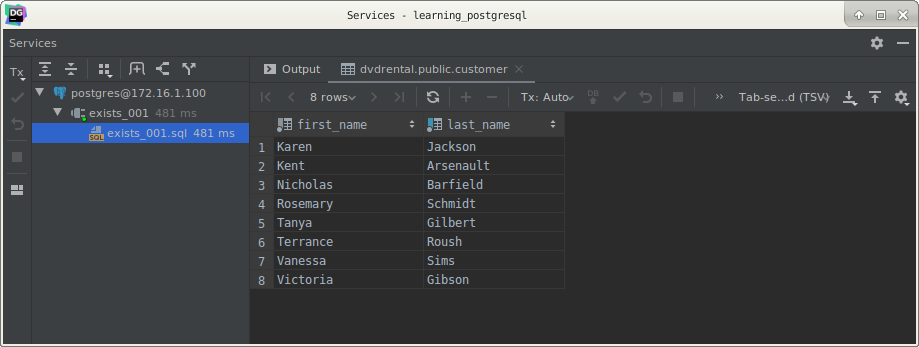
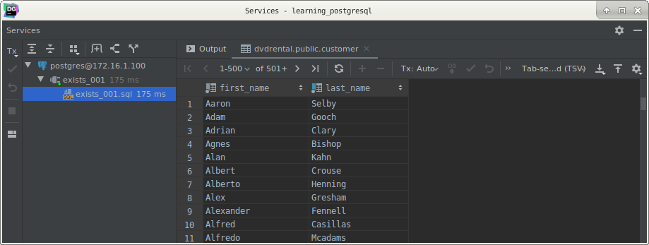

# PostgreSQL `EXISTS` operator

## What you will learn

in this tutorial, you will learn how to use the PostgreSQL `EXISTS` operator to test for existence of rows in a 
sub-query.

## Introduction to PostgreSQL `EXISTS`

The `EXISTS` operator is used to test for existence of rows in a sub-query.

The following illustrates syntax of the `EXISTS` operator:

    EXISTS (subquery)

The `EXISTS` operator accepts an argument which is a sub-query.

If the sub-query returns at least one row, the result of `EXISTS` is true. 

In case the sub-query returns no row, the result is of `EXISTS` is false.

`EXISTS` is often used with the correlated sub-query.

The result of `EXISTS` depends on whether any row returned by the sub-query, and not on the content of the rows. 

Therefore, the columns that appear on the `SELECT` clause of the sub-query are not important.

For this reason, the common coding convention is to write `EXISTS` in the following form:

    SELECT
        column_1
        FROM
            table_1
        WHERE
            EXISTS(SELECT
                       1
                       FROM
                           table_2
                       WHERE
                           column_2 = table_1.column_1);
                           
Note that if the sub-query returns `NULL`, the result of `EXISTS` is true.

## PostgreSQL `EXISTS` examples

We will use the following `customer` and `payment` tables in the sample database for the demonstration:

## A) Find `customers` who have at least one `payment` whose amount is greater than 11.

The following statement returns customers who have paid at least a rental which is greater than 11:

    SELECT
        first_name,
        last_name
        FROM
            customer c
        WHERE
            EXISTS
                (SELECT
                     1
                     FROM
                         payment p
                     WHERE
                           p.customer_id = c.customer_id
                       AND amount > 11)
        ORDER BY
            first_name,
            last_name;
            

In this example, for each customer in the customer table, the sub-query checks the payment table to find if that 
customer made at least one payment (p.customer_id = c.customer_id) and the amount is greater than 11 ( amount > 11)

## B) `NOT EXISTS` example

`NOT EXISTS` is opposite to `EXISTS`, meaning that if the sub-query returns no row, `NOT EXISTS` returns true. 

If the sub-query returns any rows, `NOT EXISTS` returns false.

The following example returns customers have not made any payment that greater than 11.

    SELECT
        first_name,
        last_name
        FROM
            customer c
        WHERE
            NOT EXISTS
                (SELECT
                     1
                     FROM
                         payment p
                     WHERE
                           p.customer_id = c.customer_id
                       AND amount > 11)
        ORDER BY
            first_name,
            last_name;
            

## C) `EXISTS` and `NULL`

If the sub-query returns `NULL`, `EXISTS` returns true. 

See the following example:

    SELECT
        first_name,
        last_name
        FROM
            customer
        WHERE
            EXISTS(SELECT NULL)
        ORDER BY
            first_name,
            last_name;
            
In this example, the sub-query returned `NULL`, therefore, the query returned all rows from the customer table.

## What you have learned

In this tutorial, you have learned how to use the PostgreSQL `EXISTS` to test for the existence of rows in the 
sub-query.