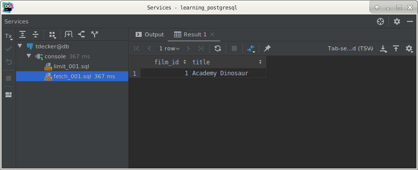
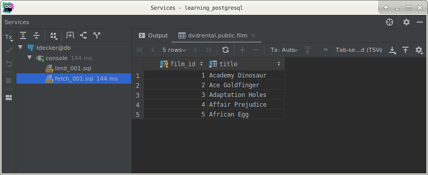
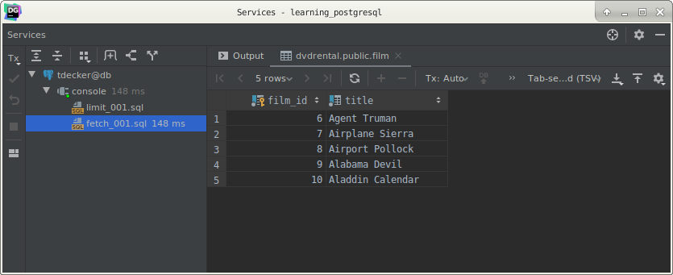

# PostgreSQL `FETCH` clause

## What you will learn

In this tutorial, you will learn how to use the PostgreSQL `FETCH` clause to retrieve a portion of rows returned by a 
query.

## Introduction to PostgreSQL `FETCH` clause

To limit the number of rows returned by a query, you often use the `LIMIT` clause. 

The `LIMIT` clause is widely used by many relational database management systems such as MySQL, H2, and HSQLDB. 

However, the `LIMIT` clause is not a SQL-standard.

To conform with the SQL standard, PostgreSQL provides the `FETCH` clause to retrieve a portion of rows returned by a 
query. 

>Note that the FETCH clause was introduced in SQL:2008.

The following illustrates the syntax of the PostgreSQL `FETCH` clause:

    OFFSET start { ROW | ROWS }
    FETCH { FIRST | NEXT } [ row_count ] { ROW | ROWS } ONLY
    
In this syntax:

- `ROW` and `FIRST` are synonymous with `ROWS` and `NEXT` respectively.

- The start is an integer that must be zero or positive. By default, it is zero if the `OFFSET` clause is not specified.
In case the start is greater than the number of rows in the underlying result set, no rows are returned.

- The row_count is one or higher. By default, the value of row_count is one if it is not specified.

Because the order of rows stored in the table is unpredictable, you should use the `FETCH` clause with the `ORDER BY` 
clause to make the result set consistent.

>Note that the `OFFSET` clause must come before the `FETCH` clause in SQL:2008. 
>
>However, `OFFSET` and `FETCH` clauses can appear in any order in PostgreSQL.

## PostgreSQL `FETCH` examples

Let’s use the film table in the sample database for the demonstration.

The following query returns the first row of the film sorted by title:

    SELECT
        film_id,
        title
        FROM
            film
        ORDER BY
            title
        FETCH FIRST ROW ONLY;
        

It is equivalent to the following query:

    SELECT
        film_id,
        title
        FROM
            film
        ORDER BY
            title
        FETCH FIRST 1 ROW ONLY;
        
The following query returns the first five films sorted by the title:

    SELECT
        film_id,
        title
        FROM
            film
        ORDER BY
            title
        FETCH FIRST 5 ROW ONLY;
        

The following statement returns the next five films after the first five films sorted by the title:

    SELECT
        film_id,
        title
        FROM
            film
        ORDER BY
            title
        OFFSET 5 ROWS
        FETCH FIRST 5 ROW ONLY;
        

## What you have learned

In this tutorial, you have learned how to use the PostgreSQL `FETCH` clause to retrieve a portion of rows returned by a 
query.