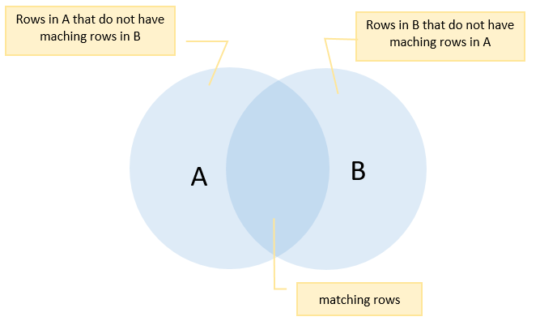
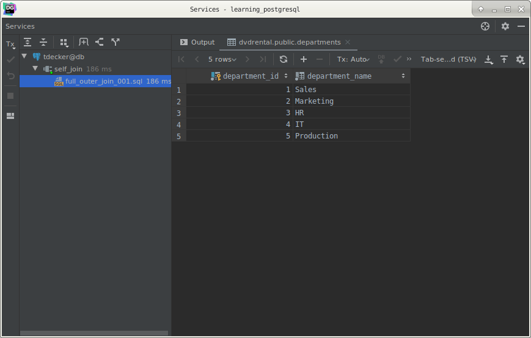
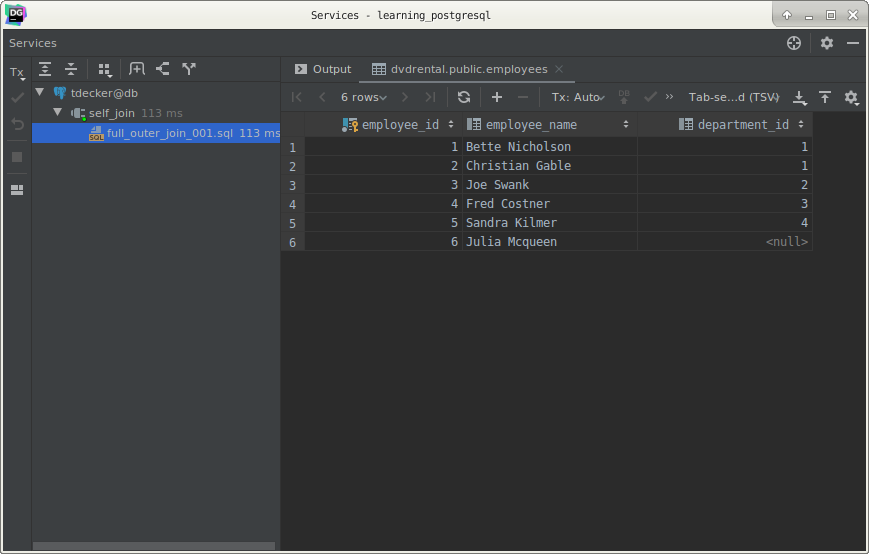
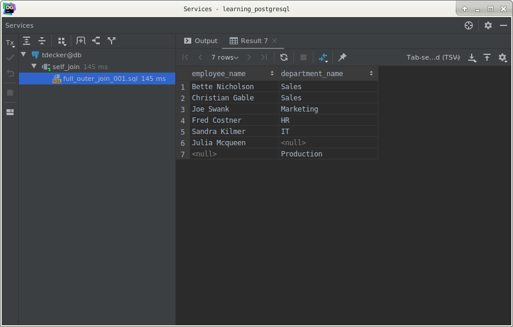
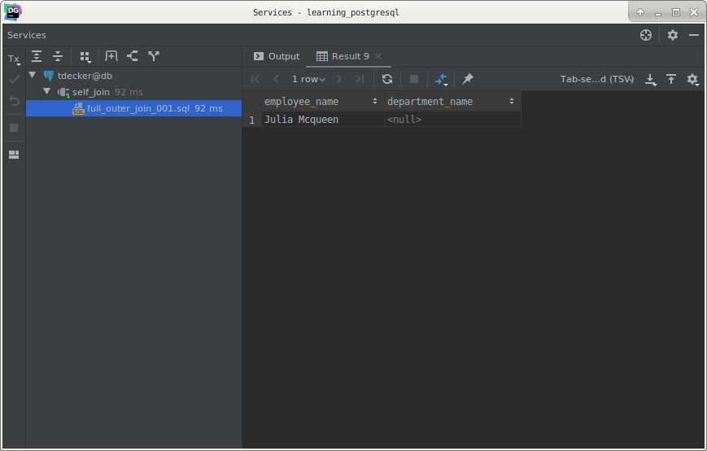

# PostgreSQL `FULL OUTER JOIN`

## What you will learn

in this tutorial, you will learn how to use the PostgreSQL `FULL OUTER JOIN` to query data from two or more tables.

## Introduction to the PostgreSQL FULL OUTER JOIN

Suppose, you want to perform a full outer join of two tables: `A` and `B`. 

The following illustrates the syntax of the `FULL OUTER JOIN`:

    SELECT *
        FROM
            A
                FULL OUTER JOIN B
                                ON A.id = B.id;
    
The `OUTER` keyword is optional.

The full outer join combines the results of both left join and right join. 

If the rows in the joined table do not match, the full outer join sets `NULL` values for every column of the table that 
lacks a matching row. 

For the matching rows , a single row is included in the result set that contains columns populated from both joined 
tables.

The following Venn diagram illustrates the `FULL OUTER JOIN` operation:

The result includes the matching rows from the both tables, and also the rows that do not match.

## PostgreSQL FULL OUTER JOIN example

First, we will create two new tables for the demonstration: employees and departments:

    CREATE TABLE
        IF NOT EXISTS departments
    (
        department_id   serial PRIMARY KEY,
        department_name VARCHAR(255) NOT NULL
    );
    
    CREATE TABLE
        IF NOT EXISTS employees
    (
        employee_id   serial PRIMARY KEY,
        employee_name VARCHAR(255),
        department_id INTEGER
    );
    
Each department has zero or many employees and each employee belongs to zero or one department.

The following `INSERT` statements add some sample data into the departments and employees tables.

    INSERT
        INTO
            departments (department_name)
        VALUES
            ('Sales'),
            ('Marketing'),
            ('HR'),
            ('IT'),
            ('Production');
    
    INSERT
        INTO
            employees (employee_name,
                       department_id)
        VALUES
            ('Bette Nicholson', 1),
            ('Christian Gable', 1),
            ('Joe Swank', 2),
            ('Fred Costner', 3),
            ('Sandra Kilmer', 4),
            ('Julia Mcqueen', NULL);
            
Next, we query data from the departments and employees tables:

    SELECT *
        FROM
            departments;
    

    
    SELECT *
        FROM
            employees;
            

Then, we use the `FULL OUTER JOIN` to query data from both employees and departments tables.

    SELECT
        employee_name,
        department_name
        FROM
            employees e
                FULL OUTER JOIN departments d ON d.department_id = e.department_id;
                
The result set includes every employee who belongs to a department and every department which have an employee. 

In addition, it includes every employee who does not belong to a department and every department that does not have an 
employee.

To find the department that does have any employee, we use a `WHERE` clause as follows:

    SELECT
        employee_name,
        department_name
        FROM
            employees e
                FULL OUTER JOIN departments d ON d.department_id = e.department_id
        WHERE
            employee_name IS NULL;
            

The result shows that the Production department does not have any employee.

To find the employee who does not belong to any department, we check for the `NULL` of the department_name in the 
`WHERE` clause as the following statement:

    SELECT
        employee_name,
        department_name
        FROM
            employees e
                FULL OUTER JOIN departments d ON d.department_id = e.department_id
        WHERE
            department_name IS NULL;
            

As you see,  Juila Mcqueen does not belong to any department.

## What you have learned

In this tutorial, you have learned how to use the PostgreSQL `FULL OUTER JOIN` clause to join two or more tables.