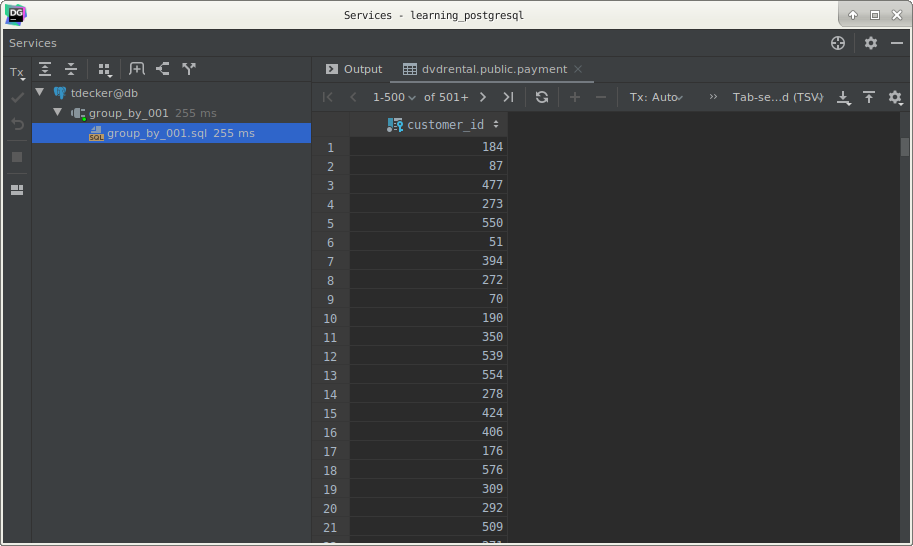
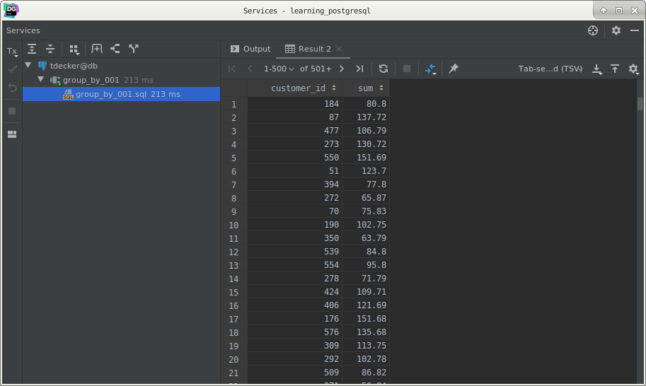
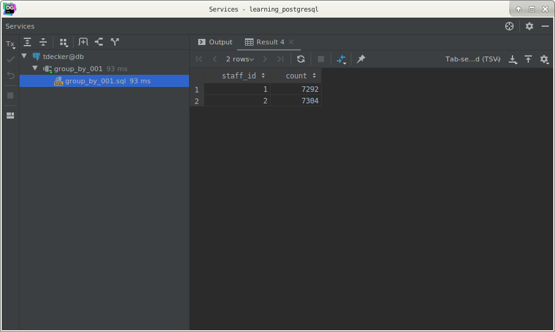

# PostgreSQL `GROUP BY`

## What you will learn

in this tutorial, you will learn how to divide rows into groups by using the PostgreSQL `GROUP BY` clause.

## Introduction to PostgreSQL `GROUP BY` clause

The `GROUP BY` clause divides the rows returned from the `SELECT` statement into groups. 

For each group, you can apply an aggregate function e.g.,  `SUM()` to calculate the sum of items or `COUNT()` to get 
the number of items in the groups.

The following statement illustrates the syntax of the `GROUP BY` clause:

    SELECT
        column_1,
        aggregate_function(column_2)
        FROM
            tbl_name
        GROUP BY
            column_1;

The `GROUP BY` clause must appear right after the `FROM` or `WHERE` clause. 

Followed by the `GROUP BY` clause is one column or a list of comma-separated columns. 

Beside the table column, you can also use an expression with the `GROUP BY` clause.

## PostgreSQL `GROUP BY` clause examples

Let’s take a look at the payment table in the sample database.

### 1) Using PostgreSQL `GROUP BY` without an aggregate function example

You can use the `GROUP BY` clause without applying an aggregate function. 

The following query gets data from the `payment` table and groups the result by customer id.

    SELECT
        customer_id
        FROM
            payment
        GROUP BY
            customer_id;
            

In this case, the `GROUP BY` acts like the `DISTINCT` clause that removes the duplicate rows from the result set.

### 2) Using PostgreSQL `GROUP BY` with `SUM()` function example

The `GROUP BY` clause is useful when it is used in conjunction with an aggregate function. 

For example, to get how much a customer has been paid, you use the `GROUP BY` clause to divide the payments table into 
groups; for each group, you calculate the total amounts of money by using the `SUM()` function as shown in the following 
query:

    SELECT
        customer_id,
        SUM(amount)
        FROM
            payment
        GROUP BY
            customer_id;
            

The `GROUP BY` clause sorts the result set by customer id and adds up the amount that belongs to the same customer. 

Whenever the `customer_id` changes, it adds the row to the returned result set.

You can use the `ORDER BY` clause with `GROUP BY` clause to sort the groups:

    SELECT
        customer_id,
        SUM(amount)
        FROM
            payment
        GROUP BY
            customer_id
        ORDER BY
            SUM(amount) DESC;
            

### 3) Using PostgreSQL `GROUP BY` with `COUNT()` function example

To count the number of transactions each staff has been processing, you group the payments table based on staff id and 
use the `COUNT()` function to get the number of transactions as the following query:

    SELECT
        staff_id,
        COUNT(payment_id)
        FROM
            payment
        GROUP BY
            staff_id;
            

The `GROUP BY` clause sorts the result set by staff id. It keeps a running total of rows, and whenever the staff id 
changes, it adds the row to the returned result set.

To filter groups, you use the `HAVING` clause instead of `WHERE` clause.

## What you have learned

In this tutorial, we have shown you how to use the PostgreSQL `GROUP BY` clause to divide a result set into groups.