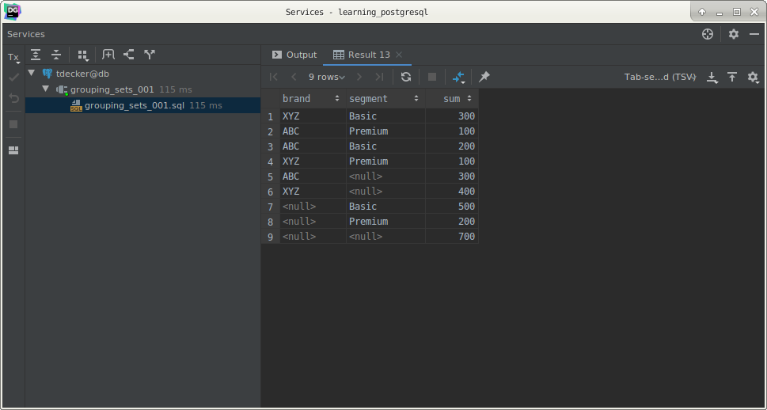

# PostgreSQL `GROUPING SETS`

## What you will learn

in this tutorial, you will learn how to use the PostgreSQL `GROUPING SETS` to generate a result set equivalent to which 
generated by the `UNION ALL` of the multiple `GROUP BY` clauses.

## Setup a sample table

Before we start, let’s create a new table named sales for the demonstration.

    CREATE TABLE sales
    (
        brand    VARCHAR NOT NULL,
        segment  VARCHAR NOT NULL,
        quantity INT     NOT NULL,
        PRIMARY KEY (brand, segment)
    );
    
    INSERT
        INTO
            sales (brand, segment, quantity)
        VALUES
            ('ABC', 'Premium', 100),
            ('ABC', 'Basic', 200),
            ('XYZ', 'Premium', 100),
            ('XYZ', 'Basic', 300);

The content of the `sales` tables:

    SELECT *
        FROM
            sales;

The `sales` table stores the number of products sold by brand and segment.

## Introduction to PostgreSQL `GROUPING SETS`

A grouping set is a set of columns by which you group. 

Typically, a single aggregate query defines a single grouping set.

For example, the following query defines a grouping set of the brand and segment. 

It returns the number of products sold by brand and segment.

    SELECT
        brand,
        segment,
        SUM(quantity)
        FROM
            sales
        GROUP BY
            brand,
            segment;

            
The following query finds the number of product sold by brand. 

It defines a grouping set of the brand:

    SELECT
        brand,
        SUM(quantity)
        FROM
            sales
        GROUP BY
            brand;
            

The following query finds the number of products sold by segment. 

It defines a grouping set of the segment:

    SELECT
        segment,
        SUM(quantity)
        FROM
            sales
        GROUP BY
            segment;
            

The following query finds the number of products sold for all brands and segments. 

It defines an empty grouping set.

    SELECT
        SUM(quantity)
        FROM
            sales;
            

Suppose that instead of four result sets, you wanted to see a unified result set with the aggregated data for all 
grouping sets. 

To achieve this, you use the `UNION ALL` to unify all the queries above.

Because the `UNION ALL` requires all result sets to have the same number of columns with compatible data types, you 
need to adjust the queries by adding `NULL` to the selection list of each as shown below:

    SELECT
        brand,
        segment,
        SUM(quantity)
        FROM
            sales
        GROUP BY
            brand,
            segment
    
    UNION ALL
    
    SELECT
        brand,
        NULL,
        SUM(quantity)
        FROM
            sales
        GROUP BY
            brand
    
    UNION ALL
    
    SELECT
        NULL,
        segment,
        SUM(quantity)
        FROM
            sales
        GROUP BY
            segment
    
    UNION ALL
    
    SELECT
        NULL,
        NULL,
        SUM(quantity)
        FROM
            sales;
            

This query generated a single result set with the aggregates for all grouping sets.

Even though the code works as you expected, it has two main problems. 

First, it is quite lengthy. 

Second, it has a performance issue because PostgreSQL has to scan the sales table separately for each query.

To make it more efficient, PostgreSQL provides the `GROUPING SETS` which is the sub-clause of the `GROUP BY` clause.

The `GROUPING SETS` allows you to define multiple grouping sets in the same query. 

The general syntax of the `GROUPING SETS` is as follows:

    SELECT
        c1,
        c2,
        aggregate_function(c3)
        FROM
            table_name
        GROUP BY
            GROUPING SETS (
            (c1, c2),
            (c1),
            (c2),
            (
            )
            );
            
In this syntax, you have four grouping sets (c1,c2), (c1), (c2), and ().

To apply this syntax to the example above, you can use `GROUPING SETS` instead of `UNION ALL` as shown in the following 
query:

    SELECT
        brand,
        segment,
        SUM(quantity)
        FROM
            sales
        GROUP BY
            GROUPING SETS (
            (brand, segment),
            (brand),
            (segment),
            (
            )
            );
            

This query is much shorter and more readable. 

In addition, PostgreSQL will optimize the number of times it scans the sales table and will not scan it separately for 
each grouping set.

Grouping function

The `GROUPING` function accepts a name of a column and returns bit 0 if the column is the member of the current grouping 
set and 1 otherwise. 

See the following example:

    SELECT
        GROUPING(brand)   grouping_brand,
        GROUPING(segment) grouping_segment,
        brand,
        segment,
        SUM(quantity)
        FROM
            sales
        GROUP BY
            GROUPING SETS (
            (brand, segment),
            (brand),
            (segment),
            (
            )
            )
        ORDER BY
            brand,
        segment;
        

## What you have learned

In this tutorial, you have learned how to use the PostgreSQL `GROUPING SETS` to generate multiple grouping sets.