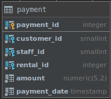
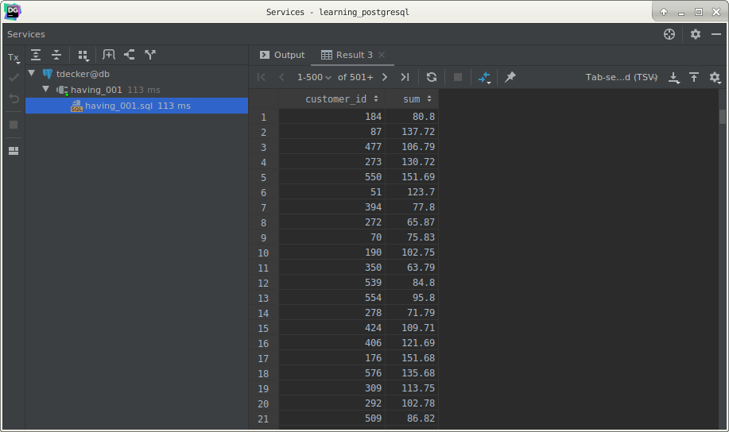
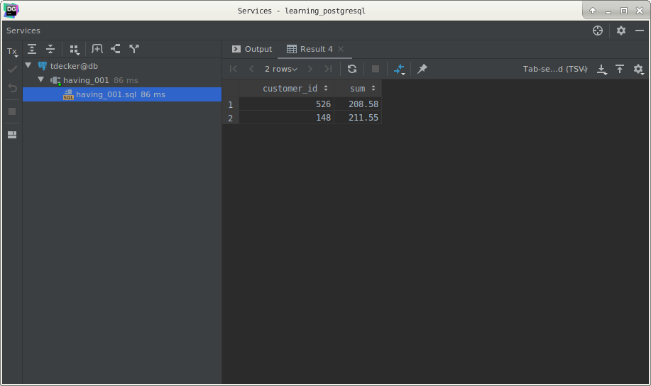
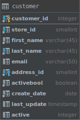
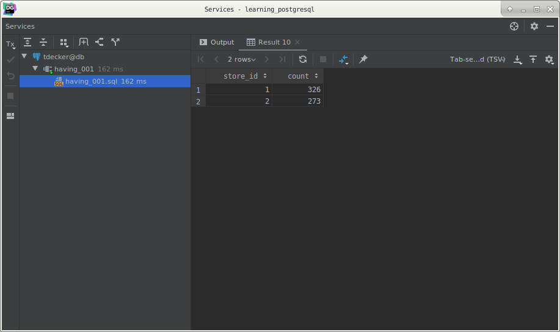

# PostgreSQL `HAVING` clause

## What you will learn

in this tutorial, you will learn how to use the PostgreSQL `HAVING` clause to eliminate groups of rows that do not 
satisfy a specified condition.

## Introduction to PostgreSQL `HAVING` clause

We often use the `HAVING` clause in conjunction with the `GROUP BY` clause to filter group rows that do not satisfy a 
specified condition.

The following statement illustrates the typical syntax of the `HAVING` clause:

    SELECT
        column_1,
        aggregate_function(column_2)
        FROM
            tbl_name
        GROUP BY
            column_1
        HAVING
            condition;

The `HAVING` clause sets the condition for group rows created by the `GROUP BY` clause after the `GROUP BY` clause 
applies while the `WHERE` clause sets the condition for individual rows before `GROUP BY` clause applies. 

This is the main difference between the `HAVING` and `WHERE` clauses.

In PostgreSQL, you can use the `HAVING` clause without the `GROUP BY` clause. 

In this case, the `HAVING` clause will turn the query into a single group. 

In addition, the `SELECT` list and `HAVING` clause can only refer to columns from within aggregate functions. 

This kind of query returns a single row if the condition in the `HAVING` clause is true or zero row if it is false.

## PostgreSQL `HAVING` clause examples

Let’s take a look at the `payment` table in the sample database.

PostgreSQL `HAVING` clause with `SUM` function example.

The following query gets the total amount of each customer by using the `GROUP BY` clause:

    SELECT
        customer_id,
        SUM(amount)
        FROM
            payment
        GROUP BY
            customer_id;
            

You can apply the `HAVING` clause to selects the only customer who has been spending more than 200 as the following 
query:

    SELECT
        customer_id,
        SUM(amount)
        FROM
            payment
        GROUP BY
            customer_id
        HAVING
            SUM(amount) > 200;
            

You can also apply a ORDER BY clause to your query to sort the groups by descending amounts:

    SELECT
        customer_id,
        SUM(amount) AS amount
        FROM
            payment
        GROUP BY
            customer_id
        HAVING
            SUM(amount) > 200
        ORDER BY
            amount DESC;
            

## PostgreSQL `HAVING` clause with `COUNT` example

Let’s take a look at the customer table.

The following query returns the number of customers per store:

    SELECT
        store_id,
        COUNT(customer_id)
        FROM
            customer
        GROUP BY
            store_id
            

You can use the `HAVING` clause to select store that has more than 300 customers:

    SELECT
        store_id,
        COUNT(customer_id)
        FROM
            customer
        GROUP BY
            store_id
        HAVING
            COUNT(customer_id) > 300;
            

## What you have learned

In this tutorial, we have shown you how to use the PostgreSQL `HAVING` clause to filter groups of rows based on a 
specified condition.