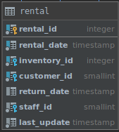
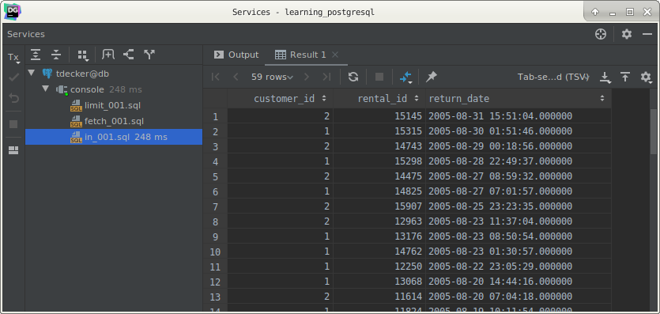
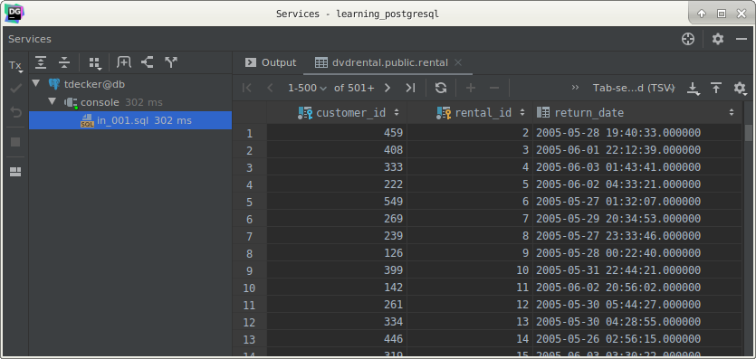
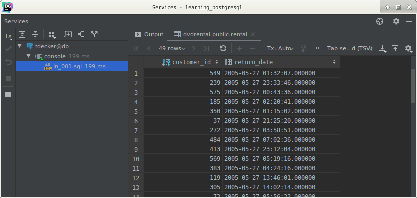
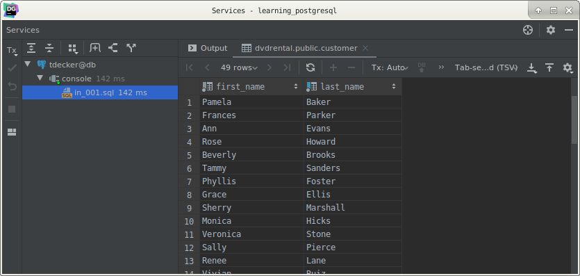

# PostgreSQL `IN` clause

## What you will learn

in this tutorial, you will learn how to use PostgreSQL `IN` operator in the WHERE clause to check against a list of 
values.

## PostgreSQL IN operator syntax

You use the `IN` operator in the `WHERE` clause to check if a value matches any value in a list of values. 

The syntax of the `IN` operator is as follows:

    value IN (value1,value2,...)
    
The expression returns true if the value matches any value in the list i.e., value1 and value2. 

The list of values can be a list of numbers or strings or the result set of a `SELECT` statement as shown in the 
following query:

    value IN (SELECT value FROM tbl_name);
    
The statement inside the parentheses is called a subquery which is a query nested inside another query.

## PostgreSQL `IN` operator examples

For these examples, we will user the rental table.

Suppose you want to know the `rental` information of customer id 1 and 2, you can use the IN operator in the `WHERE` 
clause as follows:

    SELECT
        customer_id,
        rental_id,
        return_date
        FROM
            rental
        WHERE
            customer_id IN (1, 2)
        ORDER BY
            return_date DESC;
            

You can use the equal (`=`) and `OR` operators to rewrite the query above as follows:

    SELECT
        rental_id,
        customer_id,
        return_date
        FROM
            rental
        WHERE
             customer_id = 1
          OR customer_id = 2
        ORDER BY
            return_date DESC;
            
The query that uses the `IN` operator is shorter and more readable than the query that uses equal (`=`) and `OR` 
operators. 

In addition, PostgreSQL executes the query with the `IN` operator much faster than the same query that uses a list of 
`OR` operators.

PostgreSQL NOT IN operator

You can combine the `IN` operator with the `NOT` operator to select rows whose values do not match the values in the 
list. 

The following statement find all rentals with the customer id is not 1 or 2.

    SELECT
        customer_id,
        rental_id,
        return_date
        FROM
            rental
        WHERE
            customer_id NOT IN (1, 2);
            

You can also rewrite the `NOT IN` operator by using the not equal (`<>`) and the `AND` operators as follows:

    SELECT
        customer_id,
        rental_id,
        return_date
        FROM
            rental
        WHERE
              customer_id <> 1
          AND customer_id <> 2;
          
## PostgreSQL `IN` with a sub-query

The following query returns a list of customer id of customers that has rental’s return date on 2005-05-27:

    SELECT
        customer_id
        FROM
            rental
        WHERE
            CAST(return_date AS DATE) = '2005-05-27';
            

You can use the list of customer id as the input for the `IN` operator as follows:

    SELECT
        first_name,
        last_name
        FROM
            customer
        WHERE
                customer_id IN (
                SELECT
                    customer_id
                    FROM
                        rental
                    WHERE
                        CAST(return_date AS DATE) = '2005-05-27'
            );
            

For more information on the subquery, check it out the [sub-query tutorial](postgresql_subquery.md).

## What you have learned

 In this tutorial, we have shown you how to use the PostgreSQL `IN` operator to match against a list of values.