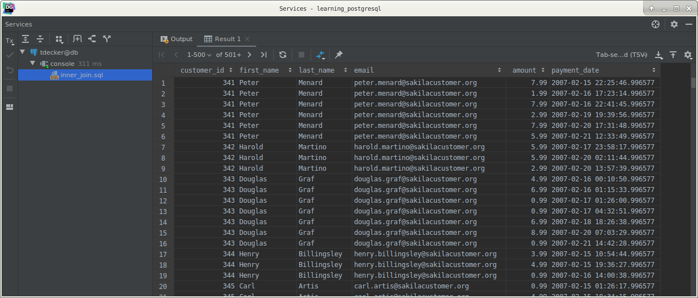
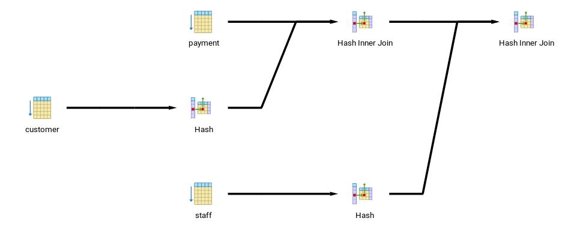

# PostgreSQL `INNER JOIN` clause

## What you will learn

in this tutorial, you will learn how to select data from multiple tables by using the PostgreSQL `INNER JOIN` clause.

## Introduction to PostgreSQL `INNER JOIN` clause

So far, you have learned how to select data from a table, choosing which columns and rows you want, and how to sort the 
result set in a particular order.

It is time to move to one of the most important concepts in the database called joining that allows you to relate data 
in one table to the data in other tables. 

There are several kinds of joins that include `INNER JOIN`, `OUTER JOIN` and self-join. 

This tutorial focuses on the `INNER JOIN`.

Suppose you want to get data from two tables named `A` and `B`. 

The `B` table has the `fka` field that relates to the primary key of the `A` table.

To get data from both tables, you use the `INNER JOIN` clause in the `SELECT` statement as follows:

    SELECT
        A.pka,
        A.c1,
        B.pkb,
        B.c2
        FROM
            A
                INNER JOIN B ON A.pka = B.fka;
                
To join A table to B table:

- First, you specify the column in both tables from which you want to select data in the `SELECT` clause
- Second, you specify the main table i.e., `A` in the `FROM` clause.
- Third, you specify the table that the main table joins to i.e., `B` in the `INNER JOIN` clause. In addition, you put 
a join condition after the `ON` keyword i.e, `A.pka = B.fka`.

For each row in the `A` table, PostgreSQL scans the `B` table to check if there is any row that matches the condition 
i.e., `A.pka = B.fka`. If it finds a match, it combines columns of both rows into one row and add the combined row to 
the returned result set.

The primary key column (`pka`) and foreign key column (`fka`) are typically indexed; therefore, PostgreSQL only has to 
check for the match in the indexes, which is very fast.

Sometimes, `A` and `B` tables have the same column name so we have to refer to the column as `table_name.column_name` 
to avoid ambiguity. 

In case the name of the table is long, you can use a table alias e.g., `tbl` and refer to the column as 
`tbl.column_name`.

The following Venn Diagram illustrates how PostgreSQL `INNER JOIN` clause works.

The `INNER JOIN` clause returns rows in `A` table that have the corresponding rows in the `B` table.

## PostgreSQL `INNER JOIN` examples

PostgreSQL INNER JOIN to join 2 tables example

Let’s take a look at the `customer` and `payment` tables in the sample database.

Each customer may have zero or many payments. 

Each payment belongs to one and only one customer. 

The `customer_id` field establishes the link between two tables.

You can use the `INNER JOIN` clause to join the customer table to payment table as follows:

    SELECT
        customer.customer_id,
        first_name,
        last_name,
        email,
        amount,
        payment_date
        FROM
            customer
                INNER JOIN payment ON payment.customer_id = customer.customer_id;
                

You can add the `ORDER BY` clause to sort the result set by customer id as follows:

    SELECT
        customer.customer_id,
        first_name,
        last_name,
        email,
        amount,
        payment_date
        FROM
            customer
                INNER JOIN payment ON payment.customer_id = customer.customer_id
        ORDER BY
            customer.customer_id;
            

You can also use a `WHERE` clause to filter customer. 

The following query returns customer’s rental data for the customer id 2:

    SELECT
        customer.customer_id,
        first_name,
        last_name,
        email,
        amount,
        payment_date
        FROM
            customer
                INNER JOIN payment ON payment.customer_id = customer.customer_id
        WHERE
            customer.customer_id = 2;
            

## PostgreSQL `INNER JOIN` to join 3 tables example

The following diagram illustrates the relationship between three tables: `staff`, `payment`, and `customer`.

- Each staff relates to zero or many payments. Each payment is processed by one and only one staff.
- Each customer has zero or many payments. Each payment belongs to one and only customer.

To join the three tables, you place the second `INNER JOIN` clause after the first `INNER JOIN` clause as the following 
query:

    SELECT
        customer.customer_id,
        customer.first_name customer_first_name,
        customer.last_name  customer_last_name,
        customer.email,
        staff.first_name    staff_first_name,
        staff.last_name     staff_last_name,
        amount,
        payment_date
        FROM
            customer
                INNER JOIN payment ON payment.customer_id = customer.customer_id
                INNER JOIN staff ON payment.staff_id = staff.staff_id;
                

>As show below, INNER JOIN can be shortened to JOIN, saving typing but loosing readability.

    SELECT
        customer.customer_id,
        customer.first_name customer_first_name,
        customer.last_name  customer_last_name,
        customer.email,
        staff.first_name    staff_first_name,
        staff.last_name     staff_last_name,
        amount,
        payment_date
        FROM
            customer
                JOIN payment ON payment.customer_id = customer.customer_id
                JOIN staff ON payment.staff_id = staff.staff_id;
                
>If joining columns have the same name, the following syntax is also equivalent:

    SELECT
        customer.customer_id,
        customer.first_name customer_first_name,
        customer.last_name  customer_last_name,
        customer.email,
        staff.first_name    staff_first_name,
        staff.last_name     staff_last_name,
        amount,
        payment_date
        FROM
            customer
                JOIN payment USING (customer_id)
                JOIN staff USING (staff_id);
                
>The following syntax is an alternative one (using the `WHERE` clause)

    SELECT
        customer.customer_id,
        customer.first_name customer_first_name,
        customer.last_name  customer_last_name,
        customer.email,
        staff.first_name    staff_first_name,
        staff.last_name     staff_last_name,
        amount,
        payment_date
        FROM
            customer,
            payment,
            staff
        WHERE
              payment.customer_id = customer.customer_id
          AND payment.staff_id = staff.staff_id;
          
For all these queries, the PgAdmin4 frontend gives you this explain(anation):

DataGrip gives you this alternate view:

- Firstly, the query engine inner joins `customer` table with `payment` table

- Secondly, the resulting set of rows in joined with `staff` table.

To join more than three tables, you apply the same technique.

## What you have learned

In this tutorial, we have shown you how to select data from multiple tables by joining one table to other tables using 
PostgreSQL `INNER JOIN` clause.