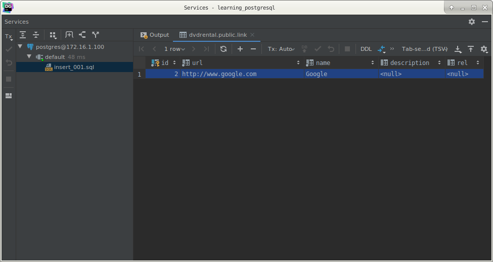
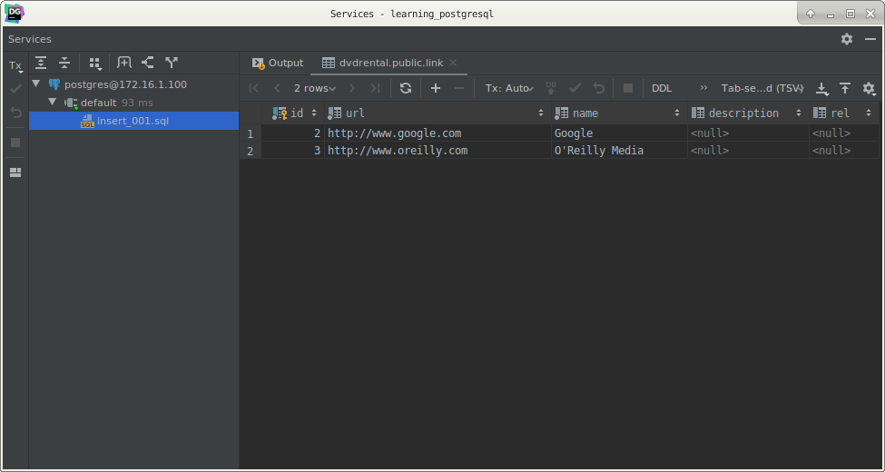
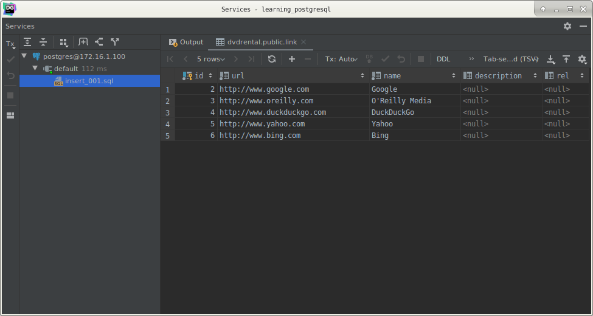
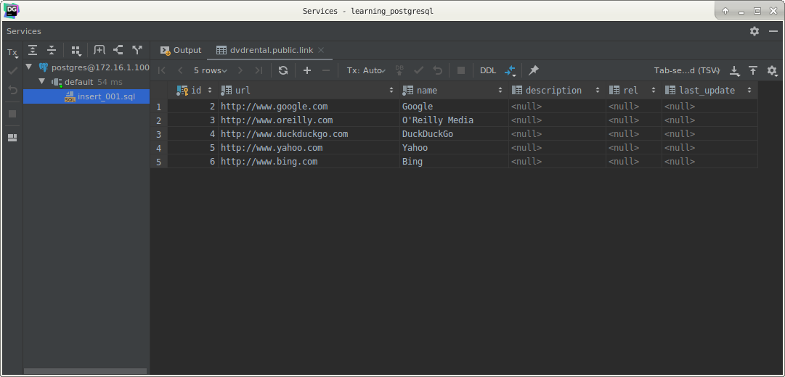
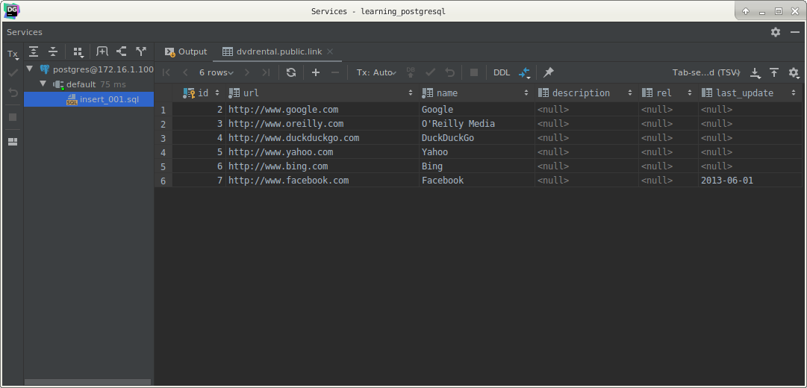
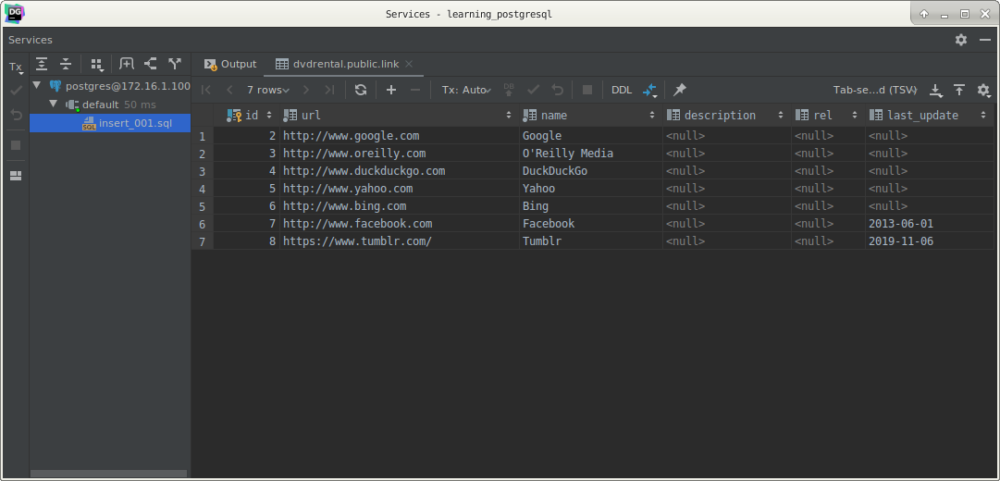
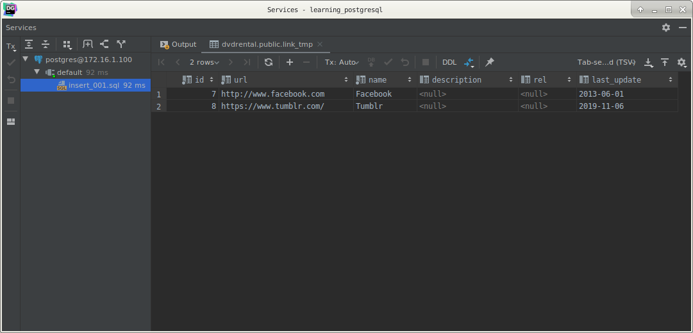
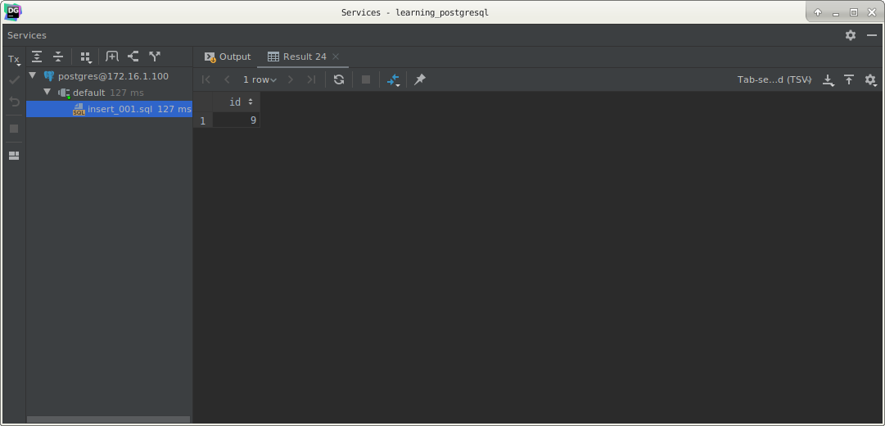
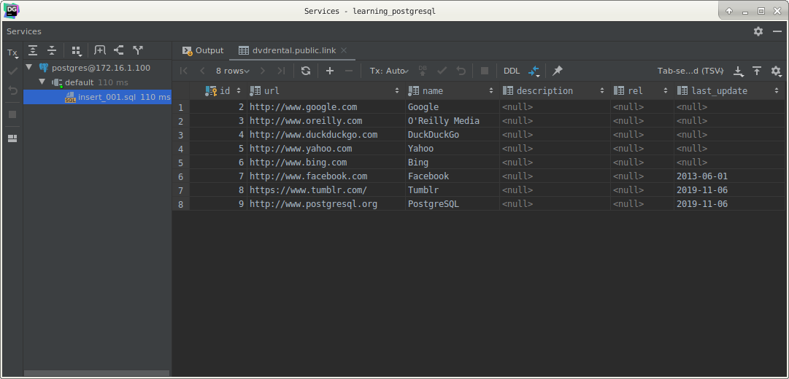

# PostgreSQL `INSERT` statement

## What you will learn

in this tutorial, you will learn how to insert new rows into a table using the PostgreSQL `INSERT` statement.

When you create a new table, it does not have any data. The first thing you often do is to insert new rows into the 
table. 

PostgreSQL provides the `INSERT` statement that allows you to insert one or more rows into a table at a time.

## PostgreSQL `INSERT` syntax

The following illustrates the syntax of the `INSERT` statement:

    INSERT
        INTO
            table(column1, column2, …)
        VALUES
            (value1, value2, …);
            
First, you specify the name of the table that you want to insert a new row after the `INSERT INTO` clause, followed by 
a comma-separated column list.

Second, you list a comma-separated value list after the `VALUES` clause. 

The value list must be in the same order as the columns list specified after the table name.

To add multiple rows into a table at a time, you use the following syntax:

    INSERT
        INTO
            table (column1, column2, …)
        VALUES
            (value1, value2, …),
            (value1, value2, …), ...;
            
You just need to add additional comma-separated value lists after the first list, each value in the list is separated 
by a comma (,).

To insert data that comes from another table, you use the `INSERT INTO SELECT` statement as follows:

    INSERT
        INTO
            table(column1, column2, ...)
    SELECT
        column1,
        column2, ...
        FROM another_table
        WHERE
            condition;
            
The `WHERE` clause is used to filter rows that allow you to insert partial data from the `another_table` into the `table`.

## PostgreSQL `INSERT` examples

Let’s create a new table named link for the demonstration.

    CREATE TABLE link
    (
        ID          serial PRIMARY KEY,
        url         VARCHAR(255) NOT NULL,
        name        VARCHAR(255) NOT NULL,
        description VARCHAR(255),
        rel         VARCHAR(50)
    );

>You will learn how to create a new table in the later tutorial, just execute the statement for now.

## PostgreSQL insert one-row examples

The following statement inserts a new row into the `link` table:

    INSERT
        INTO
            link (url, name)
        VALUES
            ('http://www.postgresqltutorial.com', 'PostgreSQL Tutorial');

To insert character data, you must enclose it in single quotes (‘) for example 'PostgreSQL Tutorial'. 

For the numeric data type, you don’t need to do so, just use plain numbers such as 1, 2, 3.

If you omit any column that accepts the `NULL` value in the `INSERT` statement, the column will take its default value. 

In case the default value is not set for the column, the column will take the `NULL` value.

PostgreSQL provides a value for the serial column automatically so you do not and should not insert a value into the 
serial column.

You can verify the inserted row by using the `SELECT` statement:

    SELECT *
        FROM
            link;
            

If you want to insert a string that contains a single quote character such as O'Reilly Media, you have to use a single 
quote (‘) escape character as shown in the following query:

    INSERT
        INTO
            link (url, name)
        VALUES
            ('http://www.oreilly.com', 'O''Reilly Media');
            

## PostgreSQL insert multiple rows example

The following statement inserts multiple rows into the link table at a time:

    INSERT
        INTO
            link (url, name)
        VALUES
            ('http://www.duckduckgo.com', 'DuckDuckGo'),
            ('http://www.yahoo.com', 'Yahoo'),
            ('http://www.bing.com', 'Bing');
            

## PostgreSQL insert date example

Let’s add a new column named `last_update` into the `link` table and set its default value to `CURRENT_DATE`.

    ALTER TABLE link
        ADD COLUMN last_update DATE;
    
    ALTER TABLE link
        ALTER COLUMN last_update
            SET DEFAULT CURRENT_DATE;
            
    ALTER TABLE link
        ADD COLUMN last_update DATE;
    
    ALTER TABLE link
        ALTER COLUMN last_update
            SET DEFAULT CURRENT_DATE;

            
The following statement inserts a new row with specified date into the `link` table. The date format is `YYYY-MM-DD`.

    INSERT
        INTO
            link (url, name, last_update)
        VALUES
            ('http://www.facebook.com', 'Facebook', '2013-06-01');
            

You can also use the `DEFAULT` keyword to set the default value for the date column or any column that has a default 
value.

    INSERT
        INTO
            link (url, name, last_update)
        VALUES
            ('https://www.tumblr.com/', 'Tumblr', DEFAULT);
            

## PostgreSQL insert data from another table example

First, create another table named link_tmp that has the same structure as the link table:

    CREATE TABLE link_tmp
    (
        LIKE link
    );
    
Second, insert rows from the link table whose values of the date column are not `NULL`:

    INSERT
        INTO
            link_tmp
    SELECT *
        FROM
            link
        WHERE
            last_update IS NOT NULL;
            
Third, verify the insert operation by querying data from the link_tmp table:

    SELECT *
        FROM
            link_tmp;
            

## Get the last inserted id

To get the last inserted id from the table after inserting a new row, you use the `RETURNING` clause in the `INSERT` 
statement. 

>This is a PostgreSQL extension to SQL.

The following statement inserts a new row into the linkt able and returns the last inserted id:

    INSERT
        INTO
            link (url, NAME, last_update)
        VALUES
            ('http://www.postgresql.org', 'PostgreSQL', DEFAULT)
        RETURNING id;
        

The id matches with the last insert id in the link table:

## What you have learned

In this tutorial, you have learned how to use the PostgreSQL `INSERT` statement to insert new rows into a table.