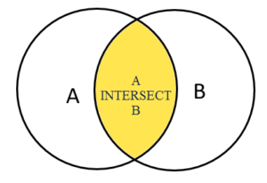
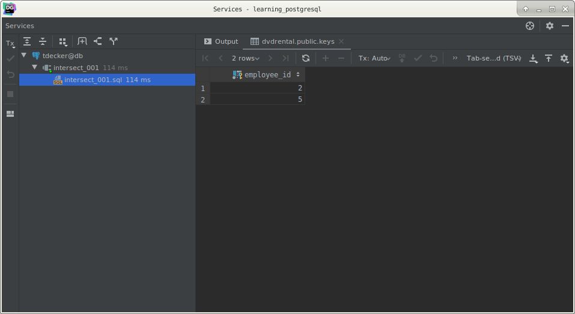

# PostgreSQL `INTERSECT` operator

## What you will learn

in this tutorial, you will learn how to use the PostgreSQL `INTERSECT` operators to combine two or more `SELECT` 
statements to form a single result set.

## Introduction to PostgreSQL `INTERSECT` operator

Like the `UNION` and `EXCEPT` operators, the PostgreSQL `INTERSECT` operator combines the result sets of two or more 
`SELECT` statements into a single result set. 

The `INTERSECT` operator returns any rows that are available in both result set or returned by both queries.

The following illustration shows the final result set produced by the `INTERSECT` operator. 

The final result set is represented by the yellow area where the circle A intersects with the circle B.

The following illustrates the syntax of the `INTERSECT` operator:

    SELECT
        column_list
        FROM
            A
    INTERSECT
    SELECT
        column_list
        FROM
            B;
            
To use the `INTERSECT` operator, the columns that appear in the `SELECT` statements must follow the rules below:

- The number of columns and their order in the `SELECT` clauses must the be the same.
- The data types of the columns must be compatible.

## PostgreSQL `INTERSECT` operator example

Let’s create some tables for the demonstration.

The following `CREATE TABLE` statement creates three tables: employees , keys, and  hipos.

    CREATE TABLE employees
    (
        employee_id   serial PRIMARY KEY,
        employee_name VARCHAR(255) NOT NULL
    );
    
    CREATE TABLE keys
    (
        employee_id    INT PRIMARY KEY,
        effective_date DATE NOT NULL,
        FOREIGN KEY (employee_id) REFERENCES employees (employee_id)
    );
    
    CREATE TABLE hipos
    (
        employee_id    INT PRIMARY KEY,
        effective_date DATE NOT NULL,
        FOREIGN KEY (employee_id) REFERENCES employees (employee_id)
    );
    
The `employees` table stores the employee master data. 

The `keys` table stores the key employees and the `hipos` table stores the employees who are high potential and high 
impact.

The following `INSERT` statements insert some sample data into the employees, keys, and  hipos tables:

    INSERT
        INTO
            employees (employee_name)
        VALUES
            ('Joyce Edwards'),
            ('Diane Collins'),
            ('Alice Stewart'),
            ('Julie Sanchez'),
            ('Heather Morris'),
            ('Teresa Rogers'),
            ('Doris Reed'),
            ('Gloria Cook'),
            ('Evelyn Morgan'),
            ('Jean Bell');
    
    INSERT
        INTO
            keys
        VALUES
            (1, '2000-02-01'),
            (2, '2001-06-01'),
            (5, '2002-01-01'),
            (7, '2005-06-01');
    
    INSERT
        INTO
            hipos
        VALUES
            (9, '2000-01-01'),
            (2, '2002-06-01'),
            (5, '2006-06-01'),
            (10, '2005-06-01');
            
The following statement returns the key employees from the `keys` table.

    SELECT
        employee_id
        FROM
            keys;
            

The following statement returns a list of `employee_id` from the `hipos` table.

    SELECT
        employee_id
        FROM
            hipos;
            

To get the employees who are both keys, and high potential and high impact.

    SELECT
        employee_id
        FROM
            keys
    INTERSECT
    SELECT
        employee_id
        FROM
            hipos;
            

The result set shows that the employee id 2 and 5 are the are key, high potential, and high impact employees.

To sort the result set returned by the `INTERSECT` operator, you place the `ORDER BY` clause at the end of the 
statement, not at the end of each `SELECT` statement.

See the following query:

    SELECT
        employee_id
        FROM
            keys
    INTERSECT
    SELECT
        employee_id
        FROM
            hipos
    ORDER BY
        employee_id;
        

## What you have learned

In this tutorial, we have shown you how to use the PostgreSQL `INTERSECT` operator to combine multiple result sets and 
return the rows that appear in both result sets.