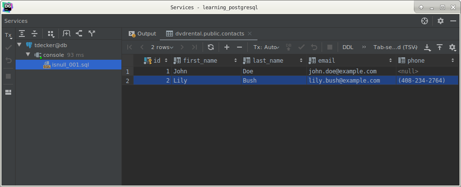
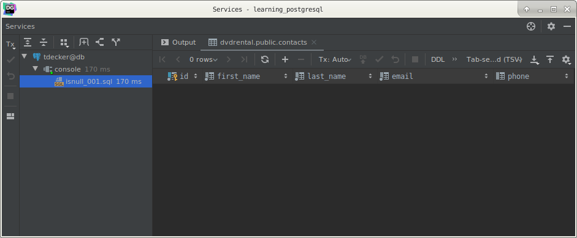
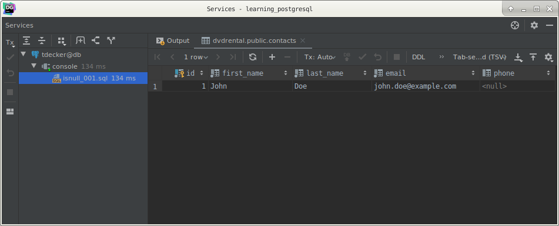
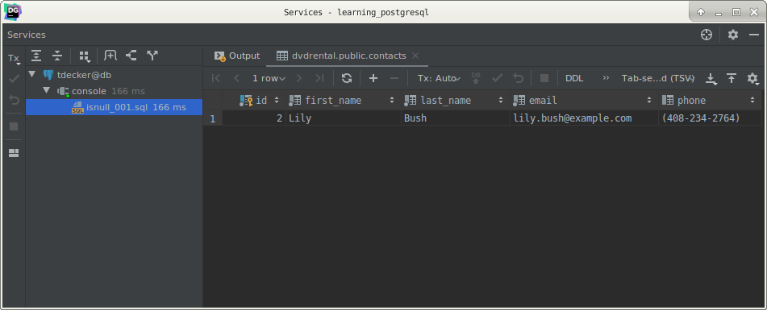

# PostgreSQL `IS NULL` clause

## What you will learn

in this tutorial, you will learn how to use the PostgreSQL `IS NULL` operator to check if a value is NULL or not.

## Introduction to `NULL` and `IS NULL` operator

In the database world, NULL means missing or not applicable information.

For example, if you have a contacts table that stores the first name, last name, email, and phone number of contacts. 

At the time of recording a contact, you may not know his or her phone number. 

To deal with this, you define the phone column as a nullable column and insert NULL into the phone column when you 
record the contact information.

    CREATE TABLE contacts
    (
        id         INT GENERATED BY DEFAULT AS IDENTITY,
        first_name VARCHAR(50)  NOT NULL,
        last_name  VARCHAR(50)  NOT NULL,
        email      VARCHAR(255) NOT NULL,
        phone      VARCHAR(15),
        PRIMARY KEY (id)
    );

Note that you will learn how to [create a new table](postgresql_create_table.md) in the subsequent tutorial. 

For now, you just need to execute the above statement to create the contacts table.

The following statement [inserts](postgresql_insert.md) two contacts, one has a phone number and one does not:

    INSERT
        INTO
            contacts(first_name, last_name, email, phone)
        VALUES
            ('John', 'Doe', 'john.doe@example.com', NULL),
            ('Lily', 'Bush', 'lily.bush@example.com', '(408-234-2764)');

            
To find the contact who does not have a phone number you may come up with the following statement:

    SELECT
        id,
        first_name,
        last_name,
        email,
        phone
        FROM
            contacts
        WHERE
            phone = NULL;

            
The statement returns no row. 

This is because the expression phone = NULL in the `WHERE` clause always returns false.

Even though there is a NULL in the phone column, the expression NULL = NULL returns false. 

This is because NULL is not equal to any value even itself.

To check whether a value is NULL or not, you use the `IS NULL` operator instead:

    value IS NULL

The expression returns true if the value is NULL or false if it is not.

So to get the contact who does not have any phone number stored in the phone column, you use the following statement 
instead:

    SELECT
        id,
        first_name,
        last_name,
        email,
        phone
        FROM
            contacts
        WHERE
            phone IS NULL;
            
Here is the output:

## PostgreSQL `IS NOT NULL` operator

To check if a value is not NULL, you use the `IS NOT NULL` operator:

    value IS NOT NULL
    
The expression returns true if the value is not NULL or false if the value is NULL.

For example, to find the contact who does have a phone number, you use the following statement:

    SELECT
        id,
        first_name,
        last_name,
        email,
        phone
        FROM
            contacts
        WHERE
            phone IS NOT NULL;
            
The output is:

## What you have learned

In this tutorial, you have learned how to use the PostgreSQL `IS NULL` and `IS NOT NULL` operator to check whether a 
value is NULL or not.