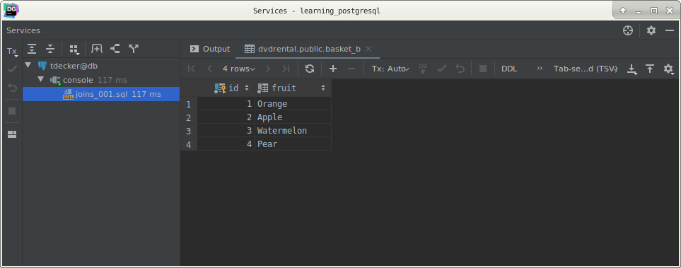
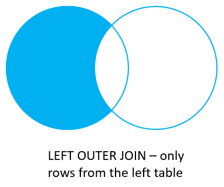
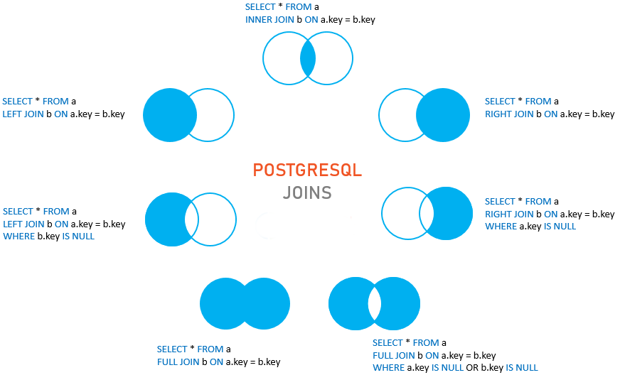

# PostgreSQL joins

## What you will learn

in this tutorial, you will learn about various kinds of PostgreSQL joins including inner join, left join, right join 
and full outer join.

PostgreSQL join is used to combine columns from one (self-join) or more tables based on the values of the common 
columns between the tables. 

The common columns are typically the primary key columns of the first table and foreign key columns of the second table.

PostgreSQL supports inner join, left join, right join, full outer join, cross join, natural join, and a special kind of 
join called self-join.

## Setting up sample tables

Suppose we have two tables called basket_a and basket_b that stores fruits:

    CREATE TABLE basket_a
    (
        id    INT PRIMARY KEY,
        fruit VARCHAR(100) NOT NULL
    );
    
    CREATE TABLE basket_b
    (
        id    INT PRIMARY KEY,
        fruit VARCHAR(100) NOT NULL
    );
    
    INSERT
        INTO
            basket_a (id, fruit)
        VALUES
            (1, 'Apple'),
            (2, 'Orange'),
            (3, 'Banana'),
            (4, 'Cucumber');
    
    INSERT
        INTO
            basket_b (id, fruit)
        VALUES
            (1, 'Orange'),
            (2, 'Apple'),
            (3, 'Watermelon'),
            (4, 'Pear');
            
The tables have some common fruits such as apple and orange. 

Left table (basket_a):

Right table (basket_b):

Let’s call the `basket_a` is the left table and `basket_b` is the right table.

## PostgreSQL inner join

The following statement joins the left table with the right table using the values in the `fruit` column:

    SELECT
        a.id    AS id_a,
        a.fruit AS fruit_a,
        b.id    AS id_b,
        b.fruit AS fruit_b
        FROM
            basket_a AS a
                INNER JOIN basket_b AS b ON a.fruit = b.fruit;
                

As you can see clearly from the result, the inner join returns a result set that contains row in the left table that 
match with the row in the right table.

The following Venn diagram illustrates the inner join:

## PostgreSQL left join

The following statement joins the left table with the right table using left join (or left outer join):

    SELECT
        a.id    id_a,
        a.fruit fruit_a,
        b.id    id_b,
        b.fruit fruit_b
        FROM
            basket_a a
                LEFT JOIN basket_b b ON a.fruit = b.fruit;
                

The left join returns a complete set of rows from the left table with the matching rows if available from the right 
table. 

If there is no match, the right side will have null values.

The following Venn diagram illustrates the left join:

To get the only rows from the left table but not in the right table, you use the left join then exclude the rows that 
you want from the right table using the `WHERE` clause:

    SELECT
        a.id    id_a,
        a.fruit fruit_a,
        b.id    id_b,
        b.fruit fruit_b
        FROM
            basket_a a
                LEFT JOIN basket_b b ON a.fruit = b.fruit
        WHERE
            b.id IS NULL;
            

The following Venn diagram illustrates the left join with only rows from the left table:

## PostgreSQL right join

The right join or right outer join is a reversed version of the left join. 

It produces a result set that contains all rows from the right table with matching rows from the left table. 

If there is no match, the left side will contain null values.

The following statement performs the right join between the left and the right tables:

    SELECT
        a.id    id_a,
        a.fruit fruit_a,
        b.id    id_b,
        b.fruit fruit_b
        FROM
            basket_a a
                RIGHT JOIN basket_b b ON a.fruit = b.fruit;
                
Here is the output:

The following Venn diagram illustrates the right join:

Similarly, you can get only rows from the right table but not from the left table by adding a `WHERE` clause as follows:

    SELECT
        a.id    id_a,
        a.fruit fruit_a,
        b.id    id_b,
        b.fruit fruit_b
        FROM
            basket_a a
                RIGHT JOIN basket_b b ON a.fruit = b.fruit
        WHERE
            a.id IS NULL;
            

The following Venn diagram illustrates the right join with only rows from the right table:

## PostgreSQL full outer join

The full outer join or full join produces a result set that contains all rows from both the left and right tables, with 
the matching rows from both sides where available. 

If there is no match, the missing side contains null values.

The following statement illustrates the full outer join:

    SELECT
        a.id    id_a,
        a.fruit fruit_a,
        b.id    id_b,
        b.fruit fruit_b
        FROM
            basket_a a
                FULL OUTER JOIN basket_b b ON a.fruit = b.fruit;
                
>Note that the OUTER keyword is optional.

Here is the result set:

The following Venn diagram illustrates the full outer join:

To return a set of rows unique to the left and right tales, you perform the same full join first and then exclude the 
rows that you don’t want from both sides using a `WHERE` clause:

    SELECT
        a.id    id_a,
        a.fruit fruit_a,
        b.id    id_b,
        b.fruit fruit_b
        FROM
            basket_a a
                FULL JOIN basket_b b ON a.fruit = b.fruit
        WHERE
             a.id IS NULL
          OR b.id IS NULL;
          
Here is the result:

The following Venn diagram illustrates the full outer join with only rows from both tables:

The following picture shows all the PostgreSQL joins that we discussed above with detailed syntax:

## What you have learned

In this tutorial, you have learned how to use various kinds of PostgreSQL joins to query data from multiple tables.