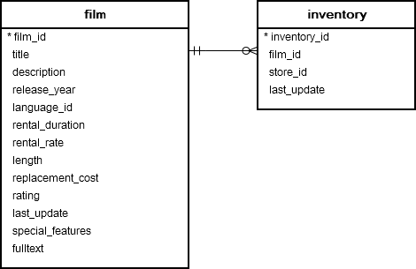
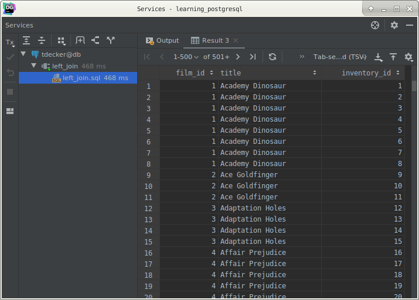
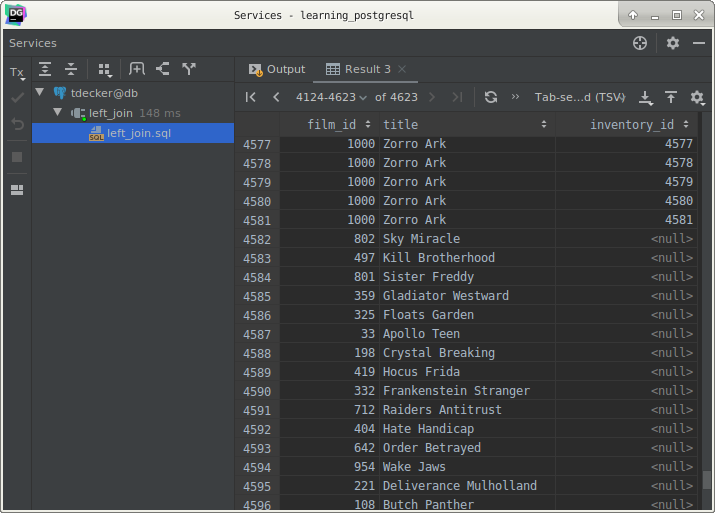
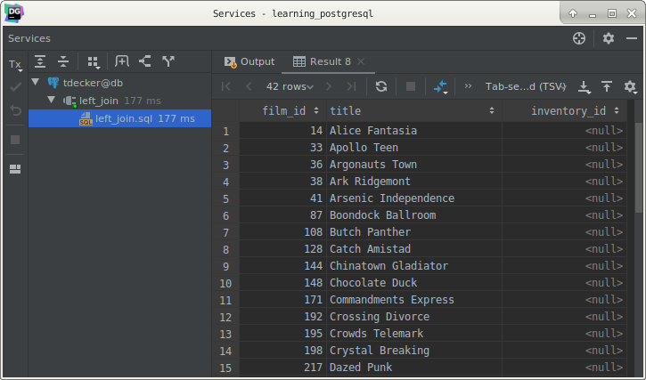
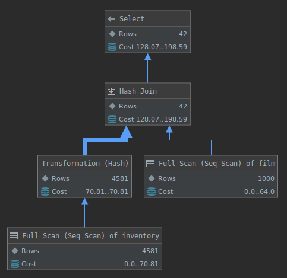

# PostgreSQL `LEFT JOIN` clause

## What you will learn

in this tutorial, you will learn how to use PostgreSQL `LEFT JOIN` clause to select data from multiple tables.

Suppose we have two tables: `A` and `B`.

The data in the `B` table relates to the data in the `A` table via the `fka` field.

Each row in the `A` table may have zero or many corresponding rows in the `B` table. 

Each row in the `B` table has one and only one corresponding row in the `A` table.

If you want to select rows from the A table that have corresponding rows in the B table, you use the INNER JOIN clause.

If you want to select rows from the A table which may or may not have corresponding rows in the B table, you use the 
`LEFT JOIN` clause. 

In case, there is no matching row in the `B` table, the values of the columns in the `B` table are substituted by the 
`NULL` values.

The following statement illustrates the `LEFT JOIN` syntax that join `A` table to `B` table:

    SELECT
        A.pka,
        A.c1,
        B.pkb,
        B.c2
        FROM
            A
                LEFT JOIN B ON A.pka = B.fka;
                
To join the `A` table to the `B` table, you need to:

- Specify the columns from which you want to select data in the `SELECT` clause.
- Specify the left table i.e., `A` table where you want to get all rows, in the `FROM` clause.
- Specify the right table i.e., `B` table in the `LEFT JOIN` clause. In addition, specify the condition for joining two 
tables.

The `LEFT JOIN` clause returns all rows in the left table (`A`) that are combined with rows in the right table (`B`) 
even though there is no corresponding rows in the right table (`B`).

The `LEFT JOIN` is also referred as `LEFT OUTER JOIN`.

The following Venn diagram illustrates how the `LEFT JOIN` clause works. 

The intersection is the rows in the `A` table that have corresponding rows in the `B` table.

## PostgreSQL `LEFT JOIN` examples

Let’s take a look at the following ER diagram, which is a part of the DVD rental sample database.

Each row in the `film` table may have zero or many rows in the `inventory` table. 

Each row in the `inventory` table has one and only one row in the `film` table.

You use the `LEFT JOIN` clause to join `film` table to the `inventory` table as follows:

    SELECT
        film.film_id,
        film.title,
        inventory_id
        FROM
            film
                LEFT JOIN inventory ON inventory.film_id = film.film_id;
                

Because some rows in the `film` table do not have corresponding rows in the `inventory` table, the values of the 
inventory id are `NULL`.

You can add a `WHERE` clause to select only `films` that are not in the `inventory` as the following query:

    SELECT
        film.film_id,
        film.title,
        inventory_id
        FROM
            film
                LEFT JOIN inventory ON inventory.film_id = film.film_id
        WHERE
            inventory.film_id IS NULL;
            

This technique is useful when you want to select data in one table that does not have a match in another table.

Explained query:

## What ou have learned

In this tutorial, we have shown you how to use PostgreSQL `LEFT JOIN` clause to select rows from one table that may or 
may not have corresponding rows in another table.

