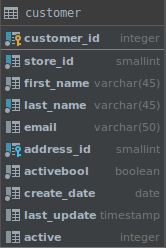

# PostgreSQL `LIKE` clause

## What you will learn

in this tutorial, you will learn how to use the PostgreSQL `LIKE` and `ILIKE` operator to query data by using pattern 
matching technique.

## Introduction to PostgreSQL `LIKE` operator

Suppose the store manager asks you find a customer that he does not remember the name exactly. 

He just remembers that customer’s first name begins with something like Jen. 

How do you find the exact customer that the store manager is asking? 

You may find the customer in the  customer table by looking at the first name column to see if there is any value that 
begins with Jen. 

It is kind of tedious because there many rows in the `customer` table.

Fortunately, you can use the PostgreSQL `LIKE` operator to as the following query:

    SELECT
        first_name,
        last_name
        FROM
            customer
        WHERE
            first_name LIKE 'Jen%';
            

>Notice that the `WHERE` clause contains a special expression: the first_name, the `LIKE` operator and a string that 
>contains a percent (%) character, which is referred as a pattern.

The query returns rows whose values in the first name column begin with Jen and may be followed by any sequence of 
characters. 

This technique is called pattern matching.

You construct a pattern by combining a string with wildcard characters and use the `LIKE` or `NOT LIKE` operator to 
find the matches. 

PostgreSQL provides two wildcard characters:

- Percent (`%`)  for matching any sequence of characters.
- Underscore (`_`)  for matching any single character.

The syntax of PostgreSQL `LIKE` operator is as follows:

    string LIKE pattern
    
The expression returns true if `LIKE` returns true and vice versa.

If the pattern does not contain any wildcard character, the `LIKE` operator acts like the equal (`=`) operator.

## PostgreSQL pattern matching examples

### PostgreSQL LIKE examples

See the following example:

    SELECT
        'foo' LIKE 'foo', -- true
        'foo' LIKE 'f%',  -- true
        'foo' LIKE '_o_, -- true
        'bar' LIKE 'b_'; -- false
        
How it works.

- The first expression returns true because the `foo` pattern does not contain any wildcard character so the `LIKE` 
operator acts like the equal(`=`) operator.
- The second expression returns true because it matches any string that begins with the letter f and followed by any 
number of characters.
- The third expression returns true because the pattern (`_o_`) matches any string that begins with any single 
character, followed by the letter o and ends with any single character.
- The fourth expression returns false because the pattern  b_ matches any string that begins with the letter  b and 
followed by any single character.

You can use the wildcard character at the beginning and/or end of the pattern. 

For example, the following query returns customers whose first name contains  er string e.g., Jenifer, Kimberly, etc.

    SELECT
        first_name,
        last_name
        FROM
            customer
        WHERE
            first_name LIKE '%er%'
            

You can combine the percent (`%`) with underscore (`_`) to construct a pattern as the following example:

    SELECT
        first_name,
        last_name
        FROM
            customer
        WHERE
            first_name LIKE '_her%';
            

The expression matches customer whose first name begins with any single character, is followed by the literal string 
her, and ends with any number of characters.

### PostgreSQL `NOT LIKE` examples

The following query returns customer whose first name does not begin with Jen:

    SELECT
        first_name,
        last_name
        FROM
            customer
        WHERE
            first_name NOT LIKE 'Jen%';
            

Notice that we used the `NOT LIKE` operator in the `WHERE` clause.

## PostgreSQL’s extensions of `LIKE` operator

PostgreSQL provides the `ILIKE` operator that acts like the `LIKE` operator. 

In addition, the `ILIKE` operator matches value case-insensitively. See the following example:

    SELECT
        first_name,
        last_name
        FROM
            customer
        WHERE
            first_name ILIKE 'BAR%';
            

The `BAR%` pattern matches any string that begins with `BAR`, `Bar`, `BaR`, etc. 

If you use the `LIKE` operator instead, the query will not return any row.

PostgreSQL also provides some operators that act like the `LIKE`, `NOT LIKE`, `ILIKE` and `NOT ILIKE` operator as shown 
below:

- ~~ is equivalent to `LIKE`
- \~~* is equivalent to `ILIKE`
- !~~ is equivalent to `NOT LIKE`
- !~~* is equivalent to `NOT ILIKE`

## What you have learned

In this tutorial, we have shown you how to use the `LIKE` and `ILIKE` operators to query data based on patterns.