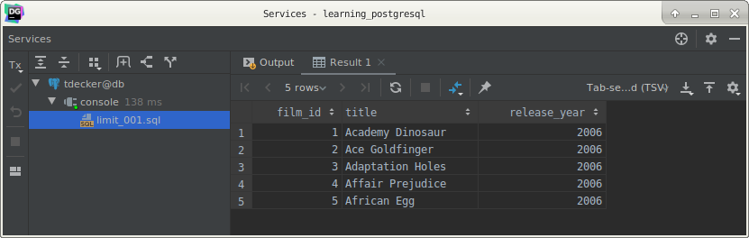
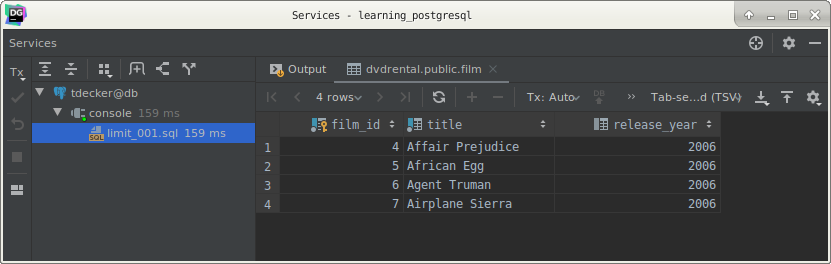
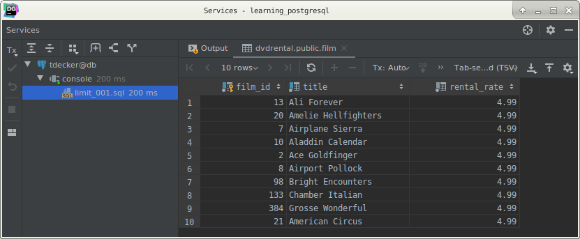

# PostgreSQL `LIMIT` clause

## What you will learn

in this tutorial, you’ll learn how to use PostgreSQL LIMIT clause to get a subset of rows generated by a query.

## Introduction to PostgreSQL `LIMIT` clause

PostgreSQL `LIMIT` is an optional clause of the `SELECT` statement that returns a subset of rows returned by the query.

The following illustrates the syntax of the `LIMIT` clause:

    SELECT *
        FROM
            table_name
        LIMIT n;
        
The statement returns n rows generated by the query. 

If n is zero, the query returns an empty set. In case n is NULL, the query returns the same result set as omitting the 
`LIMIT` clause.

In case you want to skip a number of rows before returning the n rows, you use `OFFSET` clause placed after the `LIMIT` 
clause as the following statement:

    SELECT *
        FROM
            table_name
        LIMIT n;
    
    SELECT *
        FROM
            table
        LIMIT n
        OFFSET m;
        
The statement first skips m rows before returning n rows generated by the query. 

If m is zero, the statement will work like without the `OFFSET` clause.

Because the order of the rows in the database table is unspecified, when you use the LIMIT clause, you should always 
use the `ORDER BY` clause to control the row order. 

If you don’t do so, you will get a result set whose rows are in an unspecified order.

If you use a large `OFFSET`, it might not be efficient because PostgreSQL still has to calculate the rows skipped by 
the `OFFSET` inside the database server, even though the skipped rows are not returned.

## PostgreSQL `LIMIT` examples

Let’s take some examples to have a better understanding of using PostgreSQL `LIMIT` clause. 

We will use the `film` table in the sample database for the demonstration.

This example uses the `LIMIT` clause to get the first 5 films ordered by film_id:

    SELECT
        film_id,
        title,
        release_year
        FROM
            film
        ORDER BY
            film_id
        LIMIT 5;
        

To retrieve 4 films starting from the third one ordered by film_id, you use both `LIMIT` and `OFFSET` clauses as 
follows:

    SELECT
        film_id,
        title,
        release_year
        FROM
            film
        ORDER BY
            film_id
        LIMIT 4
        OFFSET 3;
        

We often use the `LIMIT` clause to get the number of highest or lowest items in a table. 

For example, to get the top 10 most expensive films, you sort the film by the rental rate in descending order and use 
the `LIMIT` clause to get the first 10 films. 

The following query illustrates the idea:

    SELECT
        film_id,
        title,
        rental_rate
        FROM
            film
        ORDER BY
            rental_rate DESC
        LIMIT 10;
        
The result of the query is as follows:

## What you have learned

In this tutorial, you have learned how to use the PostgreSQL `LIMIT` clause to retrieve a subset of rows returned by a 
query.