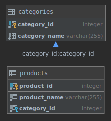
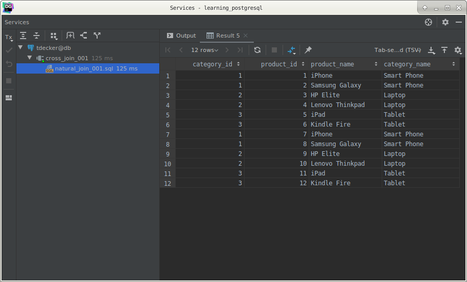

# PostgreSQL `NATURAL JOIN`

## What you will learn

in this tutorial, you will learn how to use the PostgresQL `NATURAL JOIN` to query data from two or more tables.

A natural join is a join that creates an implicit join based on the same column names in the joined tables. 

See the following syntax of PostgreSQL natural join:

    SELECT *
    FROM T1
    NATURAL [INNER, LEFT, RIGHT] JOIN T2;

A natural join can be an inner join, left join, or right join. If you do not specify a join explicitly e.g., 
`INNER JOIN`, `LEFT JOIN`, `RIGHT JOIN`, PostgreSQL will use the `INNER JOIN` by default.

## PostgreSQL `NATURAL JOIN` examples

To demonstrate the PostgreSQL natural join, we will create two tables: categories and products. 

The following `CREATE TABLE` statements create the `categories` and `products` table.

Each category has zero or many products whereas each product belongs to one and only one category. 

The `category_id` column in the `products` table is the foreign key that references to the primary key of the 
`categories` table. 

The `category_id` is the common column that we will use to perform the natural join.

The following INSERT statements insert some sample data into the categories and products tables.

    INSERT
        INTO
            categories (category_name)
        VALUES
            ('Smart Phone'),
            ('Laptop'),
            ('Tablet');
    
    INSERT
        INTO
            products (product_name, category_id)
        VALUES
            ('iPhone', 1),
            ('Samsung Galaxy', 1),
            ('HP Elite', 2),
            ('Lenovo Thinkpad', 2),
            ('iPad', 3),
            ('Kindle Fire', 3);

The following statement uses the `NATURAL JOIN` clause to join the `products` table with the `categories` table:

    SELECT *
        FROM
            products
                NATURAL JOIN categories;
                

The above statement is equivalent to the following statement that uses the `INNER JOIN` clause.

    SELECT *
        FROM
            products
                INNER JOIN categories USING (category_id);
                
The convenience of the `NATURAL JOIN` is that it does not require you to specify the join clause because it uses an 
implicit join clause based on the common column.

However, you should avoid using the `NATURAL JOIN` whenever possible because sometimes it may cause an unexpected 
result.

For example, let’s take a look at the city and country tables. 

Both tables have the same `country_id` column so we can use the `NATURAL JOIN` to join these tables as follows:

    SELECT *
        FROM
            city
                NATURAL JOIN country;
                

The query returns an empty result set.

The reason is that…

Both tables also have a common column named `last_update`, which cannot be used for the join. 

However, the NATURAL JOIN clause just uses the `last_update` column.

## What you learned

In this tutorial, we have explained to you how the PostgreSQL `NATURAL JOIN` works and shown you how to use it to query 
data from two or more tables.