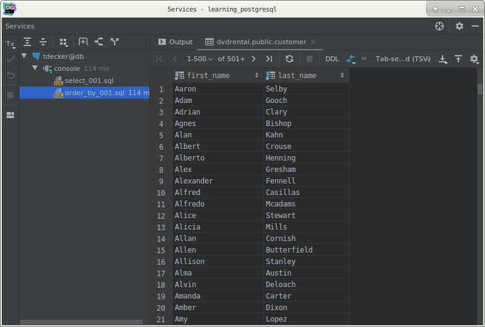
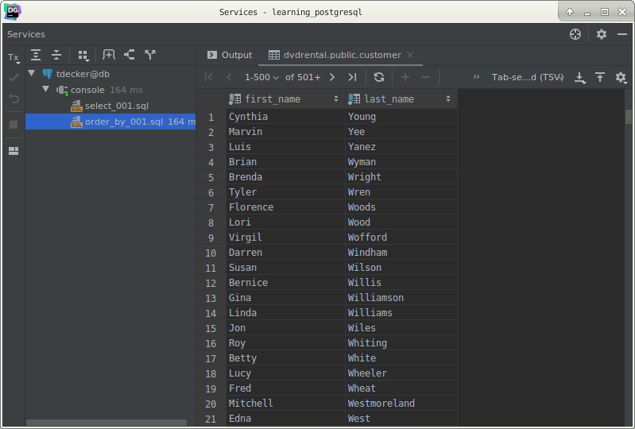
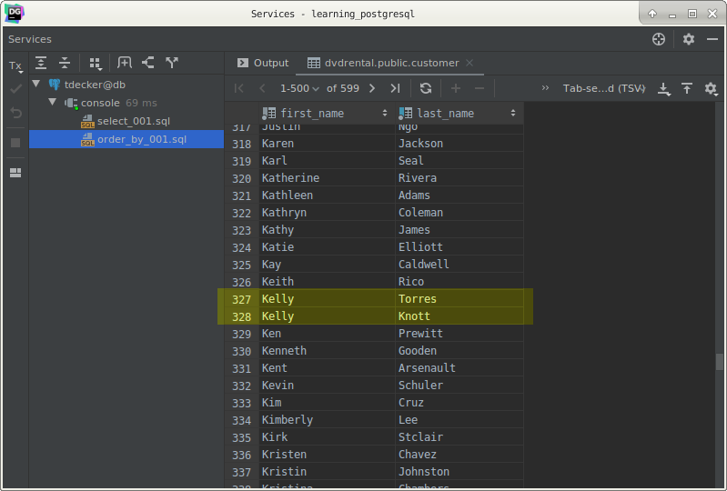

# PostgreSQL `ORDER BY` clause

## What you will learn

in this tutorial, you will learn how to sort the result set returned from the `SELECT` statement by using the PostgreSQL 
`ORDER BY` clause.

## Introduction to PostgreSQL `ORDER BY` clause

When you query data from a table, PostgreSQL returns the rows in the order that they were inserted into the table. 

In order to sort the result set, you use the `ORDER BY` clause in the `SELECT` statement.

The `ORDER BY` clause allows you to sort the rows returned from the `SELECT` statement in ascending or descending order 
based on the specified criteria.

The following illustrates the syntax of the `ORDER BY` clause:

    SELECT
        column_1,
        column_2
        FROM
            tbl_name
        ORDER BY
            column_1 ASC,
            column_2 DESC;
            
Let’s examine the syntax of the `ORDER BY` clause in more detail:

- First, specify the column that you want to sort in the `ORDER BY` clause. If you sort the result set based on multiple 
columns, use a comma to separate between two columns.

- Second, use `ASC` to sort the result set in ascending order and `DESC` to sort the result set in descending order. If 
you leave it blank, the `ORDER BY` clause will use `ASC` by default.

Let’s take some examples of using the PostgreSQL `ORDER BY` clause.

## PostgreSQL `ORDER BY` examples

We will use the customer table in the sample database for the demonstration.

The following query sorts customers by the first name in ascending order:

    SELECT
        first_name,
        last_name
        FROM
            customer
        ORDER BY
            first_name ASC;
            

Because `ASC` is used by default, you can omit it in the statement.

If you want to sort the customers by the last name in descending order, you can use the `DESC` keyword as shown in the 
following query:

    SELECT
        first_name,
        last_name
        FROM
            customer
        ORDER BY
            last_name DESC;
            

If you want to sort the customers by the first name in the ascending order first, and then sort the sorted result set by
the last name in descending order, you use the following statement:

    SELECT
        first_name,
        last_name
        FROM
            customer
        ORDER BY
            first_name ASC,
            last_name DESC;
            

>Notice that the SQL standard only allows you to sort rows based on the columns that appear in the `SELECT` clause.
>
>However, PostgreSQL allows you to sort rows based on the columns that even does not appear in the selection list.
>
>It is good practice to follow SQL Standard to make your code portable and adapt to the changes that may potentially 
>happen in the next release of PostgreSQL.

## What you have learned

In this tutorial, we have shown you how to sort the result set in ascending and descending order based on one or more 
columns by using the Postgre SQL `ORDER BY` clause.
