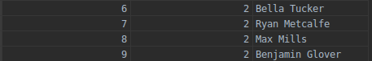
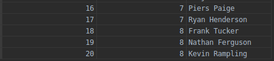
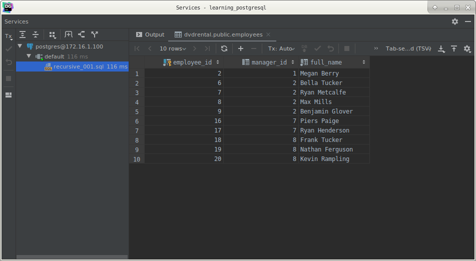

# PostgreSQL Recursive Queries

## What you will learn

in this tutorial, you will learn about the PostgreSQL recursive query using recursive common table expressions or CTEs.

## Introduction to the PostgreSQL recursive query

PostgreSQL provides the `WITH` statement that allows you to construct auxiliary statements for use in a query. 

These statements are often referred to as common table expressions or CTEs. 

The CTEs are like temporary tables that only exist during the execution of the query.

A recursive query is a query that refers to a recursive CTE. 

The recursive queries are useful in many situations such as for querying hierarchical data like organizational 
structure, bill of materials, etc.

The following illustrates the syntax of a recursive CTE:

    WITH RECURSIVE cte_name(
        CTE_query_definition -- non-recursive term
        UNION [ALL]
        CTE_query definion  -- recursive term
    ) SELECT * FROM cte_name;
    
A recursive CTE has three elements:

- Non-recursive term: the non-recursive term is a CTE query definition that forms the base result set of the CTE 
structure.
- Recursive term: the recursive term is one or more CTE query definitions joined with the non-recursive term using the 
UNION or UNION ALL operator. The recursive term references to the CTE name itself.
- Termination check: the recursion stops when no rows are returned from the previous iteration.

PostgreSQL executes a recursive CTE in the following sequence:

- Execute the non-recursive term to create the base result set (R0).
- Execute recursive term with Ri as an input to return the result set Ri+1 as the output.
- Repeat step 2 until an empty set is returned. (termination check)
- Return the final result set that is a UNION or UNION ALL of the result set R0, R1, … Rn

PostgresQL recursive query example

We will create a new table to demonstrate the PostgreSQL recursive query.

    CREATE TABLE employees
    (
        employee_id serial PRIMARY KEY,
        full_name   VARCHAR NOT NULL,
        manager_id  INT
    );
    
The `employees` table consists of three columns: `employee_id`, `manager_id`, and `full_name`.  

The `manager_id` column specifies the manager id of an employee.

The following statement inserts sample data into the employees table.

    INSERT
        INTO
            employees (employee_id,
                       full_name,
                       manager_id)
        VALUES
            (1, 'Michael North', NULL),
            (2, 'Megan Berry', 1),
            (3, 'Sarah Berry', 1),
            (4, 'Zoe Black', 1),
            (5, 'Tim James', 1),
            (6, 'Bella Tucker', 2),
            (7, 'Ryan Metcalfe', 2),
            (8, 'Max Mills', 2),
            (9, 'Benjamin Glover', 2),
            (10, 'Carolyn Henderson', 3),
            (11, 'Nicola Kelly', 3),
            (12, 'Alexandra Climo', 3),
            (13, 'Dominic King', 3),
            (14, 'Leonard Gray', 4),
            (15, 'Eric Rampling', 4),
            (16, 'Piers Paige', 7),
            (17, 'Ryan Henderson', 7),
            (18, 'Frank Tucker', 8),
            (19, 'Nathan Ferguson', 8),
            (20, 'Kevin Rampling', 8);

The following query returns all subordinates of the manager with the id 2.

    WITH
        RECURSIVE
        subordinates AS (
            SELECT
                employee_id,
                manager_id,
                full_name
                FROM
                    employees
                WHERE
                    employee_id = 2
            UNION
            SELECT
                e.employee_id,
                e.manager_id,
                e.full_name
                FROM
                    employees e
                        INNER JOIN subordinates s ON s.employee_id = e.manager_id
        )
    SELECT *
        FROM
            subordinates;

How it works.

- The recursive CTE, subordinates, defines one non-recursive term and one recursive term.
- The non-recursive term returns the base result set R0 that is the employee with the id 2.

    --
    -- Non-recursive part
    --
    SELECT
        employee_id,
        manager_id,
        full_name
        FROM
            employees
        WHERE
            employee_id = 2;

The recursive term returns the direct subordinate(s) of the employee id 2.

    --
    -- Recursive part
    --
    SELECT
        e.employee_id,
        e.manager_id,
        e.full_name
        FROM
            employees e
                INNER JOIN subordinates s ON s.employee_id = e.manager_id

This is the result of joining between the employees table and the subordinates CTE.

The first iteration of the recursive term returns the following result set:

PostgreSQL executes the recursive term repeatedly. 

The second iteration of the recursive member uses the result set above step as the input value, and returns this result 
set:

The third iteration returns an empty result set because there is no employee reporting to the employee with the id 16, 
17, 18, 19 and 20.

PostgreSQL returns the final result set that is the union of all result sets in the first and second iterations 
generated by the non-recursive and recursive terms.

## What you have learned

In this tutorial, you have learned how to use the recursive CTEs to construct the PostgreSQL recursive queries.