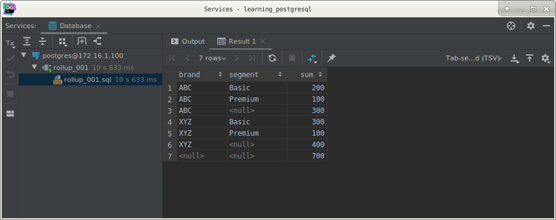
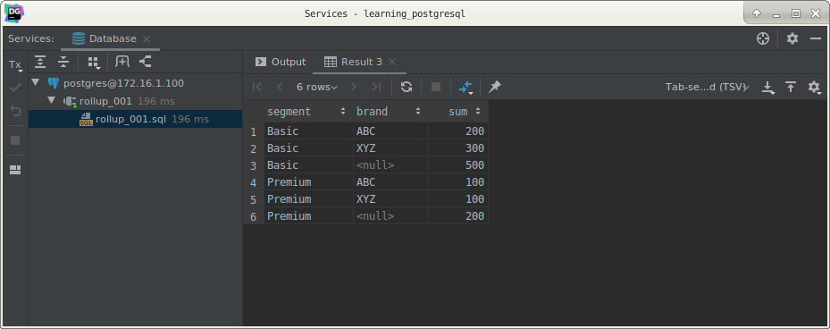
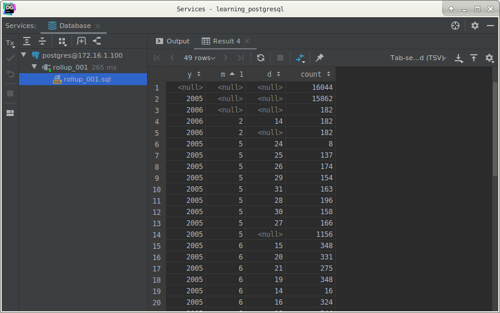

# PostgreSQL `ROLLUP` sub-clause

## What you will learn

in this tutorial, you will learn how to use the PostgreSQL `ROLLUP` to generate multiple grouping sets.

## Introduction to the PostgreSQL ROLLUP

The PostgreSQL `ROLLUP` is a sub-clause of the `GROUP BY` clause that offers a shorthand for defining multiple grouping 
sets. 

A grouping set is a set of columns to which you want to group. 

Check it out the grouping sets tutorial for further information.

Different from the `CUBE` sub-clause, `ROLLUP` does not generate all possible grouping sets based on the specified 
columns. 

It just makes a subset of those.

The `ROLLUP` assumes a hierarchy among the input columns and generates all grouping sets that make sense considering 
the hierarchy. 

This is the reason why `ROLLUP` is often used to generate the subtotals and the grand total for reports.

For example, the `CUBE` (c1,c2,c3) makes all eight possible grouping sets:

    (c1, c2, c3)
    (c1, c2)
    (c2, c3)
    (c1,c3)
    (c1)
    (c2)
    (c3)
    ()
    
However, the `ROLLUP(c1,c2,c3)` generates only four grouping sets, assuming the hierarchy c1 > c2 > c3 as follows:

    (c1, c2, c3)
    (c1, c2)
    (c1)
    ()
    
A common use of  `ROLLUP` is to calculate the aggregations of data by year, month, and date, considering the hierarchy 
year > month > date.

The following illustrates the syntax of the PostgreSQL `ROLLUP`:

    SELECT
        c1,
        c2,
        c3,
        aggregate(c4)
        FROM
            table_name
        GROUP BY
            ROLLUP (
            c1, c2, c3);
            
It is also possible to do a partial roll up to reduce the number of subtotals generated.

    SELECT
        c1,
        c2,
        c3,
        aggregate(c4)
        FROM
            table_name
        GROUP BY
            c1,
            ROLLUP (
            c2, c3);
            
## PostgreSQL `ROLLUP` examples

The following query uses the `ROLLUP` sub-clause to find the number of products sold by brand (subtotal) and by all 
brands and segments (total).

    SELECT
        brand,
        segment,
        SUM(quantity)
        FROM
            sales
        GROUP BY
            ROLLUP (
            brand, segment)
        ORDER BY
            brand,
            segment;
            

As you can see from the output, the third row shows the number of products sold for the ABC brand, the sixth row 
displays the number of products show for the XYZ brand. 

The last row shows the grand total which displays the total products sold for all brands and segments. 

In this example, the hierarchy is brand > segment.

If you change the order of brand and segment, the result will be different as follows:

    SELECT
        segment,
        brand,
        SUM(quantity)
        FROM
            sales
        GROUP BY
            ROLLUP (
            segment, brand)
        ORDER BY
            segment,
            brand;
            

In this case, the hierarchy is the segment > brand.

The following statement performs a partial roll-up:

    SELECT
        segment,
        brand,
        SUM(quantity)
        FROM
            sales
        GROUP BY
            segment,
            ROLLUP (
            brand)
        ORDER BY
            segment,
            brand;
            

See the following `rental` table from the sample database.

The following statement finds the number of rental per day, month, and year by using the `ROLLUP`:

    SELECT
        EXTRACT(YEAR FROM rental_date)  y,
        EXTRACT(MONTH FROM rental_date) M,
        EXTRACT(DAY FROM rental_date)   d,
        COUNT(rental_id)
        FROM
            rental
        GROUP BY
            ROLLUP (
            EXTRACT(YEAR FROM rental_date),
            EXTRACT(MONTH FROM rental_date),
            EXTRACT(DAY FROM rental_date)
            );
            

## What you have learned

In this tutorial, you have learned how to use the PostgreSQL `ROLLUP` to generate multiple grouping sets.