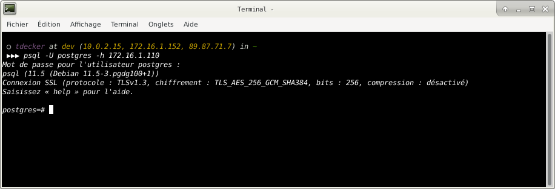
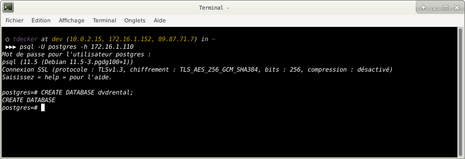
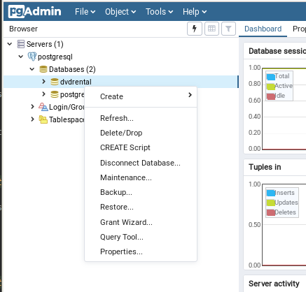
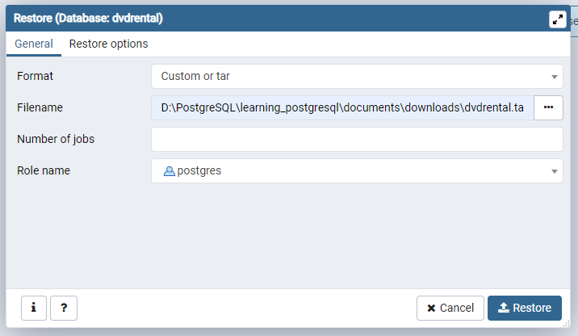

# PostgreSQL Sample Database

## What you will learn

in this tutorial, we will introduce you to a PostgreSQL sample database that you can use for learning and practice 
PostgreSQL.

## The Sample Database

We will use the DVD rental database for demonstrating the features of PostgreSQL.

The DVD rental database represents the business processes of a DVD rental store. 

The DVD rental database has many objects including:

- 15 tables
- 1 trigger
- 7 views
- 8 functions
- 1 domain
- 13 sequences

## Download PostgreSQL sample database

You can download the PostgreSQL DVD Rental sample database via the following link:

- [Download the sample database](downloads/dvdrental.zip)

## Details about the sample database

There are 15 tables in the DVD Rental database:

- `actor` – stores actors data including first name and last name.
- `film` – stores films data such as title, release year, length, rating, etc.
- `film_actor` – stores the relationships between films and actors.
- `category` – stores film’s categories data.
- `film_category`- stores the relationships between films and categories.
- `store` – contains the store data including manager staff and address.
- `inventory` – stores inventory data.
- `rental` – stores rental data.
- `payment` – stores customer’s payments.
- `staff` – stores staff data.
- `customer` – stores customers data.
- `address` – stores address data for staff and customers
- `city` – stores the city names.
- `country` – stores the country names.

## Create the sample database

Creating a new DVD rental database

You need to create a new database in the PostgreSQL database server before loading database schema and data into the 
database.

First, launch the `psql` tool from your host machine and connect to your PostgreSQL server:

    psql -U postgres -h 172.16.1.110
    

Then enter the following `CREATE DATABASE` statement to create a new `dvdrental` database:

    CREATE DATABASE dvdrental;
    
PostgreSQL will create a new database named `dvdrental`.

Then quit the PostgreSQL shell.

## Load the sample database with `psql` command-line tool

## Load the sample database with `pgadmin` tool

You can use the `pgAdmin` tool to restore the sample database from the downloaded database file using the following 
steps:

First, launch the `pgAdmin` tool and connect to the PostgreSQL server.

Next, right-click on the `dvdrental` database and choose Restore… menu item as shown in the following picture:

