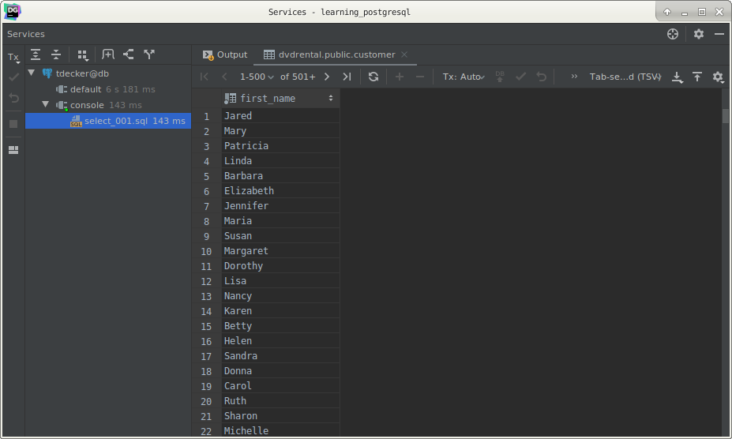

# PostgreSQL `SELECT` statement

## What you will learn

In this tutorial, you are going to learn how to use basic PostgreSQL SELECT statement to query data from a table.

One of the most common tasks, when you work with PostgreSQL, is to query data from tables by using the SELECT statement.

The `SELECT` statement is one of the most complex statements in PostgreSQL.

It has many clauses that you use to form a flexible query.

Because of its complexity, we will break down the PostgreSQL `SELECT` statement tutorial into many shorter and 
easy-to-understand tutorials so that you can learn the functionality of each clause faster.

The `SELECT` statement has the following clauses:

- Select distinct rows using `DISTINCT` operator.
- Sort rows using `ORDER BY` clause.
- Filter rows using `WHERE` clause.
- Select a subset of rows from a table using `LIMIT` or `FETCH` clause.
- Group rows into groups using `GROUP BY` clause
- Filter groups using `HAVING` clause.
- Join with other tables using joins such as `INNER JOIN`, `LEFT JOIN`, `FULL OUTER JOIN`, `CROSS JOIN` clauses.
- Perform set operations using `UNION`, `INTERSECT`, and `EXCEPT`.

In this tutorial, you are going to focus on the `SELECT` and `FROM` clauses.

## PostgreSQL SELECT statement syntax

Let’s start with the basic form of the `SELECT` statement that retrieves data from a single table.

The following illustrates the syntax of the `SELECT` statement:

    SELECT
       column_1,
       column_2,
       ...
    FROM
       table_name;

Let’s examine the `SELECT` statement in more detail:

- First, specify the column of the table from which you want to query data in the `SELECT` clause. If you retrieve data 
from multiple columns, use a list of comma-separated columns. In case you want to query data from all columns, you can 
use an asterisk (*) as the shorthand.

- Second, specify the name of the table from which you want to query data after the `FROM` keyword.

In addition to the columns from a table, you can use literal values and expressions in the `SELECT` clause.

>Note that the SQL language is case insensitive. It means that `SELECT` or select has the same effect.
>
> By convention, we will use SQL keywords in uppercase to make the code easier to read.

## PostgreSQL SELECT examples

Let’s take a look at some examples of using PostgreSQL `SELECT` statement.

We will use the following customers table in the sample database for the demonstration :

### 1) Using `SELECT` statement to query data from one column example

This example uses the `SELECT` statement to find the first names of all customers in the customer table:

    --
    -- Select a single column from a table
    --
    SELECT
        first_name,
        FROM
            customer;

Here is the partial output:

>Notice that we have added a semicolon (;) at the end of the `SELECT` statement.
>
>The semicolon is not a part of the SQL statement.
>
>It is used to signal PostgreSQL engine the end of an SQL statement.
>
>The semicolon is also used to separate two SQL statements.

### 2) Using `SELECT` statement to query data from multiple columns example

Suppose you just want to know the first name, last name and email of customers, you can specify these column names in 
the `SELECT` clause as shown in the following query:

    SELECT
       first_name,
       last_name,
       email
    FROM
       customer;

### 3) Using SELECT statement to query data in all columns of a table example

The following query uses the `SELECT` statement to return data from all rows and columns of the customer table:

    SELECT *
        FROM
            customer;

In this example, we used an asterisk (*) in the `SELECT` clause, which is a shorthand for all columns.

So instead of listing all columns in the `SELECT` clause, we just used the asterisk (*) .

However, it is not a good practice to use the asterisk (*) in the `SELECT` statement because of the following reasons:

- Imagine that you have a big table with many columns, the `SELECT` statement with an asterisk (*) shorthand will 
retrieve data from all columns of the table, which may not be necessary.

- In addition, retrieving unnecessary data from the database increases the traffic between the database and application 
layers. As a result, your applications will be slow and less scalable. Therefore, it is a good practice to specify the 
column names explicitly in the `SELECT` clause whenever possible to get only necessary data from a table.

### 3) Using `SELECT` statement with expressions example

The following example uses the `SELECT` statement to return the full names and emails of all customers:

    SELECT
        first_name || ' ' || last_name AS full_name,
        email
        FROM
            customer;

Here is the partial output:

In this example, we used the concatenation operator || to concatenate first name, space, and last name of every customer.

In addition, we used a column alias AS full_name to assign the expression a column heading.

### 4) Using `SELECT` statement with  only expressions example

The following example uses the `SELECT` statement with expression. 

We skip the FROM clause because the statement does not refer to any table:

    SELECT 5 * 3 AS result;

## What you have learned

In this tutorial, you have learned how to use a basic form of PostgreSQL `SELECT` statement to query data from a 
database table.