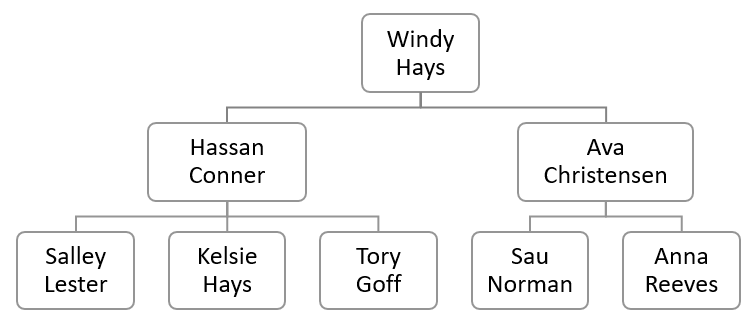
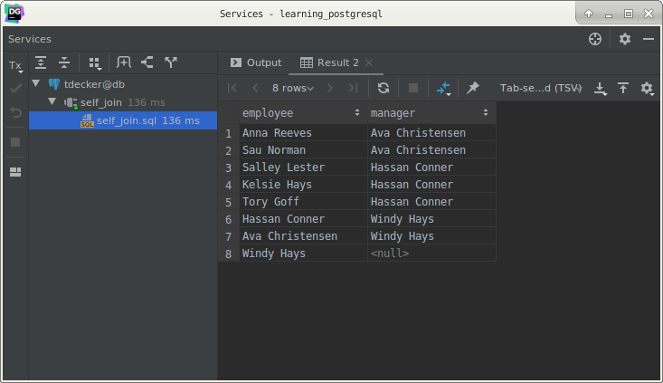
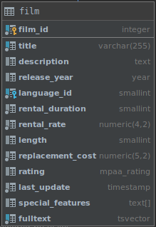
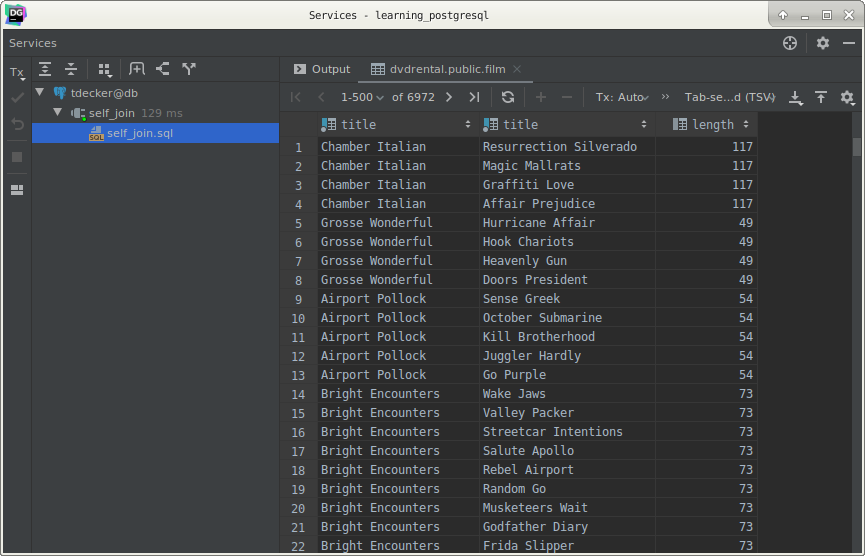

# PostgreSQL Self-join

## What you will learn

in this tutorial, you will learn how to use the PostgreSQL self-join technique to compare rows within the same table.

## Introduction to PostgreSQL self-join

A self-join is a query in which a table is joined to itself. 

Self-joins are useful for comparing values in a column of rows within the same table.

To form a self-join, you specify the same table twice with different aliases, set up the comparison, and eliminate 
cases where a value would be equal to itself.

The following query shows how to join the table A to itself:

    SELECT
        column_list
        FROM
            A a1
                INNER JOIN A b1 ON join_predicate;
                
In this syntax, table A is joined to itself using the `INNER JOIN` clause. 

>Note that you can also use the `LEFT JOIN` or `RIGHT JOIN` clause.

## PostgreSQL self-join examples

### 1) Querying hierarchy data example

Let’s set up a sample table for the demonstration.

Suppose, we have the following organization structure:

The value in the `manager_id` column represents the manager who the employee reports to. 

If the value in the manager_id column is null, then the employee does not report to anyone. 

In other words, that employee is the top manager.

To find who reports to whom, you use the following query:

    SELECT
        e.first_name || ' ' || e.last_name employee,
        m.first_name || ' ' || m.last_name manager
        FROM
            employee e
                INNER JOIN employee m ON m.employee_id = e.manager_id
        ORDER BY
            manager;
            
This query referenced the employees table twice, one as the employee and another as the manager. 

It uses table aliases `e` for the employee and `m` for the manager.

The join predicate finds employee/manager pair by matching values in the `employee_id` and `manager_id` columns.

As you can see from the screen shot, the top manager did not appear on the output.

To include the top manager in the result set, you use the `LEFT JOIN` instead of `INNER JOIN` clause as shown in the 
following query:

    SELECT
        e.first_name || ' ' || e.last_name employee,
        m.first_name || ' ' || m.last_name manager
        FROM
            employee e
                LEFT JOIN employee m ON m.employee_id = e.manager_id
        ORDER BY
            manager;
            

### 2) Comparing the rows with the same table

See the following film table from the DVD rental database:

The following query finds all pair of films that have the same length.

    SELECT
        f1.title,
        f2.title,
        f1.length
        FROM
            film f1
                INNER JOIN film f2 ON f1.film_id <> f2.film_id
                AND f1.length = f2.length;
                

This query joined the `film` table to itself. 

The join predicate matches different films specified by `film_id` that have the same length.

## What you have learned

In this tutorial, you have learned how to use the PostgreSQL self-join technique to join a table to itself.