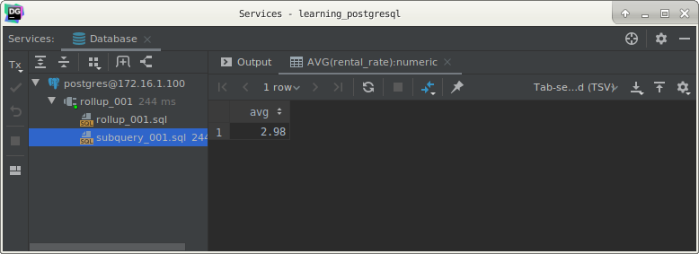
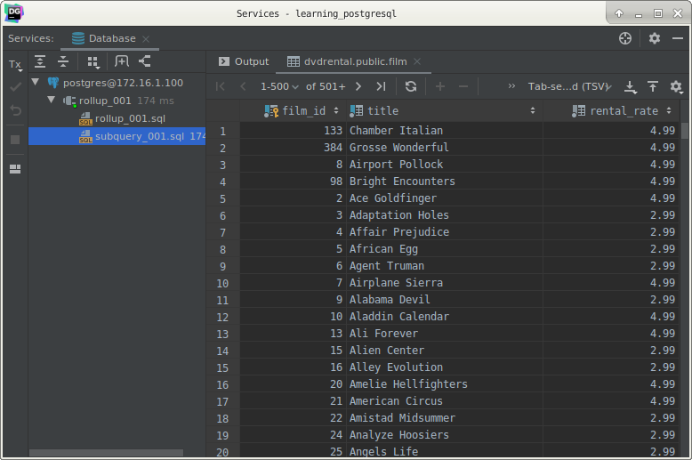
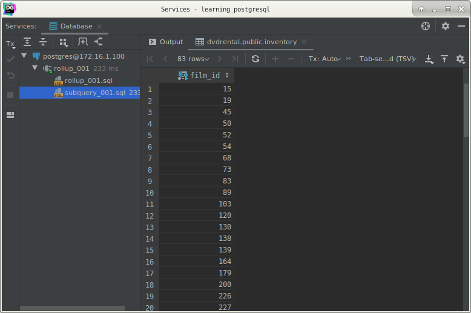
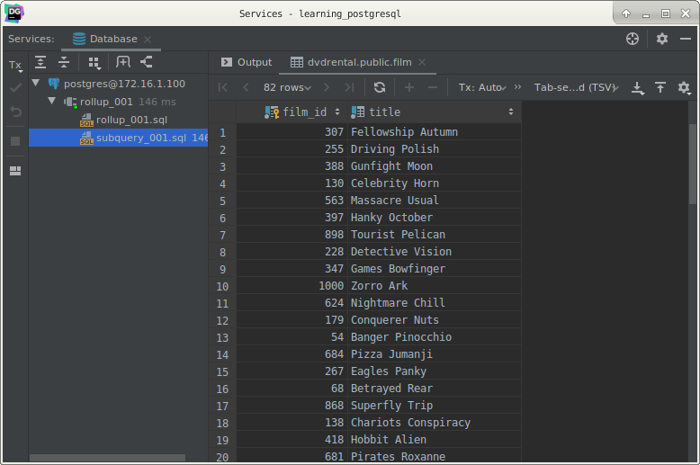
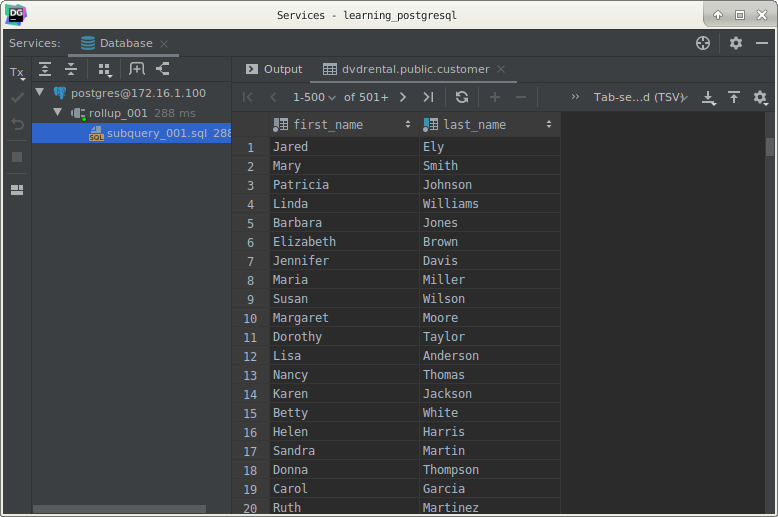

# PostgreSQL Sub-queries

## What you will learn

In this tutorial, you will learn how to use the PostgreSQL sub-query that allows you to construct complex queries.

## Introduction to PostgreSQL subquery

Let’s start with a simple example.

Suppose we want to find the films whose rental rate is higher than the average rental rate. We can do it in two steps:

- Find the average rental rate by using the SELECT statement and average function ( AVG).
- Use the result of the first query in the second SELECT statement to find the films that we want.

The following query gets the average rental rate:

    SELECT
        AVG(rental_rate)
        FROM
            film;

The average rental rate is 2.98

Now, we can get films whose rental rate is higher than the average rental rate:

    SELECT
        film_id,
        title,
        rental_rate
        FROM
            film
        WHERE
            rental_rate > 2.98;
            

The code is not so elegant, which requires two steps. 

We want a way to pass the result of the first query to the second query in one query. 

The solution is to use a sub-query.

A sub-query is a query nested inside another query such as `SELECT`, `INSERT`, `DELETE` and `UPDATE`. 

In this tutorial, we are focusing on the `SELECT` statement only.

To construct a sub query, we put the second query in brackets and use it in the `WHERE` clause as an expression:

    SELECT
        film_id,
        title,
        rental_rate
        FROM
            film
        WHERE
                rental_rate > (
                SELECT
                    AVG(rental_rate)
                    FROM
                        film
            );
            
The query inside the brackets is called a sub-query or an inner query. 

The query that contains the sub-query is known as an outer query.

PostgreSQL executes the query that contains a sub-query in the following sequence:

- First, executes the sub-query.
- Second, gets the result and passes it to the outer query.
- Third, executes the outer query.

## PostgreSQL sub-query with IN operator

A sub-query can return zero or more rows. 

To use this sub-query, you use the `IN` operator in the `WHERE` clause.

For example, to get films that have the returned date between 2005-05-29 and 2005-05-30, you use the following query:

    SELECT
        inventory.film_id
        FROM
            rental
                INNER JOIN inventory ON inventory.inventory_id = rental.inventory_id
        WHERE
            return_date BETWEEN '2005-05-29'
                AND '2005-05-30';
                

It returns multiple rows so we can use this query as a sub-query in the `WHERE` clause of a query as follows:

    SELECT
        film_id,
        title
        FROM
            film
        WHERE
                film_id IN (
                SELECT
                    inventory.film_id
                    FROM
                        rental
                            INNER JOIN inventory ON inventory.inventory_id = rental.inventory_id
                    WHERE
                        return_date BETWEEN '2005-05-29'
                            AND '2005-05-30'
            );
            

PostgreSQL sub-query with `EXISTS` operator

The following expression illustrates how to use a sub-query with `EXISTS` operator:

    EXISTS subquery
    
A sub-query can be an input of the `EXISTS` operator. 

If the sub-query returns any row, the `EXISTS` operator returns true. 

If the sub-query returns no row, the result of `EXISTS` operator is false.

The `EXISTS` operator only cares about the number of rows returned from the sub-query, not the content of the rows, 
therefore, the common coding convention of `EXISTS` operator is as follows:

    EXISTS (SELECT 1 FROM tbl WHERE condition);
    
See the following query:

    SELECT
        first_name,
        last_name
        FROM
            customer
        WHERE
            EXISTS(
                    SELECT
                        1
                        FROM
                            payment
                        WHERE
                            payment.customer_id = customer.customer_id
                );
                

The query works like an inner join on the customer_id column. 

However, it returns at most one row for each row in the customer table even though there are some corresponding rows in 
the payment table.

## What you have learned

In this tutorial, you have learned how to use the PostgreSQL sub-query to construct complex queries.