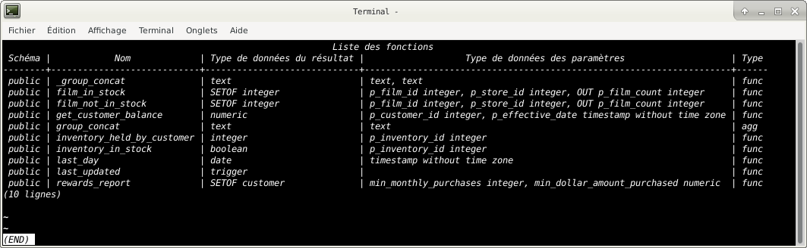
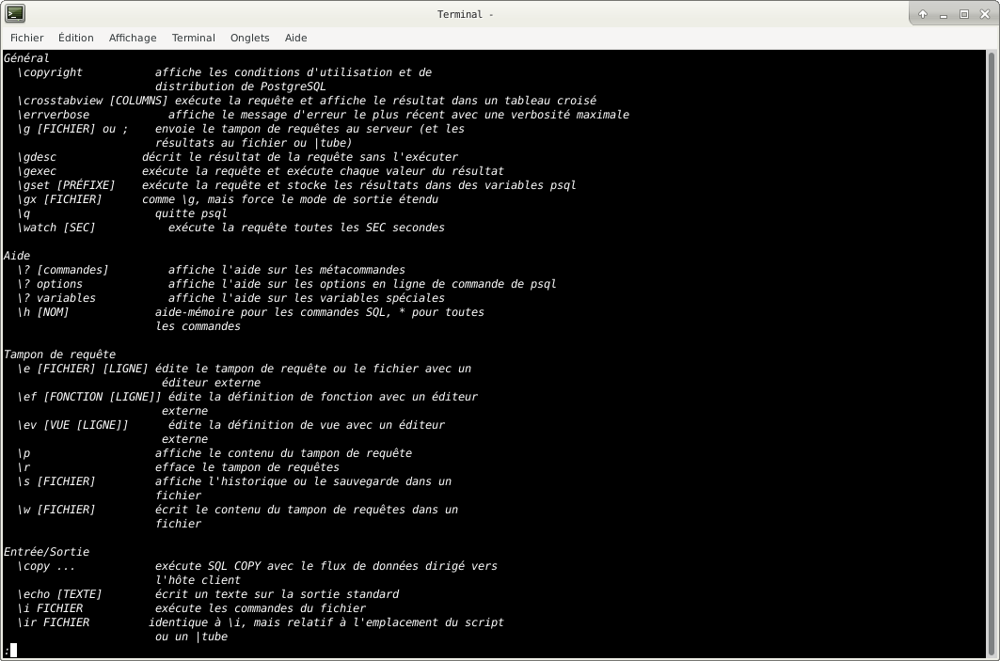

# PostgreSQL Tips and Tricks

## Connect to PostgreSQL database

The following command connects to a database under a specific user. 

After pressing Enter PostgreSQL will ask for the password of the user.

    psql -d database -U  user -W
    
If you want to connect to a database that resides on another host, you add the -h option as follows:

    psql -h host -d database -U user -W

    
In case you want to use SSL mode for the connection, just specify it as shown in the following command:

    psql -U user -h host "dbname=db sslmode=require"
    
## Switch connection to a new database

Once you are connected to a database, you can switch the connection to a new database under a user specified by user. 

The previous connection will be closed. 

If you omit the user parameter, the current user is assumed.

    \c dbname username
    

## List available databases

To list all databases in the current PostgreSQL database server, you use \l command:

    \l
    

    
## List available tables

To list all tables in the current database, you use \dt command:

    \dt

## Execute a SQL script file with PSql

    psql -U <user_name> -h <host> -f <script_name>

## Describe a table

To describe a table such as a column, type, modifiers of columns, etc., you use the following command:

    \d table_name
    

## List available schema

To list all schemas of the currently connected database, you use the \dn command.

    \dn
    

## List available functions

To list available functions in the current database, you use the \df command.

    \df
    

## List available views

To list available views in the current database, you use the \dv command.

    \dv
    

## List users and their roles

To list all users and their assign roles, you use \du command:

    \du
    

## Execute the previous command

To retrieve the current version of PostgreSQL server, you use the `version()` function as follows:

    SELECT version();
    
Now, you want to save time typing the previous command again, you can use `\g` command to execute the previous command:

    \g

psql executes the previous command again, which is the `SELECT` statement.
    

## Command history

To display command history, you use the \s command.

    \s

If you want to save the command history to a file, you need to specify the file name followed the \s command as follows:
	
    \s filename
    

## Execute `psql` commands from a file

In case you want to execute `psql` commands from a file, you use `\i` command as follows:
	
    \i filename
    

## Get help on `psql` commands

To know all available `psql` commands, you use the `\?` command.

    \?

To get help on specific PostgreSQL statement, you use the \h command.

For example, if you want to know detailed information on ALTER TABLE statement, you use the following command:
	
    \h ALTER TABLE
    

## Turn on query execution time

To turn on query execution time, you use the \timing command.

## Edit command in your own editor

It is very handy if you can type the command in your favorite editor. 

To do this in `psql`, you use the `\e` command. 

After issuing the command, `psql` will open the text editor defined by your `EDITOR` environment variable and place the 
most recent command that you entered in `psql` into the editor.

## Quit `psql`

To quit `psql`, you use `\q` command and press enter to exit `psql`.
	
    \q

## Editing PostgreSQL prompt

By editing the user `.psqlrc` file you can customize the main `psql` prompt (`PROMPT1`).
 
Edit the `.psqlrc` file with the editor of your choice to add the following lines (here we’ll use nano).

    nano .psqlrc

and put this command in it:    

    set PROMPT1 '%[%033[1;33m%][%M:%>]%[%033[1;37m%] %[%033[1;34m%]%n@%/%R%#%x %[%033[1;37m%]'
    
This configuration file will give you the following prompt:

- %M refers to the database server’s hostname – is “[local]” if the connection is over a Unix domain socket
- %> refers to the listening port
- %n refers to the session username
- %/ refers the current database
- %R refers to whether you’re in single-line mode (^) or disconnected (!) but is normally =
- %# refers to whether you’re a superuser (#) or a regular user (>)
- %x refers to the transaction status – usually blank unless in a transaction block (*)