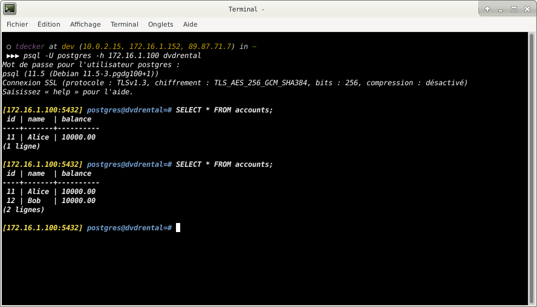
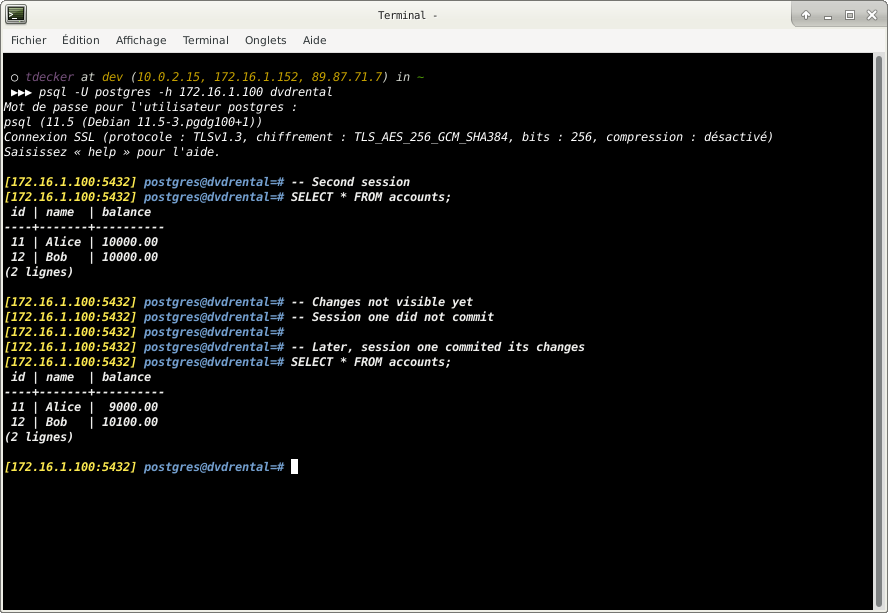

# PostgreSQL Transactions

## What you will learn

in this tutorial, you will learn how to handle PostgreSQL transactions using the `BEGIN`, `COMMIT`, and `ROLLBACK` 
statements.

## What is a database transaction

A database transaction is a single unit of work which may consist of one or more operations.

A classical example of a transaction is a transfer from one bank account to another. 

A complete transaction must ensure subtracting an amount from the sender’s account and adding that same amount to the 
receiver’s account.

A transaction in PostgreSQL is atomic, consistent, isolated, and durable. 

These properties are often referred to as ACID:

- Atomicity guarantees that the transaction completes in an all-or-nothing manner.
- Consistency ensures the change to data written to the database must be valid and follow predefined rules.
- Isolation determines how transaction integrity is visible to other transactions.
- Durability makes sure that transactions which have been committed will be stored permanently.

## Setting up a sample table

Let’s create a new table named accounts for the demonstration:

    CREATE TABLE accounts
    (
        id      INT GENERATED BY DEFAULT AS IDENTITY,
        name    VARCHAR(100) NOT NULL,
        balance DEC(15, 2)   NOT NULL,
        PRIMARY KEY (id)
    );
    
## Beginning a transaction

When you execute the following `INSERT` statement:

    INSERT INTO accounts(name, balance)
    VALUES ('Bob', 10000);

PostgreSQL inserted a new row into the `accounts` table immediately. 

In this case, you did not know when the transaction began and had no chance to intercept the change such as undoing it.

To start a transaction, you use the following statement:

    BEGIN TRANSACTION;
    
or
    
    BEGIN WORK;
    
or just
    
    BEGIN;

For example, the following statements start a new transaction and insert a new account into the `accounts` table:

    BEGIN;
    
    INSERT INTO accounts(name, balance)
    VALUES ('Alice', 10000);

From the current session, you can see the change by querying the accounts table:

    SELECT
        id,
        name,
        balance
    FROM accounts;
    

However, if you start a new session and execute the query above, you will not see the change.

## Committing a transaction

To make the change become visible to other sessions (or users) you need to commit the transaction by using the following 
statement:

    COMMIT TRANSACTION;

or

    COMMIT WORK;

or just

    COMMIT;
    
After executing the `COMMIT` statement, PostgreSQL also guarantees that the change will be durable if a crash happens.

## PostgreSQL `COMMIT`: Bank account transfer example

In this demonstration, we will show you how to transfer 100 from Bob’s account to Alice’s account. 

We will use two sessions for viewing the change of each operation.

## Rolling back a transaction

## What you have learned

In this tutorial, you have learned how to manipulate PostgreSQL transactions via `BEGIN`, `COMMIT`, and `ROLLBACK` 
statements.