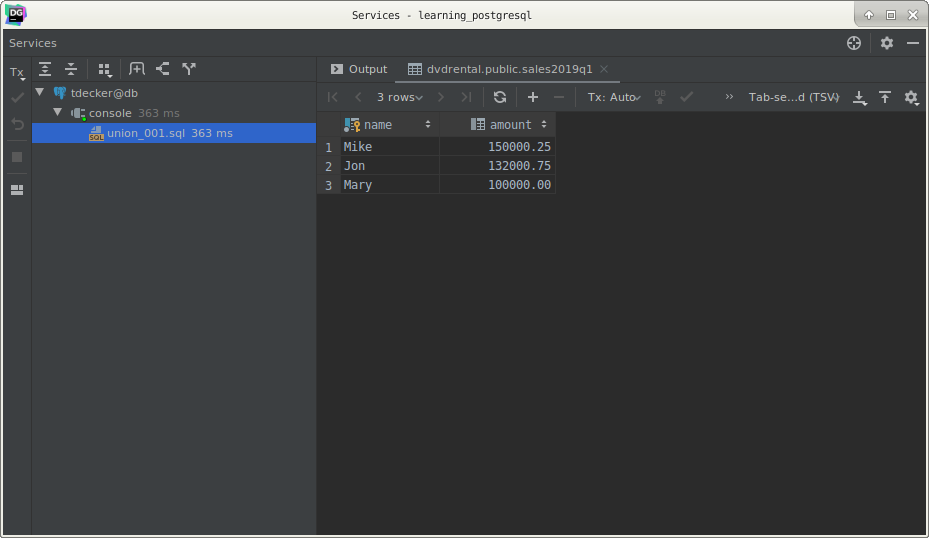
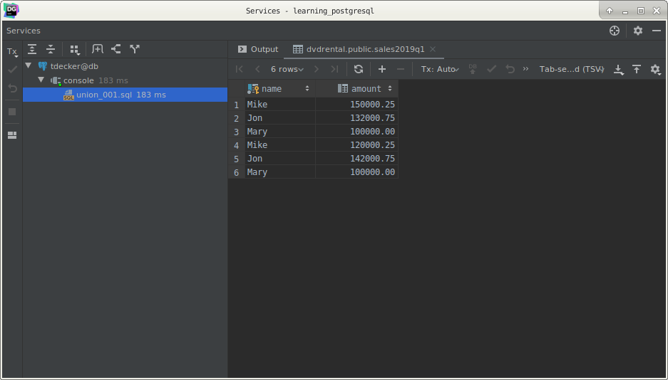
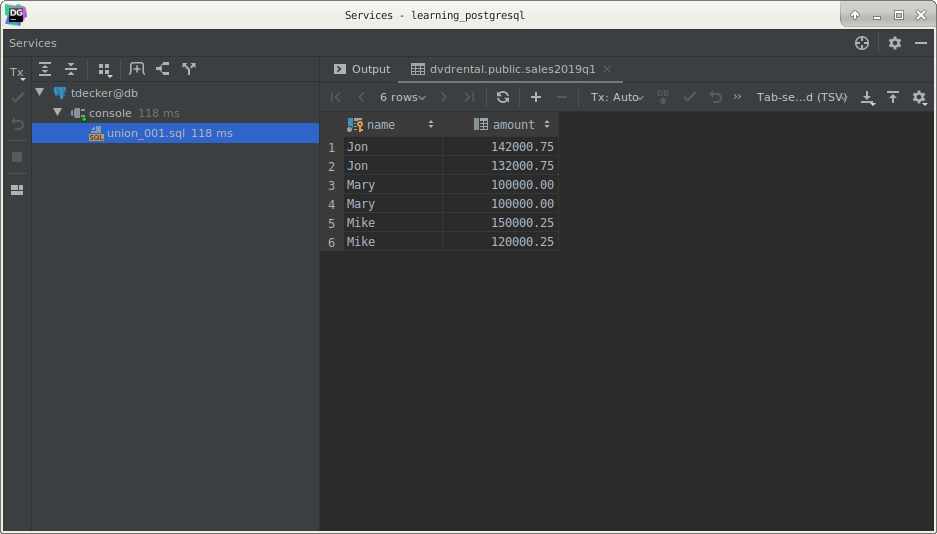
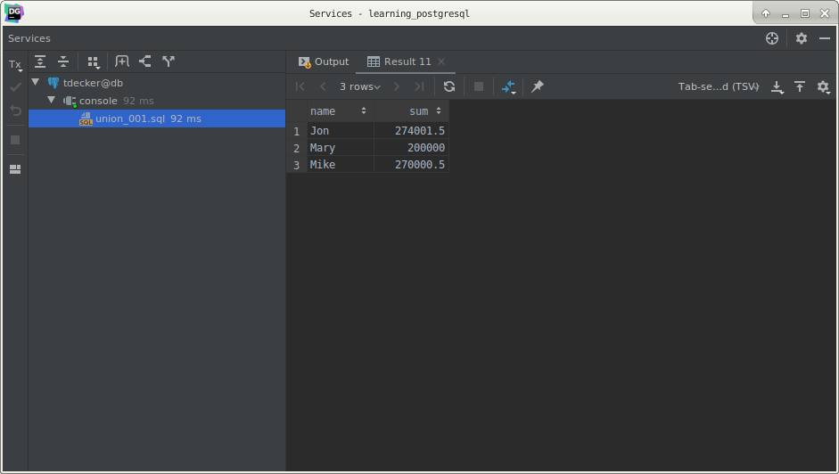

# PostgreSQL `UNION` operator

## What you will learn

in this tutorial, you will learn how to use PostgreSQL `UNION` operator to combine result sets of multiple queries into 
a single result.

The `UNION` operator combines result sets of two or more `SELECT` statements into a single result set. 

The following illustrates the syntax of the UNION operator that combines result sets from two queries:

    SELECT
        column_1,
        column_2
        FROM
            tbl_name_1
    UNION
    SELECT
        column_1,
        column_2
        FROM
            tbl_name_2;
            
The following are rules applied to the queries:

- Both queries must return the same number of columns.
- The corresponding columns in the queries must have compatible data types.

The `UNION` operator removes all duplicate rows unless the `UNION ALL` is used.

The `UNION` operator may place the rows in the first query before, after or between the rows in the result set of the 
second query. To sort the rows in the combined result set by a specified column, you use the `ORDER BY` clause.

We often use the `UNION` operator to combine data from similar tables that are not perfectly normalized. 

Those tables are often found in the reporting or data warehouse system.

## PostgreSQL `UNION` examples

Let’s create the following tables:

- sales2019q1: stores sales data in Q1 2019.
- sales2019q2: stores sales data in Q2 2019.

    CREATE TABLE sales2019q1
    (
        name   CHAR(255)
            CONSTRAINT sales2019q1_pk
                PRIMARY KEY,
        amount NUMERIC(10, 2)
    );
    
    CREATE TABLE sales2019q2
    (
        name   CHAR(255)
            CONSTRAINT sales2019q2_pk
                PRIMARY KEY,
        amount NUMERIC(10, 2)
    );
    
    INSERT
        INTO
            sales2019q1 (name,
                         amount)
        VALUES
            ('Mike', 150000.25),
            ('Jon', 132000.75),
            ('Mary', 100000);
    
    INSERT
        INTO
            sales2019q2 (name,
                         amount)
        VALUES
            ('Mike', 120000.25),
            ('Jon', 142000.75),
            ('Mary', 100000);

sales2019q1 data:

sales2019q2 data:

## PostgreSQL `UNION ALL` example

There are five rows in the combined result set because the `UNION` operator removes one duplicate row. 

To get all rows that include duplicate, you use the `UNION ALL` operator as follows:

    SELECT *
        FROM
            sales2019q1
    UNION ALL
    SELECT *
        FROM
            sales2019q2;
            

## PostgreSQL `UNION` with `ORDER BY` example

To sort the combined result returned by the `UNION` operator, you use the `ORDER BY` clause. 

You need to put the `ORDER BY` clause at the last query as the following statement:

    SELECT *
        FROM
            sales2019q1
    UNION ALL
    SELECT *
        FROM
            sales2019q2
    ORDER BY
        name ASC,
        amount DESC;
        

If you put the `ORDER BY` clause at the end of each query, the combined result set will not be sorted as you expected. 

Because when `UNION` operator combines the sorted result sets from each query, it does not guarantee the order of rows 
in the final result set.

As you will see later, the `UNION` and `UNION ALL` statements can also be combined in a `GROUP BY` clause.

Here is an example :

    SELECT
        t.name,
        sum(t.amount)
        FROM
            (
                SELECT *
                    FROM
                        sales2019q1
                UNION ALL
                SELECT *
                    FROM
                        sales2019q2
                ORDER BY
                    name ASC,
                    amount DESC
            ) AS t
        GROUP BY
            t.name;
            

## What you have learned

In this tutorial, we have shown you how to use the PostgreSQL `UNION` and `UNION ALL` to combine the result sets from 
multiple queries into a single result set.