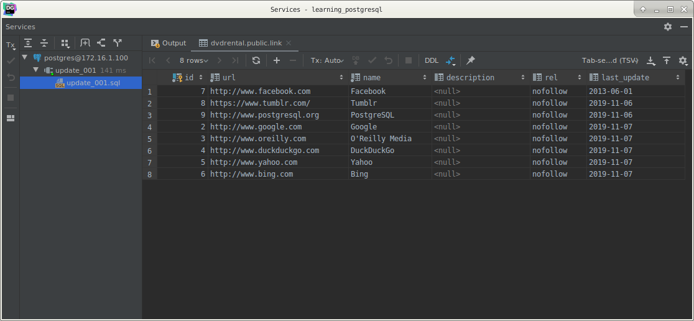

# PostgreSQL `UPDATE` statement

## What you will learn

in this tutorial, you will learn how to use the PostgreSQL `UPDATE` statement to update existing data in a table.

## PostgreSQL UPDATE syntax

To change the values of the columns in a table, you use the `UPDATE` statement. 

The following illustrates the syntax of the `UPDATE` statement:

    UPDATE table
       SET column1 = value1,
           column2 = value2, ...
           WHERE
           condition;
           
Let’s examine the syntax of the statement in detail:

First, specify the table name where you want to update the data after `UPDATE` clause.

Second, list the columns whose values you want to change in the `SET` clause. 

If you update values in multiple columns, you use a comma (`,`) to separate each pair of column and value. 

The columns that are not on the list retain their original values.

Third, determine which rows you want to update in the condition of the `WHERE` clause. 

If you omit the WHERE clause, all the rows in the table are updated.

## PostgreSQL `UPDATE` examples

We will use the link table created in the `INSERT` tutorial for the demonstration.

Let’s examine the content of the link table:

    SELECT *
      FROM link;
      

## PostgreSQL update table partially example

To change the `NULL` values of the `last_update` column to the current date, you use the following statement:

    UPDATE link
       SET last_update = DEFAULT
     WHERE last_update IS NULL;
     

The `WHERE` clause only updates the rows whose values in the `last_update` column is `NULL`. 

We used the `DEFAULT` keyword because the `last_update` column accepts the current date as the default value.

## PostgreSQL update all rows in a table

To update the values of the `rel` column to 'nofollow' for all rows in the link table, you omit the `WHERE` clause in 
the `UPDATE` statement as follows:

    UPDATE link
       SET rel = 'nofollow';
       

You can also update data of a column from another column within the same table. 

The following statement copies the values of the `name` column to the `description` column of the `link` table:

    UPDATE link
       SET description = name;
       

## PostgreSQL update join example

Let’s examine the `link_tmp` table, which has the same structure as the link table:

    SELECT *
      FROM link_tmp;
      

The following statement updates values that come from the `link` table for the columns in the `link_tmp` table:

    UPDATE link_tmp
       SET rel         = link.rel,
           description = link.description,
           last_update = link.last_update
      FROM link
     WHERE link_tmp.id = link.id;
     

Notice that we used the `FROM` clause in the `UPDATE` statement to specify the second table ( link) that involves in 
the update.

This kind of `UPDATE` statement sometimes referred to as `UPDATE JOIN` or `UPDATE INNER JOIN` because two or more 
tables are involved in the UPDATE statement. 

The join condition is specified in the `WHERE` clause.

## PostgreSQL update with returning clause

The `UPDATE` statement returns the number of affected rows by default. 

The PostgreSQL `UPDATE` statement also returns updated entries using the `RETURNING` clause. 

>This addition is a PostgreSQL’s extension to the SQL standard.

The following statement updates the row with id 1 in the `link` table and returns the updated entries:

       UPDATE link
          SET description = 'Learn PostgreSQL fast and easy',
              rel         = 'follow'
        WHERE id = 2
    RETURNING id,
        description,
        rel;
        

To verify the update, you can select data from the `link` table as the following query:

    SELECT *
      FROM link
     WHERE id = 2;
     

## What you have learned

In this tutorial, you have learned how to update data from a table by using the PostgreSQL `UPDATE` statement.