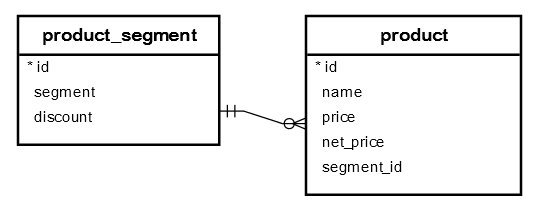
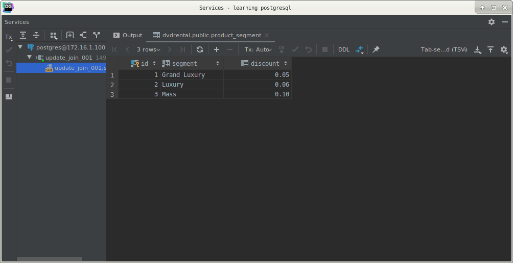
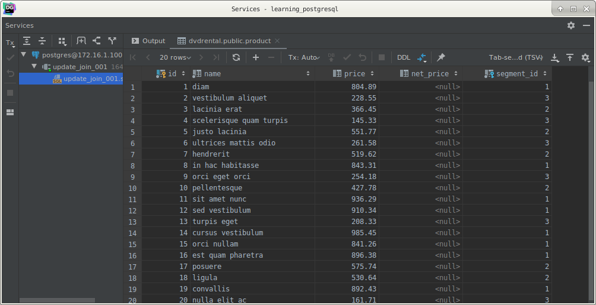
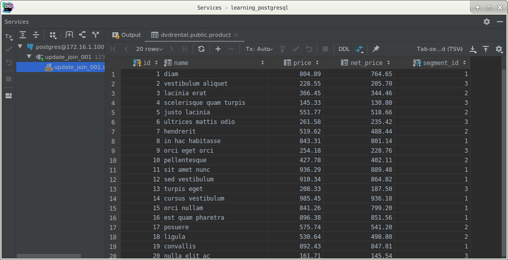

# PostgreSQL `UPDATE` join statement

## What you will learn

this tutorial shows you how to use the PostgreSQL `UPDATE` join syntax to update data in a table based on values in 
another table.

## Introduction to the PostgreSQL `UPDATE` join syntax

Sometimes, you need to update data of a table based on values in another table. 

In this case, you can use the PostgreSQL `UPDATE` join syntax as follows:

    UPDATE a
       SET a.c1 = expresion
      FROM b
     WHERE a.c2 = b.c2;

To join to another table in the `UPDATE` statement, you specify the joined table in the FROM clause and provide the 
join condition in the `WHERE` clause. 

The `FROM` clause must appear immediately after the `SET` clause.

This form of the `UPDATE` statement updates column value c1 in the table A if each row in the table A and B have a 
matching value in the column c2.

## PostgreSQL `UPDATE JOIN` example

Let’s take a look at an example to understand how the PostgreSQL `UPDATE` join works. 

We will use the following database tables for the demonstration:

First, create a new table called `product_segment` that stores the product segments such as grand luxury, luxury and 
mass.

The `product_segment` table has the discount column that stores the discount percentage based on a specific segment. 

For example, grand luxury products have 5% discount while luxury and mass products have 6% and 10% discount 
respectively.

    CREATE TABLE product_segment
    (
        id       SERIAL
            PRIMARY KEY,
        segment  VARCHAR NOT NULL,
        discount NUMERIC(4, 2)
    );
    
    
    INSERT INTO product_segment (segment, discount)
    VALUES ('Grand Luxury', 0.05),
           ('Luxury', 0.06),
           ('Mass', 0.1);

Second, create another table named `product` that stores the product data. 

The `product` table has the foreign key column `segment_id` that links to the `id` of the `segment` table.

    CREATE TABLE product
    (
        id         SERIAL
            PRIMARY KEY,
        name       VARCHAR NOT NULL,
        price      NUMERIC(10, 2),
        net_price  NUMERIC(10, 2),
        segment_id INT     NOT NULL,
        FOREIGN KEY (segment_id)
            REFERENCES product_segment (id)
    );
    
    
    INSERT INTO product (name, price, segment_id)
    VALUES ('diam', 804.89, 1),
           ('vestibulum aliquet', 228.55, 3),
           ('lacinia erat', 366.45, 2),
           ('scelerisque quam turpis', 145.33, 3),
           ('justo lacinia', 551.77, 2),
           ('ultrices mattis odio', 261.58, 3),
           ('hendrerit', 519.62, 2),
           ('in hac habitasse', 843.31, 1),
           ('orci eget orci', 254.18, 3),
           ('pellentesque', 427.78, 2),
           ('sit amet nunc', 936.29, 1),
           ('sed vestibulum', 910.34, 1),
           ('turpis eget', 208.33, 3),
           ('cursus vestibulum', 985.45, 1),
           ('orci nullam', 841.26, 1),
           ('est quam pharetra', 896.38, 1),
           ('posuere', 575.74, 2),
           ('ligula', 530.64, 2),
           ('convallis', 892.43, 1),
           ('nulla elit ac', 161.71, 3);

         
Third, suppose you have to calculate the net price of every product based on the discount of the product segment. 

To do this, you can apply the `UPDATE` join statement as follows:

    UPDATE product
       SET net_price = price - price * discount
      FROM product_segment
     WHERE product.segment_id = product_segment.id;
     
This statement joins the `product` table to the `product_segment` table. 

If there is a match in both tables, it gets the discount from the `product_segment` table, calculates the net price 
based on the following formula, and updates the `net_price` column.

    net_price = price - price * discount;
    
Let’s use the following `SELECT` statement to check the data of the `product` table:

    SELECT *
      FROM product;
      

As you can see, the `net_price` column has been updated with the correct values.

## What you have learned

In this tutorial, you have learned how to use the PostgreSQL `UPDATE` join statement to update data in a table based on 
values in another table.