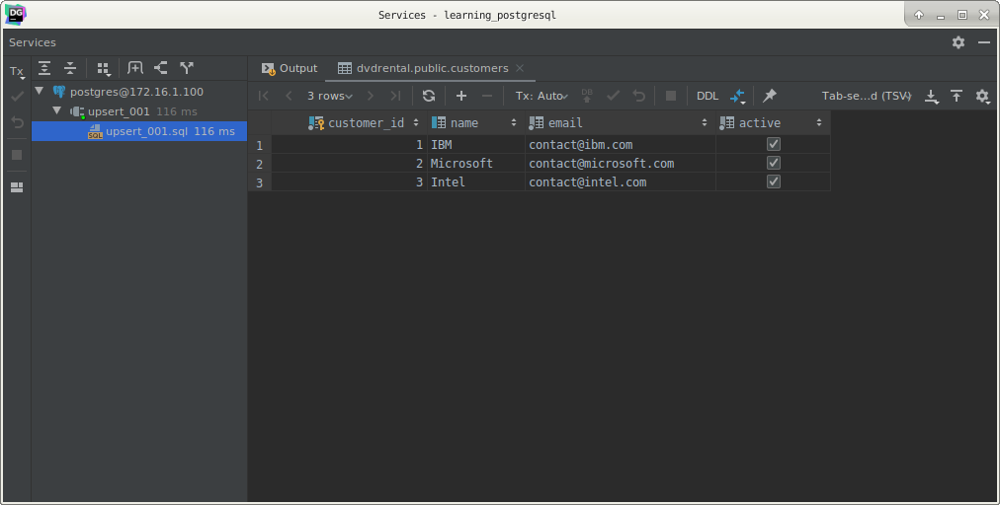
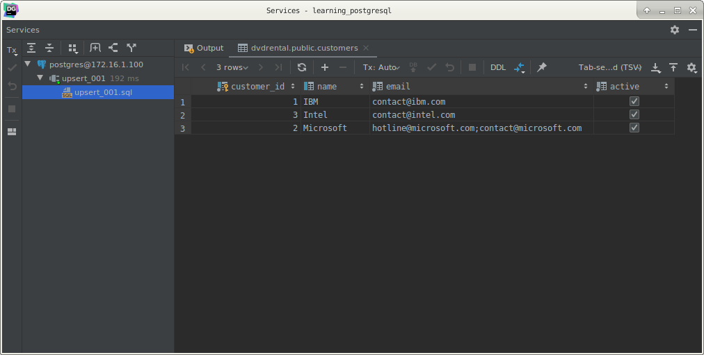

# PostgreSQL Upsert

## What you will learn

this tutorial shows you how to use the PostgreSQL upsert feature to insert or update data if the row that is being 
inserted already exists in the table.

## Introduction to the PostgreSQL upsert

In relational databases, the term `upsert` is referred to as a merge. 

The idea is that when you insert a new row into the table, PostgreSQL will update the row if it already exists, 
otherwise, PostgreSQL inserts the new row. 

That is why we call the action is `upsert` (update or insert).

To use the `upsert` feature in PostgreSQL, you use the `INSERT ON CONFLICT` statement as follows:

    INSERT INTO table_name(column_list)
    VALUES (value_list)
        ON CONFLICT target ACTION;

PostgreSQL added the `ON CONFLICT` target action clause to the `INSERT` statement to support the upsert feature.

The target can be:

- (column_name) – a column name.
- `ON CONSTRAINT` constraint_name – where the constraint name could be a name of the `UNIQUE` constraint.
- `WHERE` predicate – a `WHERE` clause with a predicate

The action can be:

- `DO NOTHING` – means do nothing if the row already exists in the table.
- `DO UPDATE SET` column_1 = value_1, .. `WHERE` condition – update some fields in the table.

>Notice that the `ON CONFLICT` clause is only available from PostgreSQL 9.5. 
>If you are using an earlier version, you will need a workaround to have the upsert feature.

If you are also working with MySQL, you will find that the upsert feature is similar to the insert on duplicate key 
update statement in MySQL.

## PostgreSQL upsert examples

Let create a new table named customers to demonstrate the PostgresQL upsert feature.

    CREATE TABLE customers
    (
        customer_id SERIAL
            PRIMARY KEY,
        name        VARCHAR
            UNIQUE,
        email       VARCHAR NOT NULL,
        active      BOOL    NOT NULL DEFAULT TRUE
    );

The `customers` table consists of four columns: `customer_id`, `name`, `email`, and `active`. 

The name column has an associated unique constraint to guarantee that the uniqueness of the customers.

The following `INSERT` statement inserts some rows into the `customers` table.

    INSERT INTO customers (name, email)
    VALUES ('IBM', 'contact@ibm.com'),
           ('Microsoft',
            'contact@microsoft.com'),
           ('Intel',
            'contact@intel.com');

The customers table contains:

    SELECT *
      FROM customers;

Suppose Microsoft changes the contact email from contact@microsoft.com to hotline@microft.com, we can update it using 
the UPDATE statement. 

However, to demonstrate the upsert feature, we use the following `INSERT ON CONFLICT` statement:

    INSERT INTO customers (name, email)
    VALUES ('Microsoft',
            'hotline@microsoft.com')
        ON CONFLICT ON CONSTRAINT customers_name_key
            DO NOTHING;
            
The statement specified that if the customer name exists in the `customers` table, just ignore it (do nothing).

The following statement is equivalent to the above statement but it uses the name column instead of the unique 
constraint name as the target of the `INSERT` statement.

    INSERT INTO customers (name, email)
    VALUES ('Microsoft',
            'hotline@microsoft.com')
        ON CONFLICT (name)
            DO NOTHING;
            
Suppose, you want to concatenate the new email with the old email when inserting a customer that already exists, in 
this case, you use `UPDATE` clause as the action of the `INSERT` statement as follows:

    INSERT INTO customers (name, email)
    VALUES ('Microsoft',
            'hotline@microsoft.com')
        ON CONFLICT (name)
            DO UPDATE
            SET email = excluded.email || ';' || customers.email;
            

## What you have learned

In this tutorial, we have shown you how to use the PostgreSQL upsert feature using the `INSERT ON CONFLICT` statement.