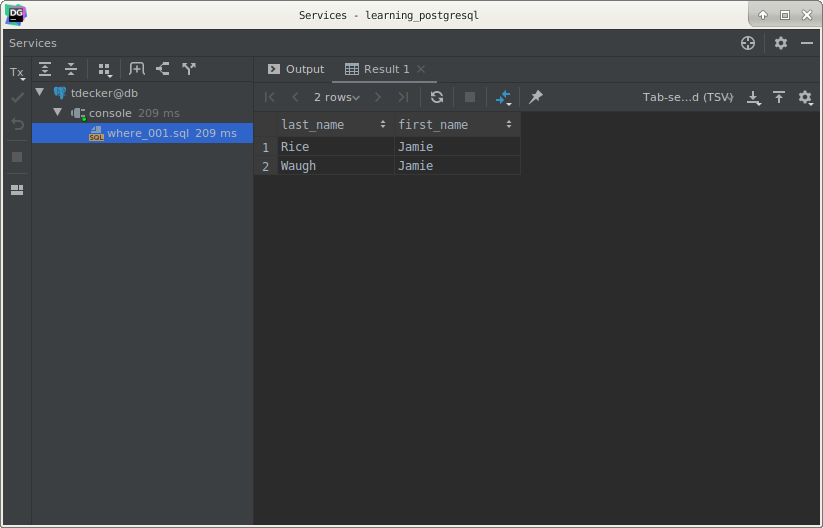
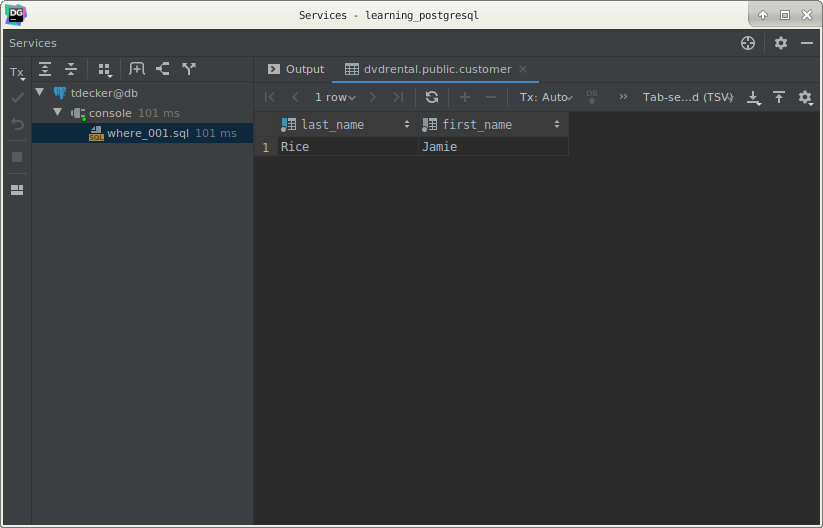
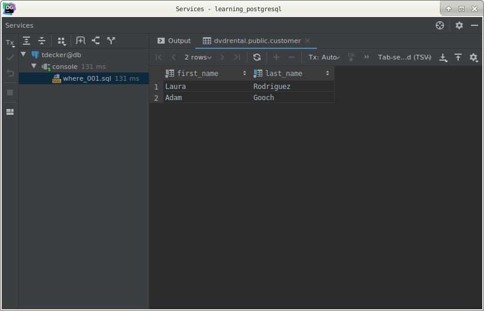
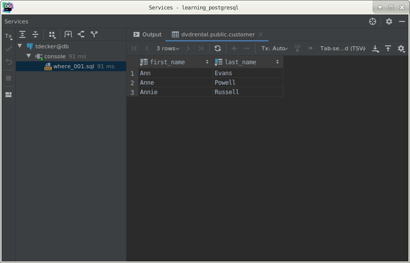
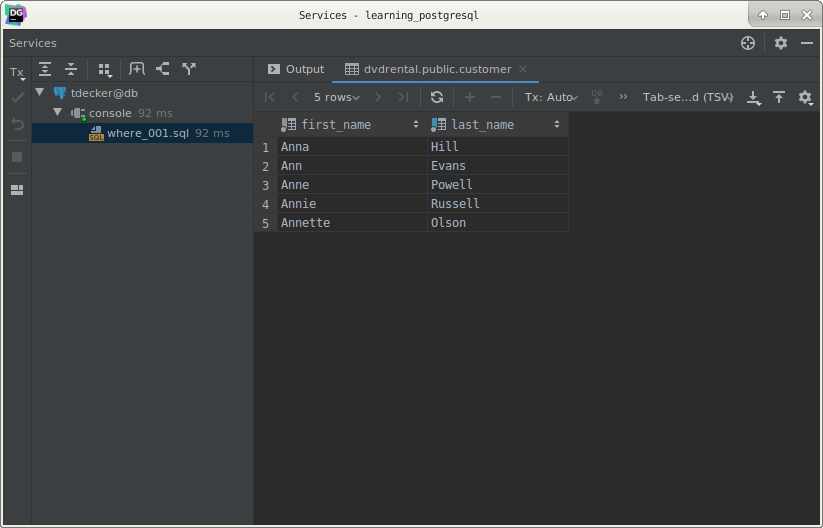
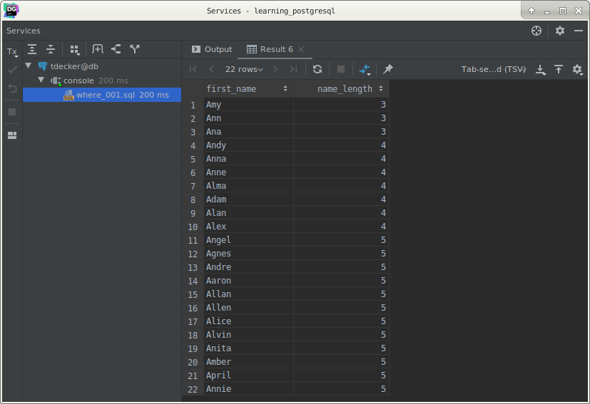
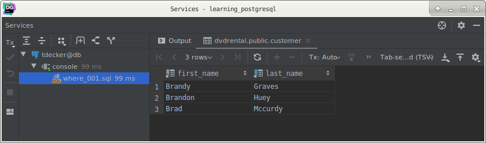

# PostgreSQL `WHERE` clause

## What you will learn

in this tutorial, you’ll learn how to use PostgreSQL `WHERE` clause to filter rows returned from the `SELECT` statement.

In the previous tutorial, you have learned how to use the `SELECT` statement to query data from a table.

What if you want to query just particular rows from a table that satisfy a certain condition. 

In this case, you need to use the `WHERE` clause.

Let’s take a look at the syntax of the PostgreSQL `WHERE` clause.

## PostgreSQL `WHERE` clause overview

The syntax of the PostgreSQL WHERE clause is as follows:

    SELECT
        select_list
        FROM
            table_name
        WHERE
            condition;
            
The `WHERE` clause appears right after the `FROM` clause of the `SELECT` statement.

The `WHERE` clause uses the condition to filter the rows returned from the `SELECT` statement.

The condition must evaluate to true, false, or unknown. 

It can be a Boolean expression or a combination of Boolean expressions using `AND` and `OR` operators.

The query returns the rows that satisfy the condition in the `WHERE` clause. 

In other words, only rows that cause the condition evaluates to true will be included in the result set.

Besides the `SELECT` statement, you can use the `WHERE` clause in the `UPDATE` and `DELETE` statement to specify rows 
to be updated or deleted.

The following table illustrates the standard comparison operators.

| Operator | Description           |
|----------|-----------------------|
|=	       | Equal                 |
|\>	       | Greater than          |
|\<	       | Less than             |
|\>=	   | Greater than or equal |
|\<=       | Less than or equal    |
|\<> or != | Not equal             |
|AND       | Logical operator AND  |
|OR        | Logical operator OR   |

## PostgreSQL `WHERE` clause examples

Let’s practice with some examples of using the WHERE clause with conditions.

We will use the `customer` table from the sample database for demonstration.

## 1)  Using `WHERE` clause with the equal (`=`) operator example

If you want to get all customers whose first names are Jamie, you can use the `WHERE` clause with the equal (`=`) 
operator as follows:

    SELECT
        last_name,
        first_name
        FROM
            customer
        WHERE
            first_name = 'Jamie';

## 2) Using `WHERE` clause with the `AND` operator example

The following example finds the customer whose first name is Jamie and last names is  rice by using the `AND` logical 
operator to combine two Boolean expressions:

    SELECT
        last_name,
        first_name
        FROM
            customer
        WHERE
              first_name = 'Jamie'
          AND last_name = 'Rice';
          

## 3) Using `WHERE` clause with the `OR` operator example

This example finds the customers whose last name is Rodriguez or first name is Adam by using the `OR` operator.

    SELECT
        first_name,
        last_name
        FROM
            customer
        WHERE
             last_name = 'Rodriguez'
          OR first_name = 'Adam';
          

## 4) Using `WHERE` clause with the `IN` operator example

If you want to match a string with any string in a list, you can use the `IN` operator. 

For example, the following statement returns customers whose first name is Ann, or Anne, or Annie:

    SELECT
        first_name,
        last_name
        FROM
            customer
        WHERE
            first_name IN ('Ann', 'Anne', 'Annie');
            

## 5) Using `WHERE` clause with the `LIKE` operator example

To find a string that matches a specified pattern, you use the `LIKE` operator. 

The following examples return all customers whose names start with the string Ann:

    SELECT
        first_name,
        last_name
        FROM
            customer
        WHERE
            first_name LIKE 'Ann%'
            

The % is called a wildcard that matches any string. The 'Ann%' pattern matches any string that starts with 'Ann'.

## 6) Using `WHERE` clause with the `BETWEEN` operator example

The following example finds customers whose first names start with the letter A and their lengths are between 3 and 5  
by using the `BETWEEN` operator. 

>Note that the `BETWEEN` operator returns true if a value is in a range of values.

    SELECT
        first_name,
        LENGTH(first_name) name_length
        FROM
            customer
        WHERE
              first_name LIKE 'A%'
          AND LENGTH(first_name) BETWEEN 3 AND 5
        ORDER BY
            name_length;
            

In this example, we used the `LENGTH()` function returns the number of characters of the input string.

## 7) Using `WHERE` clause with the not equal operator (`<>`) example

This example finds customers whose first name starts with Bra and last name is not Motley:

    SELECT
        first_name,
        last_name
        FROM
            customer
        WHERE
              first_name LIKE 'Bra%'
          AND last_name <> 'Motley';
          

>Note that you can use the `!=` operator instead of `<>` operator. They have the same effect.

## What you have learned

In this tutorial, you have learned how to use PostgreSQL `WHERE` clause in the `SELECT` statement to filter rows based 
on a specified condition.